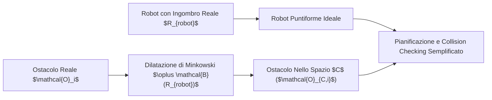
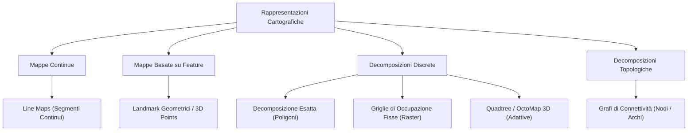
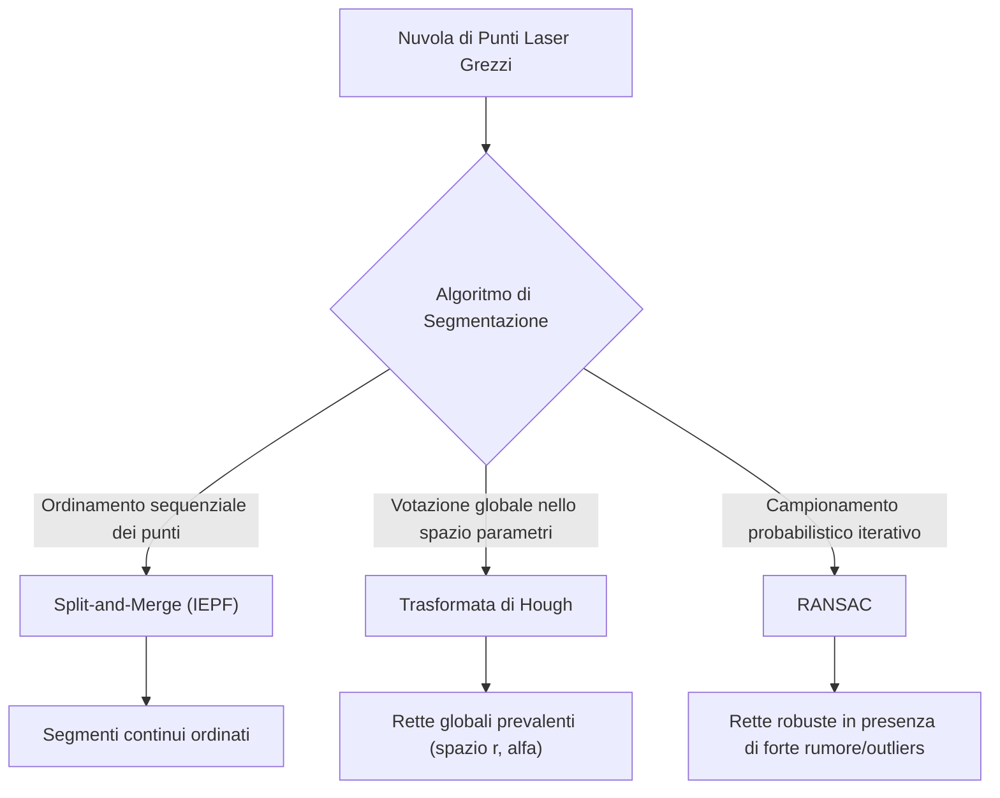
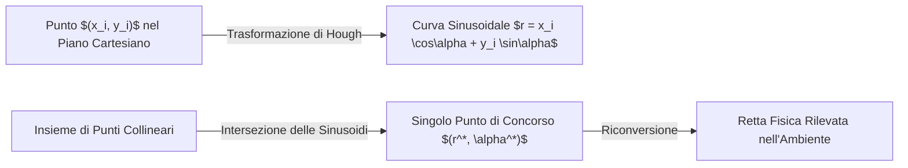

# 3. Rappresentazione dell'Ambiente Ed Estrazione Di Feature

La capacità di operare autonomamente nello spazio richiede che un robot mobile possieda una rappresentazione strutturata del mondo circostante (__mappa__) e sia in grado di estrarre dai segnali sensoriali grezzi delle entità geometriche o semantiche compatte, stabili e informative (__feature__).

Questo capitolo affronta in modo organico la transizione dai dati grezzi dei sensori di distanza (_range data_, tipicamente da scansioni LiDAR 2D) alla costruzione di modelli ambientali, analizzando:
1. L'inquadramento cinematico e geometrico della percezione ambientale e il concetto di spazio delle configurazioni;
2. La tassonomia formale delle rappresentazioni cartografiche (continue, basate su feature, decomposizioni discrete e grafi topologici);
3. La formulazione matematica del __line fitting__ in coordinate polari e forma normale di Hesse;
4. Gli algoritmi fondamentali di segmentazione geometrica: __Split-and-Merge__, __Trasformata di Hough__ e __RANSAC__.

---

## Inquadramento Geometrico E Spazio Delle Configurazioni

Per localizzarsi, pianificare traiettorie ed evitare collisioni, il robot deve relazionare le proprie misure sensoriali con un modello geometrico dell'ambiente. A livello teorico e di pianificazione di base, il robot viene spesso trattato come un __punto materiale__ ideale privo di ingombro nello spazio bidimensionale:

$$
\mathbf{p}_r = \begin{bmatrix} x \\ y \end{bmatrix} \in \mathbb{R}^2
$$

Nella realtà operativa, tuttavia, ogni veicolo terrestre possiede una sagoma geometrica finita, definita da un poligono o da un raggio di ingombro $R_{robot}$.



> [!NOTE] Dallo Spazio Fisico allo Spazio delle Configurazioni ($C$-Space)
> Per preservare la semplicità degli algoritmi di navigazione e collision checking considerando il robot puntiforme, si applica la __somma di Minkowski__ ($\oplus$) tra la geometria di ciascun ostacolo $\mathcal{O}_i$ e la geometria del robot $\mathcal{A}$ invertita rispetto all'origine:
>
> $$
> \mathcal{O}_{C,i} = \mathcal{O}_i \oplus (-\mathcal{A})
> $$
>
> Nel caso conservativo in cui il robot sia inscritto in un cerchio di raggio $R_{robot}$, l'operazione coincide con una __dilatazione isotropa degli ostacoli__ di una quantità pari al raggio $R_{robot}$. In questo modo, qualsiasi traiettoria percorsa dal robot puntiforme che non intersechi gli ostacoli dilatati garantisce l'assoluta assenza di collisioni nel mondo reale.

---

## Tassonomia Delle Rappresentazioni Cartografiche

La scelta del formalismo con cui rappresentare l'ambiente dipende strettamente dal compito assegnato, dalle capacità computazionali di bordo e dai sensori disponibili. La letteratura di riferimento suddivide le mappe in quattro macro-categorie:



### Mappe Continue a Linee (Line-Based Continuous Maps)

Nelle mappe continue, gli elementi strutturali dell'ambiente (muri, pareti, divisori interni) vengono descritti mediante insiemi di primitive geometriche definite su coordinate reali $\mathbb{R}^2$:

$$
\mathcal{M}_{line} = \left\{ \mathbf{l}_1, \mathbf{l}_2, \dots, \mathbf{l}_N \right\}
$$

Ciascun segmento di retta $\mathbf{l}_j$ è caratterizzato dagli estremi cartesiani $\left( (x_{s,j}, y_{s,j}), (x_{e,j}, y_{e,j}) \right)$ oppure dalla forma normale polare con intervallo di estensione.

![[slide_06_map_continuous_vs_linemap_comparison.png|center big]]

Le proprietà salienti di questa rappresentazione includono:
- __Risoluzione infinita__: non vi è alcuna quantizzazione spaziale indotta da una griglia discreta;
- __Efficienza di memoria__: l'occupazione di memoria non scala con la superficie totale dell'ambiente, bensì è strettamente proporzionale alla __densità degli ostacoli__ (numero di muri $N$);
- __Assunzione di Mondo Chiuso (_Closed-World Assumption_)__: le linee tracciano perimetri continui che racchiudono l'area esplorata; ciò che giace all'esterno del poligono di confini è implicitamente inaccessibile.

> [!WARNING] Limiti delle Mappe Continue a Linee
> Sebbene siano eccellenti per la localizzazione precisa di robot dotati di LiDAR planari in ambienti strutturati (uffici, corridoi), le _line maps_ risultano inadatte per la navigazione in ambienti non strutturati, vegetazione o terreni aperti, e non consentono di rappresentare ostacoli di forma irregolare o parzialmente trasparenti.

### Mappe Basate Su Feature (Landmark-Based Maps)

Invece di descrivere l'intero contorno fisico dell'ambiente, le mappe basate su feature memorizzano unicamente la posizione e i parametri descrittivi di punti salienti o elementi distintivi (_landmarks_):

$$
\mathcal{M}_{feat} = \left\{ \mathbf{f}_1, \mathbf{f}_2, \dots, \mathbf{f}_M \right\}, \quad \mathbf{f}_j = \begin{bmatrix} \mathbf{p}_j \\ \mathbf{d}_j \end{bmatrix}
$$

dove $\mathbf{p}_j$ rappresenta la coordinata spaziale (2D o 3D) e $\mathbf{d}_j$ è un descrittore associato (geometrico o fotometrico).

![[slide_06_map_cas_tool_simulation.png|center small]]

Tra i sistemi più rilevanti basati su questo paradigma troviamo i framework di Visual SLAM come __ORB-SLAM__:
1. __Mappa Sparsa di Keypoint 3D__: l'ambiente è memorizzato come una costellazione di punti tridimensionali triangolati dai fotogrammi chiave;
2. __Grafo delle Pose (Pose Graph / Co-visibility Graph)__: i nodi rappresentano le pose stimate della telecamera nel tempo, mentre gli archi modellano i vincoli di co-visibilità di punti comuni e le trasformazioni relative.

![[slide_06_map_orb_slam_features_and_posegraph.png|center big]]

### Decomposizioni Discrete: Esatta, Fissa E Adattiva

Quando l'obiettivo primario è il motion planning e la verifica istantanea delle collisioni, l'ambiente continuo viene partizionato in regioni elementari (_celle_).

#### Decomposizione Esatta (Exact Cell Decomposition)

L'ambiente libero viene suddiviso geometricamente in un insieme di celle poligonali convesse contigue $\mathcal{C}_1, \dots, \mathcal{C}_K$, tracciando segmenti verticali o estensioni dei vertici degli ostacoli (_trapezoidal decomposition_).

![[slide_06_map_discrete_exact_decomposition.png|center mid]]

- All'interno di ciascuna cella convessa, due punti qualsiasi possono essere congiunti da un segmento rettilineo che non tocca alcun ostacolo;
- Il motion planning si riduce alla ricerca su grafo tra celle adiacenti (attraversando i punti medi dei segmenti di confine) partendo dalla cella contenente lo `Start` fino a raggiungere quella del `Goal`.

#### Decomposizione a Griglia Fissa (Occupancy Grid Maps)

Proposta originariamente da Moravec ed Elfes, la decomposizione a griglia fissa tessella lo spazio bidimensionale in una matrice regolare di celle quadrate di lato fisso $\delta$ (tipicamente da $1\text{ cm}$ a $10\text{ cm}$):

$$
\mathbf{m} = \{ m_i \}, \quad m_i \in [0, 1]
$$

Ogni cella $m_i$ conserva la probabilità stocastica di occupazione $P(m_i = 1)$:
- $P(m_i) \approx 1$ (nero): cella occupata da un ostacolo;
- $P(m_i) \approx 0$ (bianco): spazio libero esplorato;
- $P(m_i) = 0.5$ (grigio): cella inesplorata o stato sconosciuto.

![[slide_06_map_discrete_fixed_occupancy_grid.png|center big]]

- __Vantaggi__: modellazione naturale dell'incertezza dei sensori, aggiornamento ricorsivo bayesiano immediato, indipendenza dalla forma geometrica degli ostacoli;
- __Svantaggi__: l'occupazione di memoria scala con l'area complessiva dell'ambiente ($O(L^2)$ in 2D e $O(L^3)$ in 3D), indipendentemente dal fatto che l'ambiente sia prevalentemente vuoto.

#### Decomposizione Adattiva: Quadtree E OctoMap

Per mitigare l'esplosione dimensionale delle griglie fisse preservando l'accuratezza sui bordi degli ostacoli, si ricorre alla suddivisione gerarchica ad albero:
- In 2D si utilizza un __Quadtree__: se una regione non è omogeneamente libera o occupata, viene divisa ricorsivamente in 4 quadranti (NW, NE, SW, SE); le aree uniformi rimangono memorizzate come blocchi grandi;
- In 3D si estende il concetto a un __Octree__, dando origine a sistemi standard come __OctoMap__.

![[slide_06_map_discrete_adaptive_quadtree.png|center mid]]

![[slide_06_map_discrete_3d_octomap.png|center big]]

> [!TIP] Caratteristiche di OctoMap in 3D
> OctoMap permette la modellazione tridimensionale a voxel multirisoluzione, tracciando esplicitamente sia lo spazio occupato che lo spazio libero (essenziale per droni aerei e bracci robotici mobili). L'occupazione di memoria è compressa grazie al raggruppamento dei nodi foglia omogenei (_node pruning_).

### Mappe Topologiche (Topological Maps)

Una mappa topologica astrae completamente la metrica geometrica, descrivendo l'ambiente come un grafo non orientato:

$$
\mathcal{G} = (\mathcal{V}, \mathcal{E})
$$

dove:
- I nodi $\mathcal{V}$ rappresentano luoghi fisici o aree salienti (es. _Stanza A_, _Incrocio Corridoio_, _Atrio_);
- Gli archi $\mathcal{E}$ modellano la connettività e la navigabilità diretta tra i luoghi (porte, corridoi percorribili).

![[slide_06_map_topological_graph_decomposition.png|center mid]]

> [!IMPORTANT] Ruolo delle Mappe Topologiche nel Corso
> Come chiarito a lezione, __le mappe topologiche non vengono utilizzate per la localizzazione fine metrica del robot__. Sebbene risultino estremamente potenti per la pianificazione globale di percorsi ad alto livello (_symbolic path planning_), esse non contengono informazioni metriche di dettaglio: un robot non può stimare con precisione millimetrica la propria terna $(x, y, \theta)$ basandosi esclusivamente su nodi e archi topologici astratti.

---

## Estrazione Di Linee Da Dati Di Distanza (Line Extraction from Range Data)

La maggior parte dei robot mobili per interni monta sensori di distanza laser (LiDAR planari) che forniscono sequenze di misure polari grezze:

$$
\mathcal{P}_{raw} = \left\{ (\rho_i, \theta_i) \right\}_{i=1}^N
$$

Il problema dell'estrazione di feature consiste nel convertire questa nuvola disordinata di campioni rumorosi in un insieme compatto di primitive geometriche (segmenti di retta).

![[slide_06_feature_range_data_lines_raw.png|center small]]

![[slide_06_feature_laser_scan_lis_lab.png|center mid]]

Il problema si articola formalmente in due sotto-problemi fondamentali:
1. __Data Segmentation__: stabilire quante linee sono presenti e quali punti appartengono a ciascuna linea;
2. __Line Fitting__: dato un sottoinsieme di punti associati a una linea, calcolare i parametri geometrici ottimi della retta minimizzando l'errore di stima.

---

## Modello Geometrico Di Retta E Line Fitting

### Perché la Forma Normale Di Hesse in Coordinate Polari?

Nel piano cartesiano standard, una retta viene comunemente espressa come:

$$
y = m x + q
$$

Questa parametrizzazione presenta una criticità fatale per i robot mobili: quando una retta o una parete è parallela all'asse $y$ (verticale), il coefficiente angolare diverge ($m \to \infty$), provocando instabilità numerica e singolarità negli algoritmi di ottimizzazione.

Per evitare qualsiasi singolarità e mantenere la robustezza rispetto all'origine del robot, si adotta la __forma normale di Hesse__ (parametrizzazione polare della retta):

$$
x \cos\alpha + y \sin\alpha - r = 0
$$

![[slide_06_feature_line_model_polar_hesse.png|center mid]]

I parametri geometrici hanno un significato fisico inequivocabile:
- $r \ge 0$: distanza ortogonale minima dall'origine degli assi (la posizione del sensore) alla retta;
- $\alpha \in [-\pi, \pi]$: angolo della normale orientata alla retta condotta dall'origine.

Dato un punto generico $P_i = (x_i, y_i)$, la distanza ortogonale con segno (residuo) tra il punto e la retta è:

$$
d_i = x_i \cos\alpha + y_i \sin\alpha - r
$$

### Incertezza Nei Dati Grezzi Del Sensore

Ciascun raggio laser misura una distanza $\rho_i$ a un angolo $\theta_i$. La conversione in coordinate cartesiane vale:

$$
\begin{cases}
x_i = \rho_i \cos\theta_i \\
y_i = \rho_i \sin\theta_i
\end{cases}
$$

A causa del rumore di misura del sensore, le coordinate polari sono variabili aleatorie con matrice di covarianza:

$$
C_{i}^{\rho\theta} = \begin{bmatrix} \sigma_{\rho,i}^2 & 0 \\ 0 & \sigma_{\theta,i}^2 \end{bmatrix}
$$

![[slide_06_feature_laser_raw_uncertainty_gaussians.png|center mid]]

> [!NOTE] Ipotesi di Indipendenza e Matrice a Blocchi Diagonali
> Nel contesto stocastico, la matrice di covarianza congiunta dell'intera scansione di $N$ punti viene modellata come una matrice diagonale a blocchi:
>
> $$
> C_{raw} = \begin{bmatrix}
> C_1^{\rho\theta} & \mathbf{0} & \dots & \mathbf{0} \\
> \mathbf{0} & C_2^{\rho\theta} & \dots & \mathbf{0} \\
> \vdots & \vdots & \ddots & \vdots \\
> \mathbf{0} & \mathbf{0} & \dots & C_N^{\rho\theta}
> \end{bmatrix}
> $$
>
> Come evidenziato a lezione, l'assunzione che gli errori sui singoli raggi laser siano reciprocamente indipendenti è un'approssimazione (nella realtà esistono correlazioni temporali e spaziali dovute alla risposta del fotodiodo o al movimento del robot durante la scansione). Tuttavia, questa ipotesi è sufficientemente accurata da poter essere applicata con successo senza appesantire il carico computazionale.

### Minimi Quadrati Ordinari (OLS) E Minimi Quadrati Pesati (WLS)

Dato un insieme di $N$ punti $\{ (x_i, y_i) \}_{i=1}^N$ appartenenti alla medesima retta, l'obiettivo è determinare i parametri $(\alpha, r)$ che minimizzano la somma dei quadrati delle distanze ortogonali:

$$
S(\alpha, r) = \sum_{i=1}^N d_i^2 = \sum_{i=1}^N \left( x_i \cos\alpha + y_i \sin\alpha - r \right)^2
$$

Annullando la derivata parziale rispetto a $r$:

$$
\frac{\partial S}{\partial r} = -2 \sum_{i=1}^N \left( x_i \cos\alpha + y_i \sin\alpha - r \right) = 0 \implies r = \bar{x} \cos\alpha + \bar{y} \sin\alpha
$$

dove $(\bar{x}, \bar{y}) = \left( \frac{1}{N} \sum x_i, \frac{1}{N} \sum y_i \right)$ è il baricentro dei punti. La retta ottimale passa sempre per il baricentro dell'insieme dei campioni!

Sostituendo $r$ in $S$ e minimizzando rispetto ad $\alpha$, si perviene alla soluzione in forma chiusa:

$$
\tan(2\alpha) = \frac{-2 \sum (x_i - \bar{x})(y_i - \bar{y})}{\sum (y_i - \bar{y})^2 - \sum (x_i - \bar{x})^2}
$$

Nel caso in cui i singoli punti posseggano varianze differenti $\sigma_i^2$, si formula il problema ai __minimi quadrati pesati (WLS)__:

$$
S_w(\alpha, r) = \sum_{i=1}^N w_i \left( x_i \cos\alpha + y_i \sin\alpha - r \right)^2, \quad w_i = \frac{1}{\sigma_i^2}
$$

> [!TIP] Approfondimento Teorico
> Per la derivazione analitica passo per passo della soluzione per $\alpha$, la disambiguazione del quadrante e la propagazione dell'incertezza con il Jacobiano $F_{PQ}$ sulla covarianza stimata $C_{AR}$, si veda [[zz. Argomenti extra#Derivazione Analitica del Line Fitting (OLS e WLS) in Coordinate Polari|zz. Argomenti extra: Derivazione Analitica del Line Fitting]].

---

## Algoritmi Di Segmentazione

La segmentazione consiste nel partizionare l'insieme totale di punti misurati in sottoinsiemi disgiunti, ciascuno associato a una specifica linea fisica presente nell'ambiente. Vengono analizzati i tre algoritmi fondamentali.



---

### Split-and-Merge (Iterative-End-Point-Fit)

L'algoritmo __Split-and-Merge__ (nella sua variante canonica _Iterative-End-Point-Fit_, IEPF) sfrutta la natura intrinsecamente ordinata della scansione laser (i punti sono acquisiti sequenzialmente per angoli $\theta$ crescenti).

![[slide_06_feature_split_and_merge_algorithm.png|center big]]

#### Procedura Operativa Passo-Passo

1. __Linea iniziale__: Si traccia un segmento di retta provvisorio congiungente il primo punto $P_1$ e l'ultimo punto $P_N$ della sequenza;
2. __Ricerca della massima distanza__: Per ciascun punto intermedio $P_i$, si calcola la distanza ortogonale $d_i$ dal segmento; sia $d_{\max} = \max_i d_i$ la distanza massima corrispondente al punto $P_k$;
3. __Fase di Split__:
   - Se $d_{\max} > \epsilon$ (soglia di tolleranza prestabilita), la sequenza di punti viene __spezzata in due sottoinsiemi__: da $P_1$ a $P_k$ e da $P_k$ a $P_N$;
   - Si applica ricorsivamente la procedura su ciascuno dei due sotto-segmenti;
4. __Arresto dello Split__: Quando in un sotto-segmento nessun punto dista più di $\epsilon$ dalla retta congiungente gli estremi, la suddivisione ricorsiva per quel segmento termina;
5. __Fase di Merge__: I segmenti contigui ottenuti vengono confrontati: se i parametri delle rette associate risultano quasi collineari e la distanza tra i punti di confine è inferiore a una soglia metrica, i segmenti vengono __fusi__ (_merged_) in un'unica linea e si esegue un fit globale su tutti i punti congiunti.

> [!IMPORTANT] Chiarimento Concettuale: Split-and-Merge e l'Associazione dei Punti
> Contrariamente a quanto a volte ritenuto, __l'algoritmo Split-and-Merge associa esplicitamente ciascun punto alla rispettiva retta__. Poiché opera per partizioni successive della sequenza ordinata di indici, al termine dell'algoritmo ogni segmento di retta possiede la lista esatta e ordinata dei punti che lo compongono.

- __Vantaggi__: Estremamente veloce ($O(N \log N)$ nel caso medio), deterministico, eccellente per contorni continui;
- __Svantaggi__: Dipende fortemente dall'ordinamento angolare dei punti e può fallire in presenza di punti sparsi isolati o salti di continuità non filtrati.

---

### Trasformata Di Hough

La __Trasformata di Hough__ è una tecnica di trasformazione per accumulazione globale introdotta per rilevare forme geometriche parametrizzabili anche in presenza di lacune o forte rumore.

#### Principio Della Dualità Punto-Linea

Nello spazio cartesiano geometrico $(x, y)$, una retta è descritta dalla forma normale di Hesse:

$$
x \cos\alpha + y \sin\alpha = r
$$

Se consideriamo un __singolo punto fissato__ $P_i = (x_i, y_i)$, quali sono tutte le infinite rette che possono passare per quel punto?
Variando l'orientamento $\alpha \in [-\pi, \pi]$, la distanza $r$ necessaria affinché la retta passi per $P_i$ è:

$$
r(\alpha) = x_i \cos\alpha + y_i \sin\alpha
$$

Nello spazio dei parametri $(\alpha, r)$, questa equazione rappresenta una __curva sinusoidale__!

![[slide_06_feature_hough_polar_transform_concept.png|center big]]



> [!NOTE] Risoluzione del Dubbio Concettuale sulla Trasformata di Hough
> L'idea alla base di Hough è elegante e potente:
> 1. Un __punto__ nello spazio geometrico diventa una __sinusoide__ nello spazio dei parametri $(\alpha, r)$;
> 2. Se più punti $P_1, P_2, \dots, P_k$ appartengono alla __stessa retta fisica__, le rispettive curve sinusoidali nello spazio dei parametri __si intersecheranno tutte esattamente nello stesso punto__ $(r^*, \alpha^*)$;
> 3. Il problema di identificare una retta nello spazio cartesiano si trasforma quindi nel problema di individuare il punto di massima intersezione tra curve nello spazio dei parametri!

#### L'Accumulatore Discreto E Il Meccanismo Di Voto

Poiché i computer lavorano su insiemi discreti, lo spazio dei parametri $(\alpha, r)$ viene quantizzato in una matrice bidimensionale detta __accumulatore di Hough__ $H[r_q, \alpha_q]$:

![[slide_06_feature_hough_transform_4quadrants_example.png|center big]]

```
Algoritmo: Trasformata di Hough per Rette
---------------------------------------------------------------------
Dati: Insieme P di punti misurati (x_i, y_i)
Risultato: Parametri delle rette dominanti (r, alpha)

1. Inizializzazione:
   - Quantizza lo spazio (alpha, r) in una griglia H di dimensioni (N_r x N_alpha)
   - Azzera tutti i valori: H[r_q, alpha_q] = 0 per ogni cella

2. Votazione (Voting):
   - Per ciascun punto (x_i, y_i) in P:
       - Per ciascun valore discretizzato alpha_q in A_q:
           - Calcola r_q = x_i * cos(alpha_q) + y_i * sin(alpha_q)
           - Trova l'indice di quantizzazione più vicino per r_q
           - Incrementa il contatore: H[r_q, alpha_q] = H[r_q, alpha_q] + 1

3. Estrazione dei Massimi:
   - Trova i picchi locali (massimi) nella matrice accumulatore H
   - Le celle che superano una soglia di voto T corrispondono alle rette stimate!
```

> [!WARNING] Limitazione dell'Accumulatore: Associazione dei Punti
> A differenza di Split-and-Merge, la procedura di voto standard nell'accumulatore individua i parametri $(r^*, \alpha^*)$ della retta globale ma __non tiene memoria diretta di quali specifici punti abbiano votato per quella cella__.
> Per recuperare i segmenti fisici ed evitare di unire pareti distanti allineate casualmente:
> 1. Si individuano i parametri $(r^*, \alpha^*)$ del picco nell'accumulatore;
> 2. Si esegue una scansione retroattiva dei dati per trovare i punti la cui distanza ortogonale da quella retta sia minore di una tolleranza $\delta$;
> 3. Si raggruppano i punti in segmenti finiti e si rimuovono dalla lista dei punti per consentire il rilevamento delle rette successive.

---

### RANSAC (RANdom SAmple Consensus)

__RANSAC__ è un algoritmo non deterministico iterativo concepito specificamente per stimare i parametri di un modello matematico in presenza di un'elevata percentuale di __outliers__ (punti spuri, riflessioni anomale, rumore pesante o ostacoli dinamici non appartenenti al modello).

![[slide_06_feature_ransac_comparison_process.png|center big]]

#### Funzionamento dell'Algoritmo

Per stimare una retta nel piano cartesiano sono necessari al minimo $s = 2$ punti distinti.

```
Algoritmo: RANSAC per Line Fitting
---------------------------------------------------------------------
Dati: Insieme P di N punti misurati, soglia di distanza epsilon,
      numero minimo di inliers M, numero massimo di iterazioni K
Risultato: Retta ottima e insieme di inliers

Ripeti K volte:
  1. Campiona casualmente un sottoinsieme minimo di 2 punti da P
  2. Calcola la retta candidata passante per i 2 punti (modello provvisorio)
  3. Calcola la distanza ortogonale d_i di TUTTI gli altri punti da questa retta
  4. Costruisci il Consensus Set (Inliers):
     Inliers = { P_i in P : d_i < epsilon }
  5. Se |Inliers| > |Miglior_Consenso|:
     Miglior_Consenso = Inliers
     Miglior_Modello = parametri della retta corrente

Fine ciclo:
  - Prendi il Miglior_Consenso (se supera la soglia M)
  - Ricalcola la retta definitiva eseguendo un Total Least Squares (OLS/WLS)
    su TUTTI i punti appartenenti al Miglior_Consenso!
  - I punti fuori dal consenso vengono scartati come outliers.
```

#### Determinazione Del Numero Di Iterazioni $K$

Quante iterazioni casuali $K$ sono necessarie per essere ragionevolmente sicuri di aver estratto almeno una volta una coppia di punti contenente esclusivamente inliers validi?

Sia $w$ la frazione di inliers nell'intero dataset ($w = \frac{N_{inliers}}{N_{tot}}$).
La probabilità che $s = 2$ punti estratti a caso siano entrambi inliers è:

$$
P(\text{2 inliers}) = w^s = w^2
$$

La probabilità che almeno uno dei due sia un outlier (campione corrotto) vale:

$$
P(\text{campione errato}) = 1 - w^s
$$

La probabilità che in tutte le $K$ iterazioni indipendenti si estragga sempre un campione corrotto è:

$$
P(\text{fallimento in } K \text{ passi}) = (1 - w^s)^K
$$

Imponendo che la probabilità di successo sia almeno $p$ (con confidenza tipica $p = 0.99$):

$$
1 - (1 - w^s)^K \ge p \implies (1 - w^s)^K \le 1 - p
$$

Applicando il logaritmo naturale a entrambi i membri:

$$
K \ge \frac{\ln(1 - p)}{\ln(1 - w^s)}
$$

> [!TIP] Esempio Numerico di RANSAC
> Se l'ambiente presenta il $50\%$ di rumore e ostacoli spuri ($w = 0.5$) e vogliamo una certezza del $99\%$ ($p = 0.99$) con un modello lineare a $s = 2$ punti:
>
> $$
> K \ge \frac{\ln(1 - 0.99)}{\ln(1 - 0.5^2)} = \frac{\ln(0.01)}{\ln(0.75)} \approx \frac{-4.605}{-0.2877} \approx 16.01 \implies K = 17 \text{ iterazioni}
> $$
>
> Bastano appena $17$ iterazioni per avere il $99\%$ di probabilità matematica di estrarre una coppia di punti valida e ripulire completamente gli outliers!

---

## Tabella Comparativa Degli Algoritmi Di Segmentazione

| Caratteristica | Split-and-Merge (IEPF) | Trasformata di Hough | RANSAC |
| :--- | :--- | :--- | :--- |
| __Input Richiesto__ | Punti con ordinamento angolare sequenziale | Punti sparsi qualsiasi | Punti sparsi qualsiasi |
| __Complessità Temporale__ | $O(N \log N)$ (molto veloce) | $O(N \cdot N_\alpha)$ (dipende dalla risoluzione) | $O(K \cdot N)$ ($K$ limitato) |
| __Tolleranza Outliers__ | Bassa (sensibile a salti di scansione) | Media (i falsi picchi creano artefatti) | __Altissima__ (robusto fino al $50\%\text{--}70\%$ di rumore) |
| __Associazione dei Punti__ | __Nativa ed esplicita__ per ogni segmento | Indiretta (richiede post-processing) | __Esplicita__ (tramite _consensus set_) |
| __Natura dell'Algoritmo__ | Deterministica | Deterministica (su griglia quantizzata) | Probabilistica / Stocastica |
| __Ambito di Elezione__ | Scansioni LiDAR 2D pulite per muri continui | Riconoscimento linee globali e forme note | Dati 3D rumorosi, stereo vision, feature visuali |
