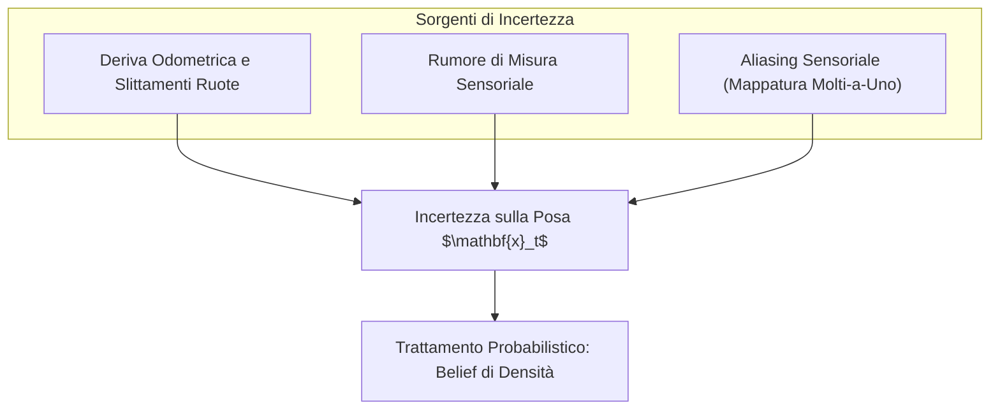
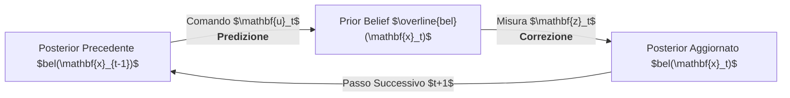

# 4. Localizzazione E Filtri Di Bayes

La localizzazione rappresenta una delle competenze primarie per la mobilità autonoma: consiste nel determinare in tempo reale la posa di un robot (posizione sul piano e orientamento) all'interno di una mappa nota dell'ambiente, fondendo le informazioni provenienti dai sensori di bordo.

A causa delle imperfezioni dei dispositivi fisici (rumore di misura, aliasing sensoriale, slittamenti cinematici), la localizzazione non può essere trattata con approcci deterministici, bensì come un __problema di stima stocastica ricorsiva__.

Questo capitolo sviluppa in modo rigoroso il framework probabilistico fondamentale della robotica mobile:
1. La formulazione stocastica della localizzazione e le sorgenti di incertezza;
2. La rappresentazione formale del __belief__ e la tassonomia dei suoi modelli continui e discreti;
3. I __Modelli di Markov Nascosti (HMM)__ e le proprietà di indipendenza condizionale;
4. L'algoritmo concettuale del __Filtro di Bayes Ricorsivo__ (ciclo di Predizione e Correzione);
5. L'analisi quantitativa dell'esempio didattico della porta (_Door State Estimation_);
6. La dimostrazione formale della ricorsione bayesiana per induzione;
7. I limiti fisici dell'assunzione markoviana e l'introduzione alle approssimazioni gaussiane.

---

## Dalla Localizzazione Deterministica Alla Stima Stocastica

Nel caso ideale teorico, la traiettoria di un veicolo terrestre potrebbe essere calcolata semplicemente integrando i comandi di velocità delle ruote o le letture degli encoder (odometria pura).

![[slide_07_martinelli_robot_localization.png|center mid]]

Nel mondo reale, l'evoluzione dello stato è soggetta a tre sorgenti ineliminabili di incertezza:
1. __Rumore nei dati propriocettivi (Attuazione e Odometria)__:
   - Gli encoder delle ruote e le piattaforme IMU misurano il movimento relativo rispetto al telaio, ma sono affetti da derive temporali non limitate (_unbounded drift_);
   - A causa di micro-slittamenti tra pneumatico e terreno, attriti e giochi meccanici, l'effetto cinematico reale generato da un comando di velocità $\mathbf{u}_t = (v_t, \omega_t)^T$ è sempre diverso da quello teorico pianificato;
2. __Rumore nei dati esteriorocettivi (Percezione dell'Ambiente)__:
   - LiDAR, telecamere, sonar e ricevitori GNSS catturano la relazione geometrica tra robot e ostacoli circostanti, ma sono degradati da rumore di quantizzazione, riflessioni anomale e condizioni operative variabili;
3. __Aliasing Sensoriale (_Perceptual Aliasing_)__:
   - È la condizione di __mappatura molti-a-uno__: ambienti geometricamente regolari o simmetrici (es. una sequenza di porte identiche lungo un corridoio rettilineo) generano letture sensoriali indistinguibili in punti spaziali diversi;
   - Una singola misura istantanea non è sufficiente a discriminare la posa corretta tra più ipotesi ambigue.



---

## Rappresentazione Del Belief (Stato Di Conoscenza)

Sia $\mathbf{x}_t \in \Omega$ la posa reale del robot all'istante temporale $t$. Nel caso comune di navigazione su un pavimento orizzontale, la posa è un vettore a tre dimensioni:

$$
\mathbf{x}_t = \begin{bmatrix} x_t \\ y_t \\ \theta_t \end{bmatrix} \in \mathbb{R}^2 \times [-\pi, \pi) \subset \Omega
$$

Definiamo le storie temporali dei dati disponibili al controllore:
- $\mathbf{u}_{1:t} = \{ \mathbf{u}_1, \mathbf{u}_2, \dots, \mathbf{u}_t \}$: sequenza dei comandi di controllo propriocettivi fino al tempo $t$;
- $\mathbf{z}_{1:t} = \{ \mathbf{z}_1, \mathbf{z}_2, \dots, \mathbf{z}_t \}$: sequenza delle misure esteriorocettive fino al tempo $t$.

> [!NOTE] Definizione Formale di Belief a Posteriori
> Il __belief__ (stato di convinzione o conoscenza interna) del robot sulla propria posa è la funzione di densità di probabilità condizionata (_pdf_) a tutta l'informazione storica disponibile:
>
> $$
> bel(\mathbf{x}_t) := p(\mathbf{x}_t \mid \mathbf{z}_{1:t}, \mathbf{u}_{1:t})
> $$

Prima di acquisire la misura all'istante $t$, il robot può formulare una predizione basata unicamente sull'azione di movimento appena completata. Tale densità prende il nome di __belief a priori__ (o predizione):

$$
\overline{bel}(\mathbf{x}_t) := p(\mathbf{x}_t \mid \mathbf{z}_{1:t-1}, \mathbf{u}_{1:t})
$$

### Tassonomia Delle Rappresentazioni Del Belief

Il formalismo matematico scelto per rappresentare la funzione $bel(\mathbf{x}_t)$ caratterizza la famiglia del filtro di stima. Come classificato nella letteratura di riferimento (Siegwart e Scaramuzza), si distinguono quattro modelli:

![[slide_07_bayes_belief_representations_taxonomy.png|center big]]

1. __Ipotesi Singola Continua (Gaussiana Unimodale - Pannello a)__:
   - Il belief è descritto da un'unica funzione di Gauss $\mathcal{N}(\boldsymbol{\mu}_t, \boldsymbol{\Sigma}_t)$;
   - Tipica dei __Filtri di Kalman lineari ed estesi (KF, EKF)__;
   - _Vantaggi_: eccezionale efficienza computazionale (si aggiornano solo vettore media e matrice di covarianza);
   - _Limiti_: non gestisce ambiguità globali né distribuzioni multimodali (_unimodal assumption_).
2. __Ipotesi Multiple Continue (Distribuzione Multimodale - Pannello b)__:
   - Modellata come una combinazione lineare di più gaussiane (_Gaussian Mixture Models_, GMM);
   - Mantiene in vita diverse tracce parallele di localizzazione (_Multi-Hypothesis Tracking_);
   - _Limiti_: complessità computazionale elevata nel gestire la scissione e fusione delle componenti gaussiane.
3. __Griglia Discreta / Istogramma a Tratti (Pannello c)__:
   - L'ambiente continuo viene suddiviso in una maglia di celle discrete costanti a tratti;
   - Tipica degli __Histogram Filters__ e della localizzazione su griglie di occupazione;
   - _Vantaggi_: forma libera arbitraria, gestisce la localizzazione globale da zero e il problema del robot rapito (_kidnapped robot_);
   - _Limiti_: esplosione esponenziale della memoria e del tempo di calcolo all'aumentare delle dimensioni dello stato ($O(N^3)$ per pose piane).
4. __Rappresentazione Topologica Discreta (Pannello d)__:
   - Distribuzione di probabilità definita su un insieme finito di nodi simbolici di un grafo topologico (es. Stanza A, Stanza B);
   - Leggera e veloce per pianificazione ad alto livello, ma totalmente priva di risoluzione metrica continua.

---

## Modelli Di Markov Nascosti (HMM) E Proprietà Di Markov

L'interazione temporale tra il robot e l'ambiente viene descritta come un __Modello di Markov Nascosto (Hidden Markov Model, HMM)__, schematizzabile mediante una rete bayesiana dinamica (_Dynamic Bayesian Network, DBN_):

![[slide_07_bayes_hmm_dynamic_bayesian_network.png|center big]]

La rete evidenzia i tre flussi informativi del sistema:
- Gli stati $\mathbf{x}_t$ sono nodi nascosti (_latenti_), non direttamente misurabili;
- I comandi $\mathbf{u}_t$ agiscono come ingressi deterministici che guidano la transizione dello stato;
- Le osservazioni $\mathbf{z}_t$ sono nodi osservabili generati dallo stato del robot all'istante di campionamento.

### Le Due Ipotesi Fondamentali Del Modello

#### 1. Completezza Dello Stato E Transizione Markoviana

Uno stato si definisce __completo__ se racchiude integralmente la memoria passata del sistema, rendendo la storia antecedente irrilevante per la predizione dell'evoluzione successiva.

Nel passaggio temporale discreto tra il passo $t-1$ e il passo $t$, ciò implica che:
__conoscendo lo stato al passo precedente $\mathbf{x}_{t-1}$ e il comando di controllo $\mathbf{u}_t$, lo stato corrente $\mathbf{x}_t$ è condizionatamente indipendente da tutti gli stati antecedenti $\mathbf{x}_{0:t-2}$, dalle misure pregresse $\mathbf{z}_{1:t-1}$ e dai comandi passati $\mathbf{u}_{1:t-1}$__:

$$
p(\mathbf{x}_t \mid \mathbf{x}_{0:t-1}, \mathbf{z}_{1:t-1}, \mathbf{u}_{1:t}) = p(\mathbf{x}_t \mid \mathbf{x}_{t-1}, \mathbf{u}_t)
$$

$p(\mathbf{x}_t \mid \mathbf{x}_{t-1}, \mathbf{u}_t)$ rappresenta la __probabilità di transizione di stato__ (il modello cinematico stocastico di movimento).

> [!NOTE] Formulazione Proiettata al Passo Futuro $t+1$
> In modo del tutto equivalente, se si assume come istante di riferimento la posa corrente $\mathbf{x}_t$, la completezza dello stato garantisce che la distribuzione della posa al passo futuro $\mathbf{x}_{t+1}$ dipenda unicamente da $\mathbf{x}_t$ e dal comando successivo $\mathbf{u}_{t+1}$:
>
> $$
> p(\mathbf{x}_{t+1} \mid \mathbf{x}_{0:t}, \mathbf{z}_{1:t}, \mathbf{u}_{1:t+1}) = p(\mathbf{x}_{t+1} \mid \mathbf{x}_t, \mathbf{u}_{t+1})
> $$

#### 2. Indipendenza Condizionale Delle Misure

La lettura sensoriale $\mathbf{z}_t$ dipende esclusivamente dallo stato fisico istantaneo $\mathbf{x}_t$ occupato dal robot nell'istante di campionamento:

$$
p(\mathbf{z}_t \mid \mathbf{x}_{1:t}, \mathbf{z}_{1:t-1}, \mathbf{u}_{1:t}) = p(\mathbf{z}_t \mid \mathbf{x}_t)
$$

$p(\mathbf{z}_t \mid \mathbf{x}_t)$ rappresenta la __probabilità di misura__ (la funzione di verosimiglianza o _likelihood_ del sensore).

> [!WARNING] Attenzione: Misure e Dipendenza Temporale
> È fondamentale chiarire un equivoco concettuale ricorrente: la verosimiglianza della misura $\mathbf{z}_t$ dipende unicamente dallo stato __corrente__ $\mathbf{x}_t$ e __NON dallo stato precedente__ $\mathbf{x}_{t-1}$. Conoscere dove si trovava il robot un secondo prima non altera la fisica del raggio laser o dell'immagine acquisita nella posa presente.

---

## Algoritmo Del Filtro Di Bayes Ricorsivo

Il Filtro di Bayes è un paradigma algoritmico ricorsivo che calcola la densità di probabilità $bel(\mathbf{x}_t)$ alternando ciclicamente due fasi complementari.



### Struttura dell'Algoritmo

```
Algoritmo: Filtro di Bayes Canonico
---------------------------------------------------------------------
Dati:   bel(x_{t-1}), comando di controllo u_t, misura z_t
Output: bel(x_t)

1. per ogni posa x_t in Omega fare:
2.     \bar{bel}(x_t) = \int_Omega p(x_t | x_{t-1}, u_t) * bel(x_{t-1}) dx_{t-1}   [PREDIZIONE]
3.     bel(x_t)       = \eta * p(z_t | x_t) * \bar{bel}(x_t)                        [CORREZIONE]
4. fine
5. ritorna bel(x_t)
```

### Dettaglio Matematico Dei Due Passaggi

#### 1. Fase Di Predizione (Prediction Step)

Applica il __teorema della probabilità totale__ (equazione di Chapman-Kolmogorov):

$$
\overline{bel}(\mathbf{x}_t) = \int_{\Omega} p(\mathbf{x}_t \mid \mathbf{x}_{t-1}, \mathbf{u}_t) \, bel(\mathbf{x}_{t-1}) \, d\mathbf{x}_{t-1}
$$

- Il robot integra il comando di controllo $\mathbf{u}_t$ convoluto con la conoscenza a priori dello stato precedente;
- Poiché l'attuazione fisica è imperfetta, questa operazione __aumenta l'entropia e la dispersione__ della distribuzione: la varianza cresce e il picco di probabilità si allarga.

#### 2. Fase Di Correzione (Measurement Update)

Applica la __regola di Bayes__ incorporando l'evidenza empirica della lettura sensoriale $\mathbf{z}_t$:

$$
bel(\mathbf{x}_t) = \eta \, p(\mathbf{z}_t \mid \mathbf{x}_t) \, \overline{bel}(\mathbf{x}_t)
$$

- La verosimiglianza $p(\mathbf{z}_t \mid \mathbf{x}_t)$ modula punto per punto la predizione cinematica, premiando le pose compatibili con il sensore e penalizzando quelle incoerenti;
- Questa fase __riduce l'incertezza__: la varianza diminuisce e il profilo di probabilità si restringe attorno alla stima corretta;
- $\eta$ è la costante di normalizzazione necessaria a garantire che l'integrale dell'intera pdf rimanga unitario:

$$
\eta = \left( \int_{\Omega} p(\mathbf{z}_t \mid \mathbf{x}_t) \, \overline{bel}(\mathbf{x}_t) \, d\mathbf{x}_t \right)^{-1}
$$

> [!CAUTION] Perché il Filtro Continuo è Puramente Concettuale?
> Nel caso di uno spazio continuo come il pavimento di una stanza ($\Omega = \mathbb{R}^2 \times [-\pi, \pi)$), la variabile $\mathbf{x}_t$ può assumere infiniti valori reali.
> Il ciclo `per ogni posa x_t in Omega` richiederebbe di valutare __infiniti integrali tridimensionali a ogni ciclo temporale__: __questo algoritmo non è direttamente implementabile su alcun calcolatore digitale__.
> Inoltre, a meno che $p(\mathbf{x}_t \mid \mathbf{x}_{t-1}, \mathbf{u}_t)$ e $bel(\mathbf{x}_{t-1})$ non appartengano a famiglie matematiche integrabili in forma chiusa algebrica (es. polinomi o gaussiane lineari), l'integrale di Chapman-Kolmogorov non ammette primitiva analitica. Tutte le tecniche di robotica pratica consistono in __metodi di discretizzazione finita__:
> - Discretizzazione a celle cubiche fisse $\to$ __Histogram Filter__;
> - Discretizzazione a campioni stocastici pesati $\to$ __Filtri a Particelle (MCL / AMCL)__;
> - Restrizione parametrica a media e covarianza $\to$ __Filtro di Kalman (EKF, UKF)__.

---

## Esempio Didattico Dettagliato: La Porta Di Thrun

Per comprendere la meccanica computazionale del filtro senza le complicazioni dello spazio continuo tridimensionale, si analizza il celebre problema minimale formulato da Sebastian Thrun: un robot mobile deve determinare lo stato di una porta e attraversarla.

![[slide_07_bayes_door_state_estimation_robot.png|center mid]]

### Definizione Del Modello Discreto

Le variabili del sistema assumono valori in domini binari discreti:
- __Stato del mondo__: $X_t \in \{ \text{is\_open}, \text{is\_closed} \}$;
- __Misure sensoriali__: $Z_t \in \{ \text{sense\_open}, \text{sense\_closed} \}$;
- __Azioni di controllo__: $U_t \in \{ \text{do\_nothing}, \text{push} \}$.

#### Conoscenza Iniziale (Stato Di Massima Ignoranza)

All'istante iniziale $t = 0$, il robot non dispone di alcuna misura pregressa:

$$
bel(X_0 = \text{is\_open}) = 0.5, \quad bel(X_0 = \text{is\_closed}) = 0.5
$$

#### Modello Di Misura (Stochastic Sensor Model)

Il sensore ottico/laser del robot è rumoroso e soggetto a falsi positivi e falsi negativi:

$$
\begin{aligned}
p(Z_t = \text{sense\_open} \mid X_t = \text{is\_open}) &= 0.6, & p(Z_t = \text{sense\_closed} \mid X_t = \text{is\_open}) &= 0.4 \\
p(Z_t = \text{sense\_open} \mid X_t = \text{is\_closed}) &= 0.2, & p(Z_t = \text{sense\_closed} \mid X_t = \text{is\_closed}) &= 0.8
\end{aligned}
$$

> [!NOTE] Interpretazione della Verosimiglianza
> Si noti che se la porta è chiusa, il sensore ha comunque un $20\%$ di probabilità di rilevare erroneamente `sense_open`. La misura $Z_t$ è un dato noto, ma __non garantisce con certezza lo stato fisico sottostante__.

#### Modello Di Transizione Di Stato (State Transition Probability)

- Se il robot esegue l'azione __`do_nothing`__, si assume che l'ambiente sia statico e che la porta non possa cambiare stato da sola:

  $$p(X_t = X_{t-1} \mid U_t = \text{do\_nothing}) = 1.0$$

- Se il robot esegue l'azione __`push`__:
  - Se la porta era già aperta, rimane aperta con certezza:

    $$p(\text{open} \mid \text{push}, \text{open}) = 1.0$$

  - Se la porta era chiusa, l'attuatore ha successo nell'$80\%$ dei casi e fallisce nel $20\%$:

    $$p(\text{open} \mid \text{push}, \text{closed}) = 0.8, \quad p(\text{closed} \mid \text{push}, \text{closed}) = 0.2$$

---

### Passo Temporale $t = 1$: Azione Nulla E Misura `sense_open`

All'istante $t = 1$, il robot non si muove ($u_1 = \text{do\_nothing}$) e acquisisce la lettura $z_1 = \text{sense\_open}$.

#### 1. Calcolo Del Prior $\overline{bel}(X_1)$ (Predizione)

Nel dominio discreto, l'integrale di Chapman-Kolmogorov diventa una sommatoria finita su tutti i possibili stati antecedenti $x_0$:

$$
\overline{bel}(x_1) = \sum_{x_0} p(x_1 \mid x_0, u_1) \, bel(x_0)
$$

Poiché $u_1 = \text{do\_nothing}$, la matrice di transizione è l'identità:

$$
\begin{aligned}
\overline{bel}(X_1 = \text{open}) &= p(\text{open} \mid \text{open}, \text{none}) \, bel(X_0 = \text{open}) + p(\text{open} \mid \text{closed}, \text{none}) \, bel(X_0 = \text{closed}) \\
&= 1.0 \cdot 0.5 + 0.0 \cdot 0.5 = \mathbf{0.5} \\[6pt]
\overline{bel}(X_1 = \text{closed}) &= p(\text{closed} \mid \text{open}, \text{none}) \, bel(X_0 = \text{open}) + p(\text{closed} \mid \text{closed}, \text{none}) \, bel(X_0 = \text{closed}) \\
&= 0.0 \cdot 0.5 + 1.0 \cdot 0.5 = \mathbf{0.5}
\end{aligned}
$$

Non avendo compiuto azioni e assumendo l'ambiente statico, la predizione a priori coincide esattamente con lo stato iniziale.

#### 2. Calcolo Del Posterior $bel(X_1)$ (Correzione)

Moltiplichiamo il prior per la verosimiglianza di aver rilevato `sense_open`:

$$
\begin{aligned}
bel(X_1 = \text{open}) &= \eta \, p(\text{sense\_open} \mid \text{open}) \, \overline{bel}(X_1 = \text{open}) = \eta \cdot 0.6 \cdot 0.5 = \eta \cdot 0.3 \\[6pt]
bel(X_1 = \text{closed}) &= \eta \, p(\text{sense\_open} \mid \text{closed}) \, \overline{bel}(X_1 = \text{closed}) = \eta \cdot 0.2 \cdot 0.5 = \eta \cdot 0.1
\end{aligned}
$$

Imponiamo che la somma delle probabilità sia unitaria:

$$
\eta \, (0.3 + 0.1) = 1 \implies \eta = \frac{1}{0.4} = 2.5
$$

Il belief a posteriori vale:

$$
\begin{cases}
bel(X_1 = \text{is\_open}) = 2.5 \cdot 0.3 = \mathbf{0.75} \\[4pt]
bel(X_1 = \text{is\_closed}) = 2.5 \cdot 0.1 = \mathbf{0.25}
\end{cases}
$$

La prima osservazione sensoriale ha fatto salire la probabilità di porta aperta dal $50\%$ al $75\%$.

---

### Passo Temporale $t = 2$: Azione `push` E Seconda Misura `sense_open`

All'istante $t = 2$, il robot spinge la porta ($u_2 = \text{push}$) e riceve una seconda lettura favorevole $z_2 = \text{sense\_open}$.

#### 1. Calcolo Del Prior $\overline{bel}(X_2)$ (Predizione Con Atto Fisico)

Calcoliamo l'effetto cinematico dell'azione `push` applicata al belief precedente $bel(X_1)$:

$$
\begin{aligned}
\overline{bel}(X_2 = \text{open}) &= p(\text{open} \mid \text{push}, \text{open}) \, bel(X_1 = \text{open}) + p(\text{open} \mid \text{push}, \text{closed}) \, bel(X_1 = \text{closed}) \\
&= 1.0 \cdot 0.75 + 0.8 \cdot 0.25 = 0.75 + 0.20 = \mathbf{0.95} \\[6pt]
\overline{bel}(X_2 = \text{closed}) &= p(\text{closed} \mid \text{push}, \text{open}) \, bel(X_1 = \text{open}) + p(\text{closed} \mid \text{push}, \text{closed}) \, bel(X_1 = \text{closed}) \\
&= 0.0 \cdot 0.75 + 0.2 \cdot 0.25 = 0.0 + 0.05 = \mathbf{0.05}
\end{aligned}
$$

La sola spinta meccanica ha elevato la confidenza a priori al $95\%$.

#### 2. Calcolo Del Posterior $bel(X_2)$ (Correzione Di Misura)

Combiniamo il prior con la verosimiglianza di $z_2 = \text{sense\_open}$:

$$
\begin{aligned}
bel(X_2 = \text{open}) &= \eta \cdot 0.6 \cdot 0.95 = \eta \cdot 0.57 \\[6pt]
bel(X_2 = \text{closed}) &= \eta \cdot 0.2 \cdot 0.05 = \eta \cdot 0.01
\end{aligned}
$$

Calcoliamo il fattore normalizzante:

$$
\eta \, (0.57 + 0.01) = 1 \implies \eta = \frac{1}{0.58} \approx 1.7241
$$

Il belief finale a posteriori risulta:

$$
\begin{cases}
bel(X_2 = \text{is\_open}) = 1.7241 \cdot 0.57 \approx \mathbf{0.983} \quad (98.3\%) \\[4pt]
bel(X_2 = \text{is\_closed}) = 1.7241 \cdot 0.01 \approx \mathbf{0.017} \quad (1.7\%)
\end{cases}
$$

---

### Riflessione Ingegneristica: Il Criterio Six-Sigma ($6\sigma$)

Con una confidenza del $98.3\%$, il robot potrebbe ritenere sicuro attraversare il varco. Tuttavia, la probabilità residua di errore è:

$$
p_e = 0.017 \approx 1.7\%
$$

Ciò significa che il robot andrà a sbattere contro la porta chiusa quasi __2 volte ogni 100 tentativi__. In contesti industriali critici o nella guida autonoma, tale affidabilità è assolutamente inaccettabile.

> [!IMPORTANT] Perché si Chiama "Sei-Sigma"?
> Il paradigma industriale __Six-Sigma__ impone che il tasso di difetti o fallimenti non superi __3.4 parti per milione di opportunità__ (DPMO, _Defects Per Million Opportunities_).
> Il nome deriva dalla statistica della distribuzione normale standard: l'area sottesa dalle code oltre $\pm 6$ deviazioni standard ($\pm 6\sigma$) dal valore medio racchiude il $99.99966\%$ della probabilità, lasciando un tasso di fallimento marginale pari a $3.4 \times 10^{-6}$.

---

## Dimostrazione Formale Del Filtro Di Bayes per Induzione

La validità del ciclo iterativo si dimostra per induzione matematica su $t$, verificando che la ricorsione preservi la definizione rigorosa di probabilità condizionata.

### 1. Dimostrazione Del Passo Di Correzione (Measurement Update)

Per definizione di probabilità condizionata:

$$
bel(\mathbf{x}_t) = p(\mathbf{x}_t \mid \mathbf{z}_{1:t}, \mathbf{u}_{1:t}) = p(\mathbf{x}_t \mid \mathbf{z}_t, \mathbf{z}_{1:t-1}, \mathbf{u}_{1:t})
$$

Applicando la regola di Bayes considerando $\mathbf{z}_t$ come evento condizionante:

$$
p(\mathbf{x}_t \mid \mathbf{z}_t, \mathbf{z}_{1:t-1}, \mathbf{u}_{1:t}) = \frac{p(\mathbf{z}_t \mid \mathbf{x}_t, \mathbf{z}_{1:t-1}, \mathbf{u}_{1:t}) \, p(\mathbf{x}_t \mid \mathbf{z}_{1:t-1}, \mathbf{u}_{1:t})}{p(\mathbf{z}_t \mid \mathbf{z}_{1:t-1}, \mathbf{u}_{1:t})}
$$

Poiché il denominatore è una costante rispetto alla variabile di stima $\mathbf{x}_t$, lo raggruppiamo nel fattore di normalizzazione $\eta$:

$$
bel(\mathbf{x}_t) = \eta \, p(\mathbf{z}_t \mid \mathbf{x}_t, \mathbf{z}_{1:t-1}, \mathbf{u}_{1:t}) \, p(\mathbf{x}_t \mid \mathbf{z}_{1:t-1}, \mathbf{u}_{1:t})
$$

Sfruttiamo l'__ipotesi markoviana di completezza dello stato__: se la posa corrente $\mathbf{x}_t$ è nota, la misura attuale $\mathbf{z}_t$ è condizionatamente indipendente da tutte le misure passate $\mathbf{z}_{1:t-1}$ e dai comandi $\mathbf{u}_{1:t}$:

$$
p(\mathbf{z}_t \mid \mathbf{x}_t, \mathbf{z}_{1:t-1}, \mathbf{u}_{1:t}) = p(\mathbf{z}_t \mid \mathbf{x}_t)
$$

Riconoscendo che il secondo fattore corrisponde esattamente al belief a priori:

$$
p(\mathbf{x}_t \mid \mathbf{z}_{1:t-1}, \mathbf{u}_{1:t}) = \overline{bel}(\mathbf{x}_t)
$$

Otteniamo la tesi cercata:

$$
bel(\mathbf{x}_t) = \eta \, p(\mathbf{z}_t \mid \mathbf{x}_t) \, \overline{bel}(\mathbf{x}_t) \quad \blacksquare
$$

---

### 2. Dimostrazione Del Passo Di Predizione (Prediction Step)

Consideriamo il belief a priori $\overline{bel}(\mathbf{x}_t)$ ed espandiamolo marginalizzando rispetto a tutte le possibili pose antecedenti $\mathbf{x}_{t-1}$ tramite il teorema della probabilità totale:

$$
\overline{bel}(\mathbf{x}_t) = p(\mathbf{x}_t \mid \mathbf{z}_{1:t-1}, \mathbf{u}_{1:t}) = \int_{\Omega} p(\mathbf{x}_t, \mathbf{x}_{t-1} \mid \mathbf{z}_{1:t-1}, \mathbf{u}_{1:t}) \, d\mathbf{x}_{t-1}
$$

Applicando la regola del prodotto congiunto:

$$
p(\mathbf{x}_t, \mathbf{x}_{t-1} \mid \mathbf{z}_{1:t-1}, \mathbf{u}_{1:t}) = p(\mathbf{x}_t \mid \mathbf{x}_{t-1}, \mathbf{z}_{1:t-1}, \mathbf{u}_{1:t}) \, p(\mathbf{x}_{t-1} \mid \mathbf{z}_{1:t-1}, \mathbf{u}_{1:t})
$$

Semplifichiamo i due fattori sfruttando la struttura causale dell'HMM:
1. __Completezza dello stato sulla transizione__: conoscendo la posa precedente $\mathbf{x}_{t-1}$ e l'ultimo comando $\mathbf{u}_t$, la storia passata dei sensori $\mathbf{z}_{1:t-1}$ e dei controlli pregressi non aggiunge informazione sulla transizione allo stato $\mathbf{x}_t$:

   $$p(\mathbf{x}_t \mid \mathbf{x}_{t-1}, \mathbf{z}_{1:t-1}, \mathbf{u}_{1:t}) = p(\mathbf{x}_t \mid \mathbf{x}_{t-1}, \mathbf{u}_t)$$

2. __Causalità temporale__: il comando di controllo futuro $\mathbf{u}_t$ impartito tra il tempo $t-1$ e il tempo $t$ non può viaggiare a ritroso nel tempo per influenzare lo stato antecedente $\mathbf{x}_{t-1}$:

   $$p(\mathbf{x}_{t-1} \mid \mathbf{z}_{1:t-1}, \mathbf{u}_{1:t}) = p(\mathbf{x}_{t-1} \mid \mathbf{z}_{1:t-1}, \mathbf{u}_{1:t-1}) = bel(\mathbf{x}_{t-1})$$

Sostituendo all'interno dell'integrale di marginalizzazione:

$$
\overline{bel}(\mathbf{x}_t) = \int_{\Omega} p(\mathbf{x}_t \mid \mathbf{x}_{t-1}, \mathbf{u}_t) \, bel(\mathbf{x}_{t-1}) \, d\mathbf{x}_{t-1} \quad \blacksquare
$$

---

## Limiti dell'Ipotesi Di Markov E Verso I Filtri Gaussiani

L'eleganza teorica del filtro di Bayes si scontra con la realtà sperimentale, in cui l'__assunzione markoviana è quasi sempre violata__:
1. __Dinamiche Ambientali Non Modellate__:
   - La mappa dell'ambiente viene assunta statica. Ostacoli mobili (persone, porte aperte temporaneamente, altri veicoli) violano l'indipendenza condizionale delle misure inducendo correlazioni temporali spurie;
2. __Inaccuratezza e Correlazione del Rumore Sensoriale__:
   - Se il modello matematico $p(\mathbf{z}_t \mid \mathbf{x}_t)$ assume rumore bianco scorrelato mentre nella realtà gli errori di misura sono cromatici o correlati nel tempo, il filtro tende a diventare __sovra-fiducioso (_overconfident_)__, restringendo artificialmente la covarianza attorno a stime errate;
3. __Costo Computazionale__:
   - La valutazione su griglie discrete sconta la maledizione della dimensionalità (_curse of dimensionality_).

> [!TIP] La Svolta Gaussiana: Il Filtro di Kalman
> Se le distribuzioni di probabilità possono essere assunte rigorosamente gaussiane:
>
> $$
> p(\mathbf{x}_t) = \mathcal{N}(\boldsymbol{\mu}_t, \boldsymbol{\Sigma}_t)
> $$
>
> __non è più necessario valutare la densità di probabilità punto per punto nell'intero spazio!__
> Poiché una gaussiana è descritta in modo esaustivo unicamente dalla sua media $\boldsymbol{\mu}_t$ e dalla sua matrice di covarianza $\boldsymbol{\Sigma}_t$, il filtro di Bayes si riduce a un insieme chiuso di equazioni algebriche matriciali (le equazioni del __Filtro di Kalman__), aprendo la strada alla stima ottimale real-time per sistemi robotici complessi.
