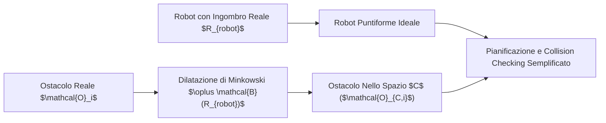
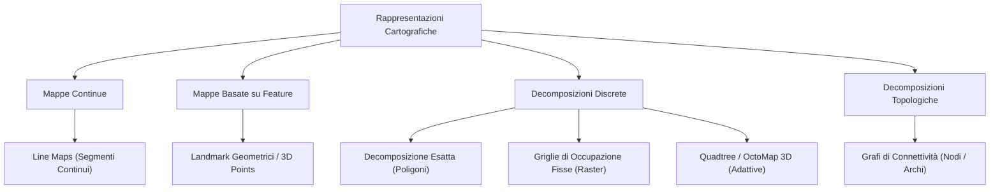
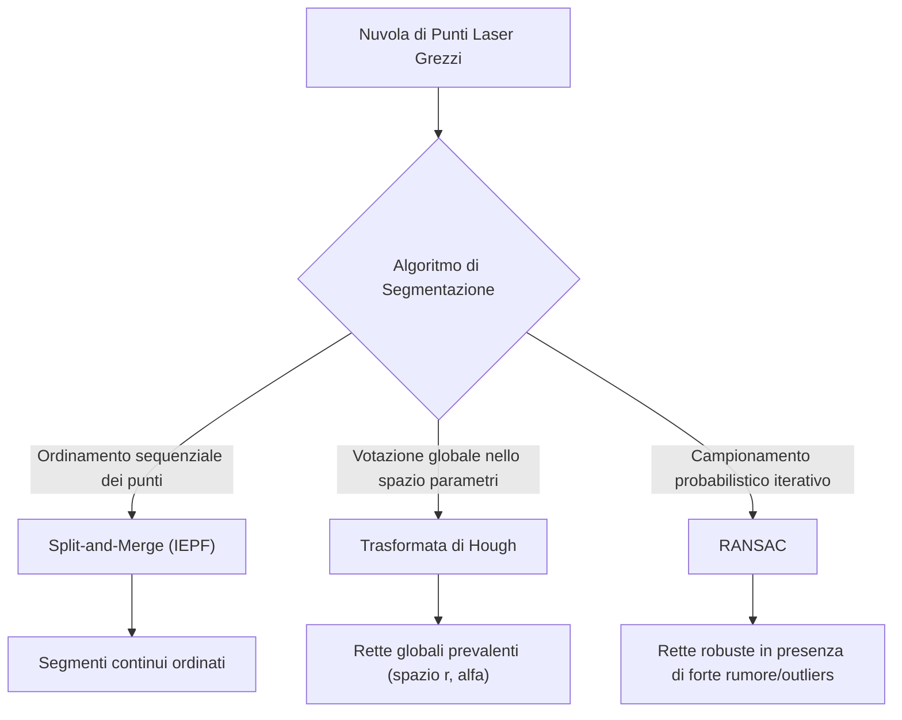
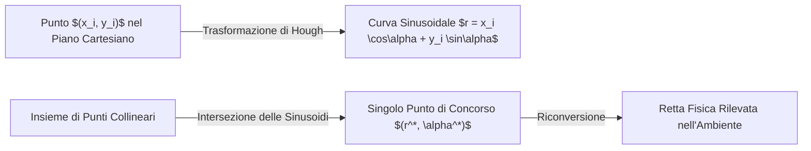
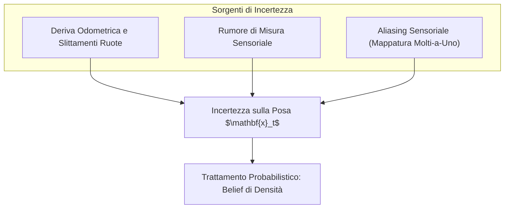
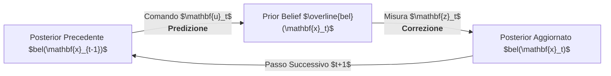

# Indice

- [[#0. Modelli Cinematici E Di Movimento|0. Modelli Cinematici E Di Movimento]]
	- [[#0. Modelli Cinematici E Di Movimento#Problemi Chiave Nella Robotica Autonoma|Problemi Chiave Nella Robotica Autonoma]]
	- [[#0. Modelli Cinematici E Di Movimento#Robot Su Ruote E Il Modello Del Disco|Robot Su Ruote E Il Modello Del Disco]]
	- [[#0. Modelli Cinematici E Di Movimento#Ipotesi Teoriche Di Base|Ipotesi Teoriche Di Base]]
	- [[#0. Modelli Cinematici E Di Movimento#Classi Di Modelli Cinematici|Classi Di Modelli Cinematici]]
	- [[#0. Modelli Cinematici E Di Movimento#Modello Cinematico Continuo Del Differenziale|Modello Cinematico Continuo Del Differenziale]]
	- [[#0. Modelli Cinematici E Di Movimento#Discretizzazione Nel Dominio Digitale|Discretizzazione Nel Dominio Digitale]]
	- [[#0. Modelli Cinematici E Di Movimento#Velocity Motion Model (Integrazione Esatta Su Arco)|Velocity Motion Model (Integrazione Esatta Su Arco)]]
	- [[#0. Modelli Cinematici E Di Movimento#Limiti Dell'Odometria Ad Anello Aperto|Limiti Dell'Odometria Ad Anello Aperto]]
- [[#1. Modelli Di Movimento Stocastici|1. Modelli Di Movimento Stocastici]]
	- [[#1. Modelli Di Movimento Stocastici#Dalla Cinematica Deterministica Ai Modelli Stocastici|Dalla Cinematica Deterministica Ai Modelli Stocastici]]
	- [[#1. Modelli Di Movimento Stocastici#Calcolo Delle Distribuzioni Vs Campionamento (Sampling)|Calcolo Delle Distribuzioni Vs Campionamento (Sampling)]]
	- [[#1. Modelli Di Movimento Stocastici#Propagazione Dell'Incertezza E Linearizzazione Di Taylor|Propagazione Dell'Incertezza E Linearizzazione Di Taylor]]
	- [[#1. Modelli Di Movimento Stocastici#Modellazione Dell'Incertezza Nei Modelli Cinematici|Modellazione Dell'Incertezza Nei Modelli Cinematici]]
	- [[#1. Modelli Di Movimento Stocastici#Il Terzo Parametro Di Rotazione ($\gamma$)|Il Terzo Parametro Di Rotazione ($\gamma$)]]
	- [[#1. Modelli Di Movimento Stocastici#Velocity Motion Model Stocastico Completo|Velocity Motion Model Stocastico Completo]]
	- [[#1. Modelli Di Movimento Stocastici#Campionamento Con Modelli Eulero E Runge-Kutta 2|Campionamento Con Modelli Eulero E Runge-Kutta 2]]
	- [[#1. Modelli Di Movimento Stocastici#Analisi Degli Scatter Plot: L'Effetto Delle Varianze|Analisi Degli Scatter Plot: L'Effetto Delle Varianze]]
	- [[#1. Modelli Di Movimento Stocastici#Configurazione Di AMCL In ROS E Modelli Di Movimento|Configurazione Di AMCL In ROS E Modelli Di Movimento]]
- [[#2. Sensori per la Robotica Mobile|2. Sensori per la Robotica Mobile]]
	- [[#2. Sensori per la Robotica Mobile#Il Ruolo Cruciale Della Percezione Nella Robotica Mobile|Il Ruolo Cruciale Della Percezione Nella Robotica Mobile]]
	- [[#2. Sensori per la Robotica Mobile#Tassonomia E Classificazione Dei Sensori|Tassonomia E Classificazione Dei Sensori]]
	- [[#2. Sensori per la Robotica Mobile#Encoder Ottici E Odometria Di Bordo|Encoder Ottici E Odometria Di Bordo]]
	- [[#2. Sensori per la Robotica Mobile#Unità Di Misura Inerziale (IMU)|Unità Di Misura Inerziale (IMU)]]
	- [[#2. Sensori per la Robotica Mobile#Sensori Di Distanza A Tempo Di Volo: Laser Scanner E LiDAR|Sensori Di Distanza A Tempo Di Volo: Laser Scanner E LiDAR]]
	- [[#2. Sensori per la Robotica Mobile#Visione Artificiale E Il Modello Prospettico|Visione Artificiale E Il Modello Prospettico]]
	- [[#2. Sensori per la Robotica Mobile#Sistemi Di Riferimento Basati Su Beacon E GNSS/GPS|Sistemi Di Riferimento Basati Su Beacon E GNSS/GPS]]
	- [[#2. Sensori per la Robotica Mobile#Appendice: Caratteristiche Metrologiche E Sensori Fisici|Appendice: Caratteristiche Metrologiche E Sensori Fisici]]
	- [[#2. Sensori per la Robotica Mobile#Riepilogo Concettuale E Collegamenti|Riepilogo Concettuale E Collegamenti]]
- [[#3. Rappresentazione dell'Ambiente Ed Estrazione Di Feature|3. Rappresentazione dell'Ambiente Ed Estrazione Di Feature]]
	- [[#3. Rappresentazione dell'Ambiente Ed Estrazione Di Feature#Inquadramento Geometrico E Spazio Delle Configurazioni|Inquadramento Geometrico E Spazio Delle Configurazioni]]
	- [[#3. Rappresentazione dell'Ambiente Ed Estrazione Di Feature#Tassonomia Delle Rappresentazioni Cartografiche|Tassonomia Delle Rappresentazioni Cartografiche]]
	- [[#3. Rappresentazione dell'Ambiente Ed Estrazione Di Feature#Estrazione Di Linee Da Dati Di Distanza (Line Extraction from Range Data)|Estrazione Di Linee Da Dati Di Distanza (Line Extraction from Range Data)]]
	- [[#3. Rappresentazione dell'Ambiente Ed Estrazione Di Feature#Modello Geometrico Di Retta E Line Fitting|Modello Geometrico Di Retta E Line Fitting]]
	- [[#3. Rappresentazione dell'Ambiente Ed Estrazione Di Feature#Algoritmi Di Segmentazione|Algoritmi Di Segmentazione]]
	- [[#3. Rappresentazione dell'Ambiente Ed Estrazione Di Feature#Tabella Comparativa Degli Algoritmi Di Segmentazione|Tabella Comparativa Degli Algoritmi Di Segmentazione]]
- [[#4. Localizzazione E Filtri Di Bayes|4. Localizzazione E Filtri Di Bayes]]
	- [[#4. Localizzazione E Filtri Di Bayes#Dalla Localizzazione Deterministica Alla Stima Stocastica|Dalla Localizzazione Deterministica Alla Stima Stocastica]]
	- [[#4. Localizzazione E Filtri Di Bayes#Rappresentazione Del Belief (Stato Di Conoscenza)|Rappresentazione Del Belief (Stato Di Conoscenza)]]
	- [[#4. Localizzazione E Filtri Di Bayes#Modelli Di Markov Nascosti (HMM) E Proprietà Di Markov|Modelli Di Markov Nascosti (HMM) E Proprietà Di Markov]]
	- [[#4. Localizzazione E Filtri Di Bayes#Algoritmo Del Filtro Di Bayes Ricorsivo|Algoritmo Del Filtro Di Bayes Ricorsivo]]
	- [[#4. Localizzazione E Filtri Di Bayes#Esempio Didattico Dettagliato: La Porta Di Thrun|Esempio Didattico Dettagliato: La Porta Di Thrun]]
	- [[#4. Localizzazione E Filtri Di Bayes#Dimostrazione Formale Del Filtro Di Bayes per Induzione|Dimostrazione Formale Del Filtro Di Bayes per Induzione]]
	- [[#4. Localizzazione E Filtri Di Bayes#Limiti dell'Ipotesi Di Markov E Verso I Filtri Gaussiani|Limiti dell'Ipotesi Di Markov E Verso I Filtri Gaussiani]]
- [[#Zz. Argomenti Extra|Zz. Argomenti Extra]]
	- [[#Zz. Argomenti Extra#Metodi Di Integrazione ODE (Eulero, RK2, RK4)|Metodi Di Integrazione ODE (Eulero, RK2, RK4)]]
	- [[#Zz. Argomenti Extra#Derivazione Analitica Del Drift Quadratico Nelle IMU|Derivazione Analitica Del Drift Quadratico Nelle IMU]]
	- [[#Zz. Argomenti Extra#Geometria Della Visione Stereoscopica|Geometria Della Visione Stereoscopica]]
	- [[#Zz. Argomenti Extra#Modellistica Dello Pseudorange Nei Sistemi GNSS / GPS|Modellistica Dello Pseudorange Nei Sistemi GNSS / GPS]]
	- [[#Zz. Argomenti Extra#Parametri Metrologici Avanzati E Fisica Dei Sensori|Parametri Metrologici Avanzati E Fisica Dei Sensori]]
	- [[#Zz. Argomenti Extra#Derivazione Analitica Del Line Fitting (OLS E WLS) in Coordinate Polari|Derivazione Analitica Del Line Fitting (OLS E WLS) in Coordinate Polari]]

# 0. Modelli Cinematici E Di Movimento

Iniziamo a studiare i modelli di movimento per la robotica autonoma. In questo corso lavoreremo quasi esclusivamente con robot su ruote, anche se molti degli algoritmi che vedremo si possono applicare anche a droni o robot con zampe.

Un robot su ruote non può muoversi liberamente in qualsiasi direzione: ha vincoli cinematici stringenti. Guidando un'auto sappiamo bene che non possiamo traslare lateralmente istantaneamente, ma con opportune manovre possiamo raggiungere qualsiasi posizione e orientamento nel parcheggio.

## Problemi Chiave Nella Robotica Autonoma

Un robot autonomo deve rispondere a tre domande fondamentali:
1. __Dove mi trovo?__: problema della __Localizzazione__ e dello __SLAM__ (con o senza mappa iniziale, indoor o outdoor).
2. __Come arrivo all'obiettivo?__: problema del __Planning__ (pianificazione geometrica di percorsi e traiettorie evitando ostacoli).
3. __Come mi muovo concretamente?__: problema del __Motion Control__ (tecniche di controllo in retroazione per inseguire la traiettoria).

Il percorso logico del corso segue proprio questa sequenza:

$$\text{Localizzazione / SLAM} \implies \text{Planning} \implies \text{Motion Control}$$

I modelli cinematici di movimento sono il punto di partenza: ci servono sia per pianificare come muoverci, sia per stimare la posizione del robot integrando i comandi nel tempo (odometria).

## Robot Su Ruote E Il Modello Del Disco

Per comprendere la cinematica di un veicolo su ruote, partiamo dal caso elementare di un disco che rotola su un piano orizzontale mantenendo il proprio piano sagittale (il piano verticale che contiene il disco):

![[slide_06_rolling_disk.png]]

Lo stato del sistema è descritto dalla __posa del robot__ $\mathbf{x}$, che rappresenta il vettore nello spazio di configurazione $\mathcal{C}$:

$$
\mathbf{x} = \begin{bmatrix} x \\ y \\ \theta \end{bmatrix}
$$

Dove $(x, y)$ sono le coordinate del punto di contatto sul piano cartesiano e $\theta$ è l'angolo di orientamento (imbardata) rispetto all'asse $x$.

>[!NOTE]
>Dal punto di vista geometrico formale, $\mathcal{C}$ è una varietà differenziabile e non un semplice spazio vettoriale, perché $\theta$ è una coordinata angolare periodica ($\theta \in S^1$). Lavorando su traiettorie nel piano 2D possiamo comunque trattarla con la terminologia degli spazi vettoriali; la distinzione diventa cruciale quando si lavora in 3D con orientamenti nello spazio.

### Vincolo Non-Olonomo E Segnali Di Ingresso

Il disco è soggetto a un __vincolo non-olonomo__: in assenza di slittamento, la velocità del punto di contatto con il suolo ha componente identicamente nulla nella direzione perpendicolare al piano sagittale. In altre parole, il disco può avanzare o ruotare, ma non può traslare istantaneamente di lato.

Un modello cinematico mette in relazione la variazione della posa con i segnali di comando in ingresso. Per il disco rotolante gli ingressi di controllo sono:
- $v$: velocità lineare di traslazione nel piano sagittale (avanti / indietro).
- $\omega$: velocità angolare attorno all'asse verticale (rotazione / imbardata $\dot{\theta}$).

In questa fase non consideriamo forze, masse o coppie motrici: ci muoviamo nel campo della cinematica pura, dove assumiamo di poter imporre direttamente le velocità desiderate.

## Ipotesi Teoriche Di Base

Per definire modelli cinematici analitici trattabili formuliamo alcune ipotesi ideali sul contatto ruota-suolo:

![[slide_13_pure_rolling_wheel_contact.png]]

- Moto confinato su una superficie perfettamente piana.
- Ruote rigide e indeformabili con contatto puntiforme con il terreno.
- Condizione di puro rotolamento (_pure rolling_): velocità nulla nel punto di contatto istantaneo.
- Assenza di fenomeni di slittamento laterale (_no skidding_).
- Assenza di attrito rispetto alla rotazione attorno al punto di contatto verticale.
- Assi di sterzo perfettamente ortogonali al piano di movimento.
- Ruote vincolate tra loro da un telaio rigido (_chassis_).

>[!IMPORTANT]
>Nel mondo reale nessuna di queste ipotesi ideali è verificata alla perfezione: gli pneumatici si deformano, il terreno presenta asperità e durante le sterzate si generano inevitabili slittamenti. Per questo i modelli cinematici da soli non bastano a localizzare il robot ad anello aperto: forniscono una prima stima (odometria) che deve essere continuamente corretta tramite sensori esterni (LiDAR, telecamere, filtri di Kalman/Bayes).

## Classi Di Modelli Cinematici

I veicoli terrestri su ruote si raggruppano principalmente in tre famiglie costruttive:

### 1. Differential Drive (Unicycle)

È l'architettura classica dei robot mobili da laboratorio e dei robot aspirapolvere (es. Roomba): due ruote motrici indipendenti montate su un asse comune e una o due ruote folli (_castor wheels_) passive per garantire stabilità:
- Posa: $\mathbf{x} = [x, y, \theta]^T$
- Segnale di controllo: $\mathbf{u} = [v, \omega]^T$ (velocità lineare e velocità angolare)

![[slide_07_differential_steering_unicycle_model.png]]

![[slide_07_differential_drive_robots.png]]

### 2. Skid-Steering

Comune nei robot cingolati, nelle ruspe compatte (tipo Bobcat) e nei rover da esplorazione: ha ruote o cingoli a orientamento fisso. Per curvare si applicano velocità diverse ai lati destro e sinistro, forzando le ruote a slittare lateralmente sul suolo:
- Posa: $\mathbf{x} = [x, y, \theta]^T$
- Segnale di controllo: $\mathbf{u} = [v, \omega]^T$

![[slide_08_skid_steering_model.png]]

![[slide_08_skid_steering_vehicles.png]]

### 3. Ackermann Steering (Car-Like)

È lo schema cinematico delle automobili e delle biciclette: ruote posteriori di trazione fisse e ruote anteriori sterzanti azionate da un quadrilatero articolato che evita lo strisciamento in curva:
- Posa: $\mathbf{x} = [x, y, \theta, \psi]^T$, dove $\psi$ indica l'angolo di sterzo delle ruote anteriori.
- Segnale di controllo: $\mathbf{u} = [v, \omega]^T$ (velocità longitudinale e velocità di variazione dello sterzo).

![[slide_09_ackermann_turning_radius.png]]

![[slide_09_bicycle_model_kinematics.png]]

![[slide_09_ackermann_mechanism_3d.png]]

![[slide_09_formula1_car.png]]

>[!NOTE]
>Nel seguito ci concentreremo quasi esclusivamente sul modello a guida differenziale (unicycle), che costituisce lo standard de facto anche nel middleware ROS (dove le velocità vengono scambiate sul topic `/cmd_vel`).

## Modello Cinematico Continuo Del Differenziale

Fissiamo una terna di riferimento cartesiana fissa inerziale nel mondo (_space frame_) e una terna solidale al telaio del robot (_body frame_):

![[slide_12_unicycle_frames_kinematics.png]]

La posa e il comando di controllo sono:

$$
\mathbf{x} = \begin{bmatrix} x \\ y \\ \theta \end{bmatrix}, \qquad \mathbf{u} = \begin{bmatrix} v \\ \omega \end{bmatrix}
$$

Proiettando la velocità lineare $v$ lungo gli assi cartesiani dello space frame otteniamo il sistema di equazioni differenziali ordinarie (ODE) del primo ordine:

$$
\begin{cases}
\dot{x} = v \cos\theta \\
\dot{y} = v \sin\theta \\
\dot{\theta} = \omega
\end{cases}
$$

Conoscendo la posa iniziale $\mathbf{x}_0$ e la storia temporale dei comandi $\mathbf{u}(t) = [v(t), \omega(t)]^T$, integrando queste equazioni nel tempo possiamo ricostruire la traiettoria percorsa dal robot nel piano:

![[slide_14_scaramuzza_trajectory_path.png]]

## Discretizzazione Nel Dominio Digitale

A bordo del robot le decisioni vengono calcolate da un computer a intervalli temporali discreti $T$ (periodo di campionamento costante).

Tra un istante di campionamento e il successivo i segnali di controllo sono tenuti costanti da un circuito di tenuta ad ordine zero (_zero-order hold_). Vogliamo quindi determinare una formula ricorsiva che aggiorni la posa:

$$
\mathbf{x}_{t+1} = f(\mathbf{x}_t, \mathbf{u}_t, T)
$$

![[slide_14_pose_trajectory_discrete_simulation.png]]

### Metodo Di Eulero Esplicito

Il metodo di Eulero approssima la derivata con il rapporto incrementale in avanti, calcolando la velocità all'inizio dell'intervallo temporale ($\theta_t$ costante su tutto il passo):

$$
\begin{cases}
x_{t+1} = x_t + v_t T \cos\theta_t \\[6pt]
y_{t+1} = y_t + v_t T \sin\theta_t \\[6pt]
\theta_{t+1} = \theta_t + \omega_t T
\end{cases}
$$

Questo metodo assume che il robot si muova lungo la tangente alla curva calcolata all'istante iniziale. È molto rapido, ma se il passo $T$ non è piccolissimo tende a tagliare le curve e ad accumulare rapidamente errore.

```python
def euler(p, v, w, T):
    x, y, th = p
    xn = x + v * T * np.cos(th)
    yn = y + v * T * np.sin(th)
    thn = th + w * T
    return np.array([xn, yn, thn])
```

### Metodo Di Runge-Kutta Al Secondo Ordine (RK-2)

Per ottenere una traiettoria più fedele possiamo usare il metodo di Runge-Kutta al secondo ordine (metodo del punto medio / midpoint).

Invece di proiettare la velocità sull'orientamento iniziale $\theta_t$, valutiamo la direzione a metà dell'intervallo di tempo, ruotando l'angolo di metà dell'incremento angolare complessivo ($\theta_t + \frac{\omega_t T}{2}$):

$$
\begin{cases}
x_{t+1} = x_t + v_t T \cos\left(\theta_t + \dfrac{\omega_t T}{2}\right) \\[8pt]
y_{t+1} = y_t + v_t T \sin\left(\theta_t + \dfrac{\omega_t T}{2}\right) \\[8pt]
\theta_{t+1} = \theta_t + \omega_t T
\end{cases}
$$

In questo modo la corda approssima molto meglio l'arco reale di traiettoria percorso dal veicolo:

```python
def runge_kutta(p, v, w, T):
    x, y, th = p
    th_mid = th + 0.5 * w * T
    xn = x + v * T * np.cos(th_mid)
    yn = y + v * T * np.sin(th_mid)
    thn = th + w * T
    return np.array([xn, yn, thn])
```

## Velocity Motion Model (Integrazione Esatta Su Arco)

Eulero e Runge-Kutta sono schemi numerici approssimati. Se però assumiamo che i comandi di velocità $v$ e $\omega$ siano __rigorosamente costanti__ durante il periodo di controllo $T$, il moto del robot differenziale non deve essere approssimato: si muove esattamente lungo un __arco di circonferenza__.

![[slide_18_velocity_motion_model_circle_arc.png]]

Dal moto circolare uniforme sappiamo che il raggio dell'arco di traiettoria è dato da:

$$
r = \frac{v}{\omega} \quad (\text{poiché } v = \omega r)
$$

### Posizione Del Centro Di Rotazione Istantaneo (ICR)

Dato il robot nella posa corrente $\langle x, y, \theta \rangle$, il raggio vettore che dal centro di rotazione $\langle x_c, y_c \rangle$ punta verso il robot forma un angolo polare pari a $\theta - 90^\circ$ rispetto all'orizzontale:

$$
\begin{bmatrix} x \\ y \end{bmatrix} = \begin{bmatrix} x_c \\ y_c \end{bmatrix} + r \begin{bmatrix} \cos(\theta - 90^\circ) \\ \sin(\theta - 90^\circ) \end{bmatrix}
$$

Isolando le coordinate del centro $\langle x_c, y_c \rangle$:

$$
x_c = x - r \cos(\theta - 90^\circ) = x - \frac{v}{\omega} \sin\theta
$$

$$
y_c = y - r \sin(\theta - 90^\circ) = y - \left(-\frac{v}{\omega}\cos\theta\right) = y + \frac{v}{\omega} \cos\theta
$$

>[!NOTE]
>Ricordando l'identità goniometrica $\sin(\theta - 90^\circ) = -\cos\theta$, il segno negativo della proiezione all'indietro si compensa con il segno meno del coseno, restituendo correttamente $+ \frac{v}{\omega}\cos\theta$.

### Posa A Fine Intervallo

Durante l'intervallo temporale $T$, il robot ruota attorno al centro di un angolo $\Delta\theta = \omega T$. L'angolo della congiungente centro-robot diventa quindi $(\theta - 90^\circ) + \omega T = (\theta + \omega T) - 90^\circ$. La posa finale $\langle x', y', \theta' \rangle$ è:

$$
x' = x_c + r \cos((\theta + \omega T) - 90^\circ) = x_c + \frac{v}{\omega} \sin(\theta + \omega T)
$$

$$
y' = y_c + r \sin((\theta + \omega T) - 90^\circ) = y_c - \frac{v}{\omega} \cos(\theta + \omega T)
$$

$$
\theta' = \theta + \omega T
$$

Sostituendo le coordinate del centro $(x_c, y_c)$ otteniamo il __Velocity Motion Model__:

$$
\begin{cases}
x_t = x_{t-1} - \dfrac{v_t}{\omega_t} \sin\theta_{t-1} + \dfrac{v_t}{\omega_t} \sin(\theta_{t-1} + \omega_t T) \\[8pt]
y_t = y_{t-1} + \dfrac{v_t}{\omega_t} \cos\theta_{t-1} - \dfrac{v_t}{\omega_t} \cos(\theta_{t-1} + \omega_t T) \\[8pt]
\theta_t = \theta_{t-1} + \omega_t T
\end{cases}
$$

A differenza di Runge-Kutta che proietta in avanti da $t$ a $t+1$, questo modello viene tipicamente formulato a ritroso per calcolare la posa presente all'istante $t$ a partire dalla posa al passo precedente $t-1$ e dai comandi applicati $(v_t, \omega_t)$.

>[!NOTE] Caso Di Moto Rettilineo $(\omega = 0)$
>Se il robot va dritto ($\omega = 0$), non possiamo dividere per zero. In tal caso l'arco collassa in un segmento retto percorso a velocità costante:
>
>$$x_t = x_{t-1} + v_t T \cos\theta_{t-1}$$
>
>$$y_t = y_{t-1} + v_t T \sin\theta_{t-1}$$
>
>$$\theta_t = \theta_{t-1}$$

L'implementazione Python gestisce la soglia singolare tramite un controllo su $\omega$:

```python
def velocity_motion_model(p, v, w, T, eps=1e-9):
    x, y, th = p
    if abs(w) < eps:
        xn = x + v * T * np.cos(th)
        yn = y + v * T * np.sin(th)
        thn = th
    else:
        r = v / w
        thn = th + w * T
        xn = x - r * np.sin(th) + r * np.sin(thn)
        yn = y + r * np.cos(th) - r * np.cos(thn)
    return np.array([xn, yn, thn])
```

## Limiti Dell'Odometria Ad Anello Aperto

Tutti i modelli visti finora sono __deterministici__: stimano la posa basandosi unicamente su grandezze propriocettive (i comandi inviati ai motori o le letture degli encoder alle ruote).

Possiamo affidarci a questi modelli per risolvere da soli il problema della localizzazione? No, per via di sorgenti di errore inevitabili:
- __Errori sistematici__: disallineamento meccanico delle ruote, raggio effettivo leggermente diverso tra ruota destra e sinistra, incertezza sulla reale carreggiata del telaio.
- __Errori non sistematici (stocastici)__: slittamento su pavimenti lisci o tappeti, dislivelli e ostacoli imprevisti, accumulo di giochi negli ingranaggi.

Integrando nel tempo ad anello aperto, questi piccoli errori si sommano a ogni passo: l'odometria inevitabilmente __deriva__ (_drift_), e la posa stimata divergerà da quella reale.

Per questo motivo, la cinematica e l'odometria costituiscono il modello di previsione temporale, ma per mantenere la stima accurata dovremo fondere le misure dei sensori esterocettivi (LiDAR, videocamere, sonar) all'interno di filtri di stima stocastici come i filtri di Bayes, l'Extended Kalman Filter (EKF) e gli algoritmi di SLAM.


# 1. Modelli Di Movimento Stocastici

Nel capitolo precedente [[0. Modelli Cinematici e di Movimento|0. Modelli Cinematici e di Movimento]] abbiamo ricavato i modelli cinematici assumendo che il moto del robot fosse perfettamente deterministico: date le velocità $v$ e $\omega$, applicando il modello calcoliamo esattamente dove andrà a finire il veicolo.

Nella realtà operativa dei robot fisici questa certezza svanisce:
- Le ruote slittano impercettibilmente sull'asfalto o sui pavimenti lisci.
- Il raggio effettivo delle ruote non è mai identico al millimetro tra destra e sinistra.
- Gli encoder hanno risoluzione finita e i motori non erogano istantaneamente la velocità richiesta.

Se continuiamo a usare un modello deterministico, l'errore di odometria si accumula a ogni passo provocando una rapida deriva della posa stimata. Per gestire questa incertezza dobbiamo passare a una trattazione rigorosamente __stocastica__.

## Dalla Cinematica Deterministica Ai Modelli Stocastici

Nei modelli deterministici la transizione della posa da un passo al successivo ha la forma:

$$
\mathbf{x}_t = f(\mathbf{x}_{t-1}, \mathbf{u}_t)
$$

Nel contesto stocastico incorporiamo esplicitamente l'incertezza introducendo una variabile aleatoria multivariata $\boldsymbol{\epsilon}_t$:

$$
\mathbf{x}_t = f(\mathbf{x}_{t-1}, \mathbf{u}_t, \boldsymbol{\epsilon}_t)
$$

Il nuovo stato $\mathbf{x}_t$ non è più un valore deterministico singolo, ma una variabile aleatoria distribuita secondo una densità di probabilità condizionata:

$$
p(\mathbf{x}_t \mid \mathbf{x}_{t-1}, \mathbf{u}_t)
$$

Questa densità prende il nome di __probabilità di transizione di stato__ (_state transition probability_) e descrive quanto sia probabile trovarsi nella posa $\mathbf{x}_t$ avendo applicato il comando $\mathbf{u}_t$ a partire dalla posa precedente $\mathbf{x}_{t-1}$.

Lo stesso approccio si applica alle misure raccolte dai sensori esterocettivi (laser scanner, sonar, fotocamere): se indichiamo con $\mathbf{z}_t$ la misura rilevata al tempo $t$, la relazione con la posa reale è descritta dalla densità di verosimiglianza:

$$
p(\mathbf{z}_t \mid \mathbf{x}_t)
$$

Queste due funzioni di densità costituiscono le colonne portanti della localizzazione probabilistica e dei filtri di Bayes.

## Calcolo Delle Distribuzioni Vs Campionamento (Sampling)

Quando manipoliamo densità di probabilità in robotica ci troviamo costantemente davanti a due operazioni concettualmente opposte:

![[slide_07_distribution_vs_sampling.png|center big]]

### 1. Calcolo Della Distribuzione (Distribution Computation)

Dato un valore specifico della variabile aleatoria (una realizzazione $x$), vogliamo calcolare il corrispondente valore di densità di probabilità:

$$x \implies p(x)$$

Nel grafico a sinistra entriamo con il valore $x$ sull'asse delle ascisse e risaliamo verticalmente fino alla curva per leggere la probabilità sull'asse delle ordinate.

Questa operazione serve quando dobbiamo valutare la plausibilità di una transizione o calcolare la verosimiglianza di una misura (ad esempio nei filtri a griglia discreta o nella fase di correzione dei filtri bayesiani).

### 2. Campionamento (Sampling)

Data una funzione di densità di probabilità, vogliamo generare numericamente una o più realizzazioni concrete (campioni o particelle) che rispettino quella distribuzione:

$$p(x) \implies x^{(i)} \sim p(x)$$

Il grafico a destra rappresenta una classica metafora visiva (introdotta nelle lezioni di Wolfram Burgard e Cyrill Stachniss) che illustra il campionamento come "problema inverso" rispetto alla valutazione della densità: partire dal dominio probabilistico per scendere a un valore di posa $x$.

>[!NOTE] Precisazione Matematica Sul Sampling Per Inversione
>A livello matematico rigoroso, __non è possibile campionare una densità invertendo direttamente la PDF $p(x)$__: la densità non è monotona, non è biunivoca (un valore di $p(x)$ corrisponde in genere a più valori di $x$) e può superare il valore 1.
>Il campionamento per inversione esatto (_Inverse Transform Sampling_) richiede di invertire la __funzione di ripartizione cumulativa (CDF)__:
>
>$$F(x) = P(X \le x) = \int_{-\infty}^x p(t)\,dt$$

>Estraendo un numero casuale uniforme $u \sim \mathcal{U}(0, 1)$, il campione è dato da $x = F^{-1}(u)$. Quando la CDF non è nota o invertibile analiticamente, si ricorre a tecniche come il campionamento per rigetto (_Rejection Sampling_), a metodi Monte Carlo (MCMC, Importance Sampling) o a generatori dedicati per distribuzioni note (come Box-Muller o somme di uniformi per le gaussiane).

Il sampling è l'operazione fondamentale degli algoritmi Monte Carlo e del Particle Filter (AMCL), dove rappresentiamo lo stato incerto del robot mediante una nube di particelle generate campionando ripetutamente dal modello di movimento stocastico.

### Esempio Scalare Lineare

Per capire la dualità tra le due operazioni, consideriamo un modello scalare unidimensionale con rumore gaussiano additivo a media nulla:

$$
x_t = x_{t-1} + u_x + \nu_x, \qquad \nu_x \sim \mathcal{N}(0, \sigma_x^2)
$$

1. __Per calcolare la probabilità__ di una transizione osservata $(x_t, x_{t-1}, u_x)$, isoliamo il rumore invertendo il modello:

   $$\nu_x = x_t - (x_{t-1} + u_x)$$

   E valutiamo la densità normale standard:

   $$p(x_t \mid x_{t-1}, u_x) = \frac{1}{\sqrt{2\pi \sigma_x^2}} \exp\left(-\frac{1}{2}\frac{\nu_x^2}{\sigma_x^2}\right)$$

2. __Per fare sampling__, estraiamo un campione di disturbo $\nu_x$ dalla distribuzione $\mathcal{N}(0, \sigma_x^2)$ e calcoliamo direttamente il nuovo stato:

   $$x_t = x_{t-1} + u_x + \nu_x$$

In sintesi: il modello diretto genera i campioni, mentre il modello inverso (risolto rispetto al rumore) permette di calcolare le probabilità.

## Propagazione Dell'Incertezza E Linearizzazione Di Taylor

Quando una variabile aleatoria attraversa una funzione di stato, come cambia la sua dispersione (matrice di covarianza)?

### Caso Lineare Esatto

Se la relazione tra le variabili aleatorie multivariate $X$ e $Y$ è puramente lineare:

$$
Y = A X
$$

La matrice di covarianza $C_Y$ si propaga in forma chiusa __esatta senza alcuna approssimazione__:

$$
C_Y = A C_X A^T
$$

Se è presente un termine di disturbo additivo indipendente $V$ con covarianza $C_V$ ($Y = A X + V$), per l'indipendenza statistica la covarianza totale diventa la somma:

$$
C_Y = A C_X A^T + C_V
$$

### Caso Non Lineare Generale

Nei robot mobili le relazioni cinematiche contengono funzioni trigonometriche ($\cos\theta, \sin\theta$) e sono intrinsecamente non lineari:

$$
Y = f(X)
$$

Non possiamo trasformare la covarianza in modo analitico esatto. Dobbiamo approssimare la funzione non lineare $f(X)$ sviluppandola in serie di Taylor al primo ordine attorno al valore atteso $\mu = E[X]$:

![[slide_10_uncertainty_propagation_scalar_linearization.png|center mid]]

$$
f(X) \approx f(\mu) + F_X (X - \mu)
$$

Dove $F_X$ è la __matrice Jacobiana__ delle derivate parziali calcolata nel punto di lavoro $\mu$:

$$
F_X = \left. \frac{\partial f}{\partial X} \right|_{X=\mu}
$$

Sostituendo l'approssimazione lineare otteniamo la matrice di covarianza propagata:

$$
C_Y \approx F_X C_X F_X^T
$$

Nel grafico scalare vediamo chiaramente l'effetto geometrico: la distribuzione gaussiana rossa su $X$ viene proiettata sulla retta tangente in $\mu_x$ per generare la distribuzione gaussiana verde su $Y$. Questa linearizzazione locale è il fondamento matematico dell'__Extended Kalman Filter (EKF)__.

## Modellazione Dell'Incertezza Nei Modelli Cinematici

Come introduciamo il rumore nei modelli cinematici del robot mobile?

Un errore ingenuo consisterebbe nell'aggiungere rumore bianco direttamente sulle coordinate cartesiane $[\epsilon_x, \epsilon_y, \epsilon_\theta]$. Ma nella realtà fisica gli errori non nascono dal nulla nelle coordinate del mondo: nascono dagli attuatori e dal contatto delle ruote con il suolo.

Se il robot è fermo, la sua posizione non deve accumulare incertezza di movimento! L'approccio corretto consiste nel modellare il disturbo sui __comandi di velocità__ inviati ai motori:

$$
\begin{bmatrix} \hat{v} \\ \hat{\omega} \end{bmatrix} = 
\begin{bmatrix} v \\ \omega \end{bmatrix} + 
\begin{bmatrix} \epsilon_{\sigma_v^2} \\ \epsilon_{\sigma_\omega^2} \end{bmatrix}
$$

Dove $\epsilon_{\sigma^2}$ sono variabili casuali a media nulla con varianza $\sigma^2$.

### Parametrizzazione Delle Varianze

Nel modello probabilistico classico di Thrun, Burgard e Fox la varianza del rumore cresce con l'intensità delle velocità comandate: più il robot va veloce o curva bruscamente, maggiore è l'incertezza generata:

$$
\sigma_v^2 = \alpha_1 v^2 + \alpha_2 \omega^2
$$

$$
\sigma_\omega^2 = \alpha_3 v^2 + \alpha_4 \omega^2
$$

I parametri $\alpha_1, \alpha_2, \alpha_3, \alpha_4 \ge 0$ sono costanti caratteristiche del robot che ne quantificano l'accuratezza cinematica:
- $\alpha_1$: incertezza sulla velocità lineare causata dalla traslazione stessa.
- $\alpha_2$: incertezza sulla velocità lineare causata dalla rotazione.
- $\alpha_3$: incertezza sulla velocità angolare causata dalla traslazione.
- $\alpha_4$: incertezza sulla velocità angolare causata dalla rotazione.

In alcune formulazioni alternative le varianze vengono scalate con i valori assoluti ($\sigma_v^2 = \alpha_1 |v| + \alpha_2 |\omega|$), ma la forma quadratica è quella standard.

## Il Terzo Parametro Di Rotazione ($\gamma$)

Analizzando il modello precedente notiamo un limite geometrico critico: abbiamo 2 parametri di disturbo ($\sigma_v^2, \sigma_\omega^2$) per modellare l'incertezza su 3 variabili di posa $(x, y, \theta)$.

Questo vincola l'orientamento $\theta$ a dipendere rigidamente dall'arco di cerchio percorso: l'incertezza rimane confinata su una varietà bidimensionale nello spazio 3D delle configurazioni.

Nella realtà delle piattaforme robotiche si verificano scivolamenti indipendenti sull'orientamento finale dovuti a piccole irregolarità del terreno o all'attrito delle ruote folli. Per catturare questa libertà si introduce una terza variabile casuale additiva $\hat{\gamma}$:

$$
\hat{\theta} = \theta + \hat{\omega} T + \hat{\gamma} T, \qquad \hat{\gamma} \sim \epsilon_{\sigma_\gamma^2}
$$

Con varianza dipendente anch'essa dai comandi applicati:

$$
\sigma_\gamma^2 = \alpha_5 v^2 + \alpha_6 \omega^2
$$

Otteniamo così il set completo di 6 parametri costruttivi $(\alpha_1, \alpha_2, \alpha_3, \alpha_4, \alpha_5, \alpha_6)$.

## Velocity Motion Model Stocastico Completo

Combinando le velocità rumorose con l'integrazione su arco di cerchio vista nella [[0. Modelli Cinematici e di Movimento#Velocity Motion Model (Integrazione Esatta Su Arco)|Lezione 0]], otteniamo la formulazione stocastica completa del Velocity Motion Model:

$$
\begin{bmatrix} x_t \\ y_t \\ \theta_t \end{bmatrix} = 
\begin{bmatrix} x_{t-1} \\ y_{t-1} \\ \theta_{t-1} \end{bmatrix} + 
\begin{bmatrix} 
-\dfrac{\hat{v}}{\hat{\omega}} \sin\theta_{t-1} + \dfrac{\hat{v}}{\hat{\omega}} \sin(\theta_{t-1} + \hat{\omega} T) \\[8pt]
\dfrac{\hat{v}}{\hat{\omega}} \cos\theta_{t-1} - \dfrac{\hat{v}}{\hat{\omega}} \cos(\theta_{t-1} + \hat{\omega} T) \\[8pt]
\hat{\omega} T + \hat{\gamma} T
\end{bmatrix}
$$

I comandi rumorosi generati a ogni iterazione sono:

$$
\begin{bmatrix} \hat{v} \\ \hat{\omega} \\ \hat{\gamma} \end{bmatrix} = 
\begin{bmatrix} 
v + \epsilon_{\alpha_1 v^2 + \alpha_2 \omega^2} \\
\omega + \epsilon_{\alpha_3 v^2 + \alpha_4 \omega^2} \\
\epsilon_{\alpha_5 v^2 + \alpha_6 \omega^2}
\end{bmatrix}
$$

### Distribuzioni Di Campionamento Del Rumore

Per estrarre i campioni di rumore $\epsilon_{\sigma^2}$ possiamo impiegare due distribuzioni:

![[slide_18_normal_and_triangular_distributions.png|center mid]]

1. __Distribuzione Normale Gaussiana__:

   $$\epsilon_{\sigma^2}(x) = \frac{1}{\sqrt{2\pi \sigma^2}} \exp\left(-\frac{1}{2}\frac{x^2}{\sigma^2}\right)$$

   In sistemi embedded può essere approssimata sommando 12 variabili uniformi nel range $[-\sigma, \sigma]$ (grazie al teorema del limite centrale, $\sum_{i=1}^{12} \text{rand}(-\sigma, \sigma) / 2$).

2. __Distribuzione Triangolare__:

   $$\epsilon_{\sigma^2}(x) = \max\left(0, \; \frac{1}{\sqrt{6}\sigma} - \frac{|x|}{6\sigma^2}\right)$$

   Ha il vantaggio computazionale di avere supporto limitato $[-\sqrt{6}\sigma, \sqrt{6}\sigma]$: non genera campioni infinitamente lontani e si campiona velocemente con due sole variabili uniformi:

   $$\text{sample} = \frac{\sqrt{6}}{2} \left( \text{rand}(-\sigma, \sigma) + \text{rand}(-\sigma, \sigma) \right)$$

### Implementazione Dell'Algoritmo Di Campionamento

Ecco l'algoritmo completo in Python che calcola un nuovo campione di posa:

```python
import numpy as np

def sample_motion_model_velocity(x_prev, u, alpha, T):
    """Campiona una nuova posa secondo il Velocity Motion Model stocastico.
    
    x_prev: [x, y, theta] al tempo t-1
    u: [v, w] comandi nominali
    alpha: [a1, a2, a3, a4, a5, a6] parametri di rumore
    T: periodo di campionamento
    """
    x, y, th = x_prev
    v, w = u
    a1, a2, a3, a4, a5, a6 = alpha

    # Varianze del rumore proporzionali ai comandi
    var_v = a1 * v**2 + a2 * w**2
    var_w = a3 * v**2 + a4 * w**2
    var_g = a5 * v**2 + a6 * w**2

    # Campionamento dei comandi rumorosi (distribuzione normale)
    v_hat = v + np.random.normal(0.0, np.sqrt(max(var_v, 1e-12)))
    w_hat = w + np.random.normal(0.0, np.sqrt(max(var_w, 1e-12)))
    gamma_hat = np.random.normal(0.0, np.sqrt(max(var_g, 1e-12)))

    # Propagazione su arco di circonferenza
    if np.isclose(w_hat, 0.0):
        x_prime = x + v_hat * T * np.cos(th)
        y_prime = y + v_hat * T * np.sin(th)
        th_prime = th + gamma_hat * T
    else:
        r_hat = v_hat / w_hat
        x_prime = x - r_hat * np.sin(th) + r_hat * np.sin(th + w_hat * T)
        y_prime = y + r_hat * np.cos(th) - r_hat * np.cos(th + w_hat * T)
        th_prime = th + w_hat * T + gamma_hat * T

    return np.array([x_prime, y_prime, th_prime])
```

## Campionamento Con Modelli Eulero E Runge-Kutta 2

Lo stesso schema di rumore sui comandi $\hat{v}, \hat{\omega}, \hat{\gamma}$ si applica direttamente ai modelli discreti approssimati:

### Modello Di Eulero Stocastico

I comandi rumorosi vengono applicati lungo la direzione tangente iniziale $\theta$:

$$
\begin{cases}
x' = x + T \hat{v} \cos\theta \\
y' = y + T \hat{v} \sin\theta \\
\theta' = \theta + T \hat{\omega} + T \hat{\gamma}
\end{cases}
$$

### Modello Di Runge-Kutta 2 (Midpoint) Stocastico

La direzione viene valutata a metà del passo temporale ruotando dell'angolo intermedio:

$$
\begin{cases}
x' = x + T \hat{v} \cos\left(\theta + \dfrac{\hat{\omega} T}{2}\right) \\[8pt]
y' = y + T \hat{v} \sin\left(\theta + \dfrac{\hat{\omega} T}{2}\right) \\[8pt]
\theta' = \theta + T \hat{\omega} + T \hat{\gamma}
\end{cases}
$$

## Analisi Degli Scatter Plot: L'Effetto Delle Varianze

Cosa succede quando generiamo centinaia di campioni con il Velocity Motion Model variando i parametri di rumore?

![[slide_19_vmm_sampling_variances_grid.png|center full]]

I quattro grafici mettono a confronto la posa precedente (la crocetta blu al centro in $\langle 1, 1 \rangle$) con la nube di pose al passo successivo (i cerchietti rossi):

### 1. Varianze Bilanciate (Top-Left)

Quando le varianze su velocità lineare e angolare sono bilanciate ($\alpha$ comparabili), la nuvola di campioni assume una forma ellissoidale allungata lungo la traiettoria, con dispersione uniforme:

![[slide_19_sampling_equal_variances.png|center mid]]

### 2. Elevata Varianza Angolare $\omega$ (Top-Right): La "Banana Shape"

Quando la varianza sulla velocità angolare è elevata rispetto a quella traslazionale, la nube di pose si dispone lungo un arco di cerchio ben visibile, originando la celebre forma arcuata a banana (_banana-shaped distribution_):

![[slide_19_sampling_large_omega_variance.png|center mid]]

Poiché il raggio della traiettoria è $r = \hat{v}/\hat{\omega}$, piccole variazioni di $\hat{\omega}$ provocano grandi cambiamenti nel raggio di curvatura, curvando la distribuzione delle particelle nello spazio cartesiano. Questa non-gaussianità palese è la ragione principale per cui l'Extended Kalman Filter (che presuppone distribuzioni gaussiane) fatica su lunghe manovre curve, mentre il Particle Filter eccelle.

### 3. Bassa Varianza Angolare $\omega$ (Bottom-Left)

Se la varianza su $\omega$ è quasi trascurabile rispetto a quella su $v$, il robot procede quasi in linea retta: i campioni collassano su una retta sottile allineata con l'avanzamento longitudinale:

![[slide_19_sampling_small_omega_variance.png|center mid]]

### 4. Elevata Varianza Su $\gamma$ (Bottom-Right)

Quando incrementiamo il terzo parametro $\gamma$, l'orientamento $\theta$ subisce oscillazioni casuali supplementari, allargando l'apertura angolare della nube di pose senza alterare la curvatura media della traiettoria:

![[slide_19_sampling_large_gamma_variance.png|center mid]]

## Configurazione Di AMCL In ROS E Modelli Di Movimento

Nei framework robotici reali come ROS1 e ROS2 (Nav2), il package di riferimento per la localizzazione probabilistica è __AMCL__ (_Adaptive Monte Carlo Localization_).

All'interno dei file di configurazione (`amcl.launch` in ROS1 o `amcl.yaml` in ROS2) troviamo i parametri di rumore dell'odometria:

```yaml
# Frammento configurazione Nav2 AMCL (ROS2)
amcl:
  ros__parameters:
    use_sim_time: false
    min_particles: 500
    max_particles: 2000
    
    # Parametri di rumore del modello di odometria
    alpha1: 0.2  # Errore di rotazione dovuto alla rotazione (rot -> rot)
    alpha2: 0.2  # Errore di rotazione dovuto alla traslazione (trans -> rot)
    alpha3: 0.2  # Errore di traslazione dovuto alla traslazione (trans -> trans)
    alpha4: 0.2  # Errore di traslazione dovuto alla rotazione (rot -> trans)
    alpha5: 0.1  # Rumore di traslazione laterale (solo robot omnidirezionali)
```

>[!IMPORTANT] Chiarimento Teorico: Velocity Model vs Odometry Model
>Spesso si genera confusione confrontando i parametri `alpha1`…`alpha4` di AMCL con le slide del __Velocity Motion Model__. È fondamentale chiarire che nel testo fondamentale _Probabilistic Robotics_ (Thrun, Burgard, Fox) coesistono __due modelli di movimento distinti__:
>
>1. __Velocity Motion Model (Capitolo 5.3)__:
>  - Si basa sui comandi nominali di velocità $\mathbf{u}_t = [v_t, \omega_t]^T$ inviati ai motori.
>   - Utilizza 6 parametri $(\alpha_1 \dots \alpha_6)$ dove $\alpha_1, \alpha_2$ pesano la varianza della velocità lineare $v$, $\alpha_3, \alpha_4$ la velocità angolare $\omega$, e $\alpha_5, \alpha_6$ la rotazione additiva $\gamma$.
>
>2. __Odometry Motion Model (Capitolo 5.4)__:
>  - Si basa sulle misure relative fornite dagli encoder delle ruote, scomponendo il moto tra due istanti successivi in tre passi geometrici discreti: prima rotazione $\delta_{\text{rot1}}$, avanzamento $\delta_{\text{trans}}$, seconda rotazione $\delta_{\text{rot2}}$.
>   - Per questo modello, __Thrun stesso__ definisce i 4 parametri esattamente come compaiono in ROS/AMCL:
>     - $\alpha_1$: incertezza di rotazione generata dalla rotazione ($\text{rot} \to \text{rot}$)
>     - $\alpha_2$: incertezza di rotazione generata dalla traslazione ($\text{trans} \to \text{rot}$)
>     - $\alpha_3$: incertezza di traslazione generata dalla traslazione ($\text{trans} \to \text{trans}$)
>     - $\alpha_4$: incertezza di traslazione generata dalla rotazione ($\text{rot} \to \text{trans}$)
>
>Non si tratta quindi di una "inversione" arbitraria operata dagli sviluppatori di ROS, ma dell'adozione dell'Odometry Motion Model (Cap. 5.4).
>
>Nelle slide del corso, il professore adatta euristicamente la notazione di AMCL alle formule continue del Velocity Model:
>
>$$\sigma_\omega^2 = \alpha_1 v^2 + \alpha_2 \omega^2, \qquad \sigma_v^2 = \alpha_3 v^2 + \alpha_4 \omega^2, \qquad \sigma_\gamma^2 = \alpha_5 \omega^2$$
>
>Tuttavia, esaminando il codice sorgente reale di AMCL (`amcl_diff.cpp` e `amcl_omni.cpp`):
>- Per un robot differenziale (`diff` o `diff-corrected`), __$\alpha_5$ non viene utilizzato affatto__: bastano unicamente i 4 parametri $\alpha_1 \dots \alpha_4$.
>- Il parametro `alpha5` viene impiegato esclusivamente per piattaforme omnidirezionali (`omni`), dove modella la componente di rumore sulla traslazione laterale ortogonale (_strafe_).


# 2. Sensori per la Robotica Mobile

Nei capitoli precedenti ([[0. Modelli Cinematici e di Movimento|0. Modelli Cinematici e di Movimento]] e [[1. Modelli di Movimento Stocastici|1. Modelli di Movimento Stocastici]]) abbiamo affrontato la propagazione dello stato del robot nel tempo partendo dai comandi di controllo e dalla cinematica delle ruote. Abbiamo dimostrato matematicamente come, anche con modelli probabilistici raffinati, la pura integrazione nel tempo (odometria o _dead reckoning_) accumuli inesorabilmente incertezza: la varianza della distribuzione cresce senza limite e il robot "diventa cieco" rispetto alla propria posizione reale nel mondo.

Per spezzare questa deriva divergente e chiudere l'anello di retroazione dobbiamo dotare il veicolo di capacità percettive. Come evidenziato nei testi di riferimento della robotica autonoma (_Siegwart, Nourbakhsh, Scaramuzza - Introduction to Autonomous Mobile Robots_, MIT Press), la percezione sensoriale costituisce la tecnologia abilitante indispensabile per permettere a una piattaforma autonoma di interagire con l'ambiente circostante, estrarre punti di riferimento (_landmarks_), stimare le distanze dagli ostacoli e correggere l'errore di posa.

## Il Ruolo Cruciale Della Percezione Nella Robotica Mobile

Un ingegnere robotico non può considerare i sensori come semplici blocchi a scatola chiusa che restituiscono la "verità a terra" (_ground truth_). Ogni dispositivo fisico è governato da leggi ottiche, elettromagnetiche o acustiche che ne determinano limiti intrinseci, zone d'ombra e specifiche modalità di guasto.

I tre interrogativi cardine della navigazione autonoma dipendono interamente dall'apparato sensoriale di bordo:
1. __Where am I? (Localizzazione e SLAM)__: richiede di confrontare i dati sensoriali correnti con una mappa nota o di stimare contemporaneamente mappa e traiettoria.
2. __Where am I going? (Planning)__: impone di ricostruire la geometria dello spazio libero per calcolare percorsi liberi da collisioni.
3. __How do I get there? (Controllo e Reattività)__: necessita di un flusso continuo di informazioni ad alta frequenza per evitare ostacoli dinamici imprevisti.

Nel nostro laboratorio (ISARLab) sono operative piattaforme robotiche eterogenee, ciascuna equipaggiata con una specifica suite sensoriale tarata sul dominio operativo:

![[slide_05_agrobot_platform.png]]

La piattaforma __Agrobot__ è concepita per la navigazione autonoma in contesti agricoli non strutturati (vigneti e oliveti). Presenta una cinematica a slittamento (_skid steering_), trazione integrale su quattro ruote motrici e una suite di sensori altamente ridondante:
- __LiDAR 3D Velodyne__: per la scansione volumetrica dei filari e la navigazione tra gli alberi.
- __Modulo RTK, GNSS/GPS e IMU__: per la georeferenziazione assoluta con precisione centimetrica in campo aperto.
- __Telecamera stereoscopica e monoculare__: per la stima visiva dell'odometria e il riconoscimento della vegetazione.
- __Encoder ottici sulle ruote__: per l'odometria cinematico-differenziale a breve termine.
- __Camera multispettrale__: dedicata al monitoraggio dello stato di salute delle colture e dell'indice di vigore vegetativo.

![[slide_05_turtlebot_platform.png]]

La piattaforma __TurtleBot__ è invece il riferimento per la robotica di servizio indoor su pavimenti lisci. Dotata di cinematica a trazione differenziale pura, integra:
- __Encoder ottici di quadratura__: calettati direttamente sull'asse dei due motori di trazione.
- __Laser scanner ToF planare 2D__: per la mappatura orizzontale delle stanze e l'algoritmo AMCL.
- __Stereo camera RGB-D__: per l'identificazione degli ostacoli tridimensionali fuori dal piano laser.
- __Unità di calcolo a bordo (board NVIDIA Jetson TX2)__: deputata all'elaborazione neurale e all'inferenza in tempo reale dei pacchetti sensoriali ROS.

## Tassonomia E Classificazione Dei Sensori

I sensori impiegati nella robotica mobile possono essere classificati secondo due criteri ortogonali fondamentali:
1. __Origine dell'informazione__: Sensori Propriocettivi vs Esterocettivi.
2. __Modalità di interazione energetica__: Sensori Passivi vs Attivi.

> [!NOTE] Definizione: Sensori Propriocettivi (PC)
> I sensori __propriocettivi__ misurano grandezze fisiche interne allo stato del robot. Non richiedono alcuna interazione con l'ambiente esterno circostante. Rientrano in questa categoria la velocità angolare delle ruote (encoder), la tensione e corrente dei motori, l'accelerazione lineare e la velocità angolare del telaio (accelerometri e giroscopi della IMU).

> [!NOTE] Definizione: Sensori Esterocettivi (EC)
> I sensori __esterocettivi__ acquisiscono informazioni provenienti direttamente dall'ambiente operativo esterno al robot. Rientrano in questa classe i sensori di distanza (LiDAR, sonar a ultrasuoni, ToF a infrarossi), i sensori di visione (telecamere monoculari, stereo ed eventi) e i sistemi di posizionamento assoluto (ricevitori GPS/GNSS, antenne di tracciamento beacon RF o ottici).

Per quanto concerne l'interazione energetica:
- __Sensori Passivi__: misurano l'energia ambientale naturalmente presente senza emettere segnali propri. Esempi tipici sono le telecamere standard (che catturano la luce solare o artificiale riflessa), le bussole magnetiche (che rilevano il campo magnetico terrestre) e i microfoni.
- __Sensori Attivi__: emettono energia controllata nell'ambiente (impulsi laser, onde elettromagnetiche radio, impulsi a ultrasuoni) e ne analizzano la porzione riflessa dall'ostacolo. Offrono generalmente un rapporto segnale-rumore (_SNR_) molto più elevato rispetto ai passivi, ma possono soffrire di auto-interferenza tra robot vicini e comportano un assorbimento di potenza significativamente superiore.

La tabella seguente sintetizza la tassonomia dei sensori di comune impiego nella robotica mobile:

| Tipologia di misura | Sensore fisico | Propriocettivo (PC) / Esterocettivo (EC) | Principio operativo |
| :--- | :--- | :---: | :--- |
| __Ruote / Motori__ | Encoder ottici (incrementali / assoluti) | PC | Interruzione o riflessione di fasci luminosi su reticolo |
| | Resolver, Synchros | PC | Accoppiamento elettromagnetico induttivo |
| | Potenziometri rotativi | PC | Partitore di tensione resistivo a contatto strisciante |
| __Heading (Orientamento)__ | Bussola magnetica (fluxgate, Hall, AMR) | EC | Misura vettoriale del campo magnetico terrestre |
| | Giroscopi (meccanici, MEMS, ottici FOG) | PC | Conservazione del momento angolare / Forza di Coriolis |
| __Accelerazione / Inerzia__ | Accelerometri (piezo, capacitivi, ToF MEMS) | PC | Deflessione di una massa sismica vincolata |
| __Ground Beacons__ | Beacon attivi (ottici, RF, ultrasuoni, UWB) | EC | Triangolazione o trilaterazione su riferimenti noti |
| | GPS / GNSS / Galileo / GLONASS | EC | Trilaterazione satellitare ToF con correzione d'orologio |
| __Active Ranging (Distanza)__ | Sonar a ultrasuoni | EC | Tempo di volo di pacchetti di onde acustiche |
| | Laser scanner 2D / LiDAR 3D | EC | Tempo di volo o modulazione di fase di luce laser collimata |
| | Sensori a luce strutturata / ToF Camera | EC | Pattern a infrarossi proiettato o ToF su sensore a matrice |
| __Visione__ | Telecamere CCD / CMOS (monoculari) | EC | Proiezione prospettica su matrice fotosensibile |
| | Telecamere stereoscopiche binoculari | EC | Disparità spaziale su baseline nota con triangolazione |

### La Sfida Della Percezione Nel Mondo Reale

Un robot mobile deve percepire, analizzare e interpretare lo stato del proprio ambiente partendo da misurazioni affette da rumore e ambiguità fisica. L'ambiente fisico reale non si comporta mai come un laboratorio ideale:
- __Riflessioni speculari__: superfici levigate, specchi o vetrate riflettono i fasci laser o ultrasonici allontanandoli dal ricevitore, causando la completa invisibilità dell'ostacolo (_drop-out_) o la stima di distanze enormemente sovrastimate dovute a rimbalzi multipli.
- __Assorbimento ottico e acustico__: superfici nere opache assorbono la quasi totalità della lunghezza d'onda laser emessa (spesso nel vicino infrarosso, ad es. a $905\text{ nm}$); materiali fonoassorbenti disperdono gli impulsi ultrasonici.
- __Cross-sensitivity (Sensibilità incrociata)__: un sensore progettato per misurare una grandezza cinematica primaria risulta invariabilmente influenzato da parametri ambientali secondari (ad esempio, la deriva termica nei giroscopi e negli oscillatori al quarzo, la sensibilità delle telecamere ai repentini cambi di illuminazione o all'abbagliamento solare diretto).
- __Struttura del rumore di misura__: gli errori sensoriali non sono puramente gaussiani a media nulla; contengono spesso _outliers_ sistematici causati da ostruzioni parziali, riflessioni secondarie o perdita momentanea di tracciamento.

## Encoder Ottici E Odometria Di Bordo

L'encoder è un dispositivo elettromeccanico che converte la posizione angolare o il moto rotatorio di un albero in un segnale analogico o digitale, fungendo a tutti gli effetti da __trasduttore di angolo__.

![[slide_11_optical_encoder_quadrature_signals.png]]

Un encoder rotativo incrementale ottico è costituito da un disco trasparente calettato sull'albero rotante, su cui è serigrafato un reticolo circolare alternato di settori opachi e trasparenti ad alta densità. Una sorgente luminosa (LED infrarosso) illumina il reticolo, mentre sul lato opposto una coppia di fotorilevatori (fotodiodi o fototransistor) genera una transizione di tensione logica ogni volta che un settore opaco interrompe il fascio.

![[slide_11_optical_encoder_disc_broadcom.png]]

### Canali In Quadratura E Determinazione Del Verso

Se l'encoder possedesse un singolo canale di fotorilevazione, il conteggio degli impulsi consentirebbe di stimare l'entità della rotazione, ma risulterebbe del tutto cieco rispetto al __verso di rotazione__ (orario o antiorario).

Per risolvere questa ambiguità si impiegano due canali distinti, denominati __Canale A__ e __Canale B__, geometricamente sfalsati nello spazio di un quarto di periodo, corrispondente a uno sfasamento elettrico di $90^\circ$ (quadratura di fase).

Come illustrato nello schema dei segnali, durante la rotazione si generano due onde quadre sfasate nel tempo:
- Quando il disco ruota in un verso, il fronte di salita del canale A precede il fronte di salita del canale B.
- Quando il disco inverte la direzione di marcia, il canale B precede il canale A.

Ciascun periodo dell'onda quadra viene suddiviso in 4 stati discreti ($S_1, S_2, S_3, S_4$):

| Stato logico | Canale A | Canale B | Transizione oraria | Transizione antioraria |
| :---: | :---: | :---: | :---: | :---: |
| __$S_1$__ | High | Low | da $S_4$ a $S_1$ | da $S_2$ a $S_1$ |
| __$S_2$__ | High | High | da $S_1$ a $S_2$ | da $S_3$ a $S_2$ |
| __$S_3$__ | Low | High | da $S_2$ a $S_3$ | da $S_4$ a $S_3$ |
| __$S_4$__ | Low | Low | da $S_3$ a $S_4$ | da $S_1$ a $S_4$ |

> [!TIP] Moltiplicazione della Risoluzione ($4\times$)
> Campionando entrambi i fronti (di salita e di discesa) di entrambi i canali A e B, la logica di conteggio digitale (spesso integrata in moduli dedicati FPGA o microcontrollori) genera __4 conteggi per ciascuna fenditura fisica__ del reticolo. Un disco ottico commerciale da $500\text{ CPR}$ (_counts per revolution_ o fenditure per giro) eroga quindi una risoluzione effettiva di:
>
> $$N = 500 \times 4 = 2000\text{ impulsi/giro}$$
>
> corrispondente a una risoluzione angolare di:
>
> $$\Delta\theta = \frac{2\pi}{2000} \approx 0.00314\text{ rad} \approx 0.18^\circ$$

Gli encoder incrementali integrano inoltre un terzo canale, denominato __Canale di Indice__ o __Index ($I$)__ (indicato con la traccia $I$ nello schema). Questo canale possiede un'unica fenditura radiale e genera un solo impulso isolato a ogni giro completo ($360^\circ$). Serve come punto di zero assoluto (_homing_) per azzerare i registri di conteggio e identificare la posizione iniziale assoluta del meccanismo.

![[slide_11_robotic_arm_joint_encoders.png]]
![[slide_11_wheel_motor_encoder_assembly.png]]

Gli encoder trovano applicazione sistematica sia nei giunti rotoidali dei manipolatori robotici per la cinematica diretta, sia calettati sull'albero dei motori a corrente continua nelle ruote di trazione dei robot mobili per calcolare l'odometria differenziale.

## Unità Di Misura Inerziale (IMU)

L'__Inertial Measurement Unit (IMU)__ è un apparato propriocettivo a stato solido che sfrutta la combinazione di accelerometri e giroscopi per stimare la velocità angolare, l'accelerazione lineare e, mediante integrazione temporale, l'orientamento, la velocità traslazionale e la posizione relativa del veicolo mobile.

![[slide_12_imu_3axis_accelerometers_gyroscopes.png]]

Una configurazione a 6 gradi di libertà (6-DoF) standard allinea 3 accelerometri lineari ortogonali lungo gli assi del sistema di riferimento solidale al corpo del robot (_body frame_ $\{b\}$, individuato dalla terna $x^b, y^b, z^b$) e 3 giroscopi angolari disposti attorno agli stessi assi:
- __Giroscopi__: misurano i tassi di rotazione angolare istantanei $\boldsymbol{\omega}^b = [\omega_x, \omega_y, \omega_z]^T$ (rollio, beccheggio, imbardata).
- __Accelerometri__: misurano l'accelerazione specifica (la somma dell'accelerazione cinematica lineare $\mathbf{a}^b$ e della reazione alla gravità terrestre $\mathbf{g}$).

### La Compensazione Del Vettore Di Gravità E Il Problema Del Drift

Per ricavare la reale accelerazione di movimento del veicolo mobile rispetto alla terna fissa inerziale nel mondo, il vettore di gravità $\mathbf{g}$ deve essere opportunamente proiettato nella terna corpo e sottratto dalle letture degli accelerometri:

$$\mathbf{a}_{\text{moto}}^b = \mathbf{a}_{\text{misurata}}^b - R_{w}^{b} \, \mathbf{g}^w$$

dove $R_w^b$ è la matrice di rotazione che descrive l'orientamento del robot rispetto al mondo, ricavata integrando le velocità angolari fornite dai giroscopi.

> [!WARNING] Il Problema Del Drift E L'Errore Quadratico ($O(t^2)$)
> Come evidenziato nelle slide della lezione, le IMU presentano una forte vulnerabilità al drift:
> 1. Un errore di stima nell'orientamento del giroscopio compromette l'orientamento rispetto alla verticale, portando a una sottrazione errata del vettore di gravità $\mathbf{g}$.
> 2. Poiché i dati dell'accelerometro devono essere __integrati due volte__ per ottenere la posizione, qualsiasi componente residua costante o spuria di accelerazione genera un __errore quadratico sulla posizione__ ($O(t^2)$).
> 
> Dopo un periodo prolungato di funzionamento tutte le IMU derivano: per annullare l'errore è indispensabile accoppiarle con riferimenti esterni (GPS, laser o telecamere).

> [!NOTE] Approfondimento Teorico
> Per la derivazione analitica formale dell'accoppiamento gravità-orientamento (che genera una deriva fino a $O(t^3)$), l'esempio numerico quantitativo ($18\text{ metri}$ di errore dopo $60\text{ s}$) e il principio fisico dell'effetto Sagnac nei giroscopi a fibra ottica FOG, si veda [[zz. Argomenti extra#Derivazione Analitica Del Drift Quadratico Nelle IMU|zz. Argomenti extra: Derivazione Analitica Del Drift Quadratico Nelle IMU]].

![[slide_12_imu_fiber_optic_sensor.png]]

Nelle applicazioni critiche (aerospaziale, veicoli a guida autonoma) si impiegano sensori ad altissima precisione come i giroscopi a fibra ottica (__FOG__, _Fiber Optic Gyro_, quale il modulo KVH 1750 illustrato), capaci di ridurre la deriva a frazioni minime di grado all'ora.

## Sensori Di Distanza A Tempo Di Volo: Laser Scanner E LiDAR

I sensori attivi di distanza a fascio ottico basano il proprio funzionamento sul principio del __Tempo di Volo__ (__ToF__, _Time-of-Flight_). Un emettitore a diodo laser emette un impulso luminoso collimato a una frequenza prefissata; l'impulso viaggia nell'aria alla velocità della luce $c \approx 3 \times 10^8\text{ m/s}$, colpisce un ostacolo riflettente e torna verso il fotorilevatore a valanga (APD) del sensore.

La distanza radiale $d$ dall'ostacolo viene ricavata misurando l'intervallo temporale di andata e ritorno $\Delta t$:

$$d = \frac{c \cdot \Delta t}{2}$$

Il fattore $2$ a denominatore tiene conto del tragitto bidirezionale (andata e ritorno).

### Dal Laser Scanner Planare 2D Al LiDAR 3D

- __Laser scanner 2D__: il raggio laser è deflesso su un unico piano orizzontale tramite uno specchio rotante motorizzato. Il sensore produce una scansione polare bidimensionale $r(\theta)$ che interseca gli ostacoli lungo una singola "fetta" orizzontale dell'ambiente.
- __LiDAR 3D__: sfrutta un fascio multiplo di laser sovrapposti o un prisma rotante bidirezionale per coprire un intero __angolo solido__ nello spazio tridimensionale, generando una densa __nuvola di punti__ (_point cloud_) che descrive l'ambiente in coordinate volumetriche $(X, Y, Z)$.

![[slide_14_velodyne_puck_vlp16_lidar.png]]

Un esempio industriale diffuso è il sensore __Velodyne Puck VLP-16__, equipaggiato a bordo del nostro robot Agrobot. Le specifiche operative del costruttore evidenziano le prestazioni tipiche di un sensore 3D compatto:

| Parametro operativo | Valore di targa | Note ingegneristiche |
| :--- | :---: | :--- |
| __Portata di misura (_Measurement range_)__ | Fino a $100\text{ metri}$ | Limitato dall'albedo della superficie e dalla luce solare |
| __Accuratezza (_Accuracy_)__ | $\pm 3\text{ cm}$ (tipica) | Errore sistematico residuo su bersaglio standard |
| __Campo visivo verticale (_Vertical FOV_)__ | $30^\circ$ | Escursione angolare simmetrica da $-15^\circ$ a $+15^\circ$ |
| __Risoluzione angolare verticale__ | $2^\circ$ | Distanziamento fisso tra i 16 fasci laser verticali |
| __Campo visivo orizzontale (_Azimuth FOV_)__ | $360^\circ$ | Rotazione continua su albero a cuscinetti |
| __Risoluzione angolare orizzontale__ | $0.1^\circ - 0.4^\circ$ | Inversamente proporzionale alla frequenza di scansione |
| __Frequenza di rotazione (_Rotation rate_)__ | $5 - 20\text{ Hz}$ | Frequenza di campionamento delle nuvole di punti ($300.000\text{ pts/s}$) |

### Elaborazione Dati Laser 2D: Dal Dominio Polare Al Piano Cartesiano

Per comprendere a fondo il funzionamento di un laser scanner 2D, analizziamo i dati reali acquisiti all'interno del laboratorio LIS (_Laboratorio di Sistemi Intelligenti_):

![[slide_15_laser_scan_polar_raw.png]]
![[slide_15_laser_scan_cartesian_plot.png]]

I dati grezzi forniti dal driver ROS del laser scanner non sono coppie di coordinate $(x, y)$, ma consistono in un vettore unidimensionale di distanze ordinate:

$$\text{range} = [8.621, \, 8.559, \, 8.692, \, 13.399, \, \dots, \, 7.127, \, 8.600, \, 8.545]$$

I metadati associati al pacchetto definiscono la geometria della scansione angolare:

```matlab
angle_min = -3.1241;        % Angolo iniziale in radianti (~ -pi)
angle_max = 3.1415;         % Angolo finale in radianti (~ +pi)
angle_increment = 0.0058172; % Risoluzione angolare (~ 0.33 gradi)
range_min = 0.02;           % Distanza minima affidabile (2 cm)
range_max = 60.0;           % Portata massima di fondo scala (60 m)
```

Nel grafico polare grezzo a sinistra le misure compaiono come una curva continua di distanza in funzione dell'angolo: per interpretare questa curva e individuare la stanza, dobbiamo trasformare ciascuna lettura polare $(r_i, \theta_i)$ nella terna cartesiana del robot.

> [!NOTE] Risoluzione Geometrica: Conversione Polare-Cartesiana Per Il Laser 2D
> L'angolo del raggio $i$-esimo viene determinato per indicizzazione lineare:
>
> $$\theta_i = \theta_{\min} + i \cdot \Delta\theta$$
>
> La proiezione nel piano cartesiano 2D solidale al sensore è ottenuta applicando la __trigonometria piana elementare__:
>
> $$x_i = r_i \cos(\theta_i)$$
>
> $$y_i = r_i \sin(\theta_i)$$
>
> Nel caso in cui il sensore laser sia posizionato sul robot con un offset roto-traslazionale $(x_L, y_L, \theta_L)$ rispetto al centro di massa del veicolo, le coordinate del punto nella terna robot sono calcolate tramite la trasformazione rigida $2\text{D}$:
>
> $$\begin{bmatrix} x_i^R \\ y_i^R \\ 1 \end{bmatrix} = \begin{bmatrix} \cos\theta_L & -\sin\theta_L & x_L \\ \sin\theta_L & \cos\theta_L & y_L \\ 0 & 0 & 1 \end{bmatrix} \begin{bmatrix} x_i \\ y_i \\ 1 \end{bmatrix}$$
>
> Il grafico cartesiano a destra mostra il risultato di questa trasformazione: la complessa curva polare si ricompone istantaneamente nelle pareti rettilinee, negli spigoli, nelle porte e negli ostacoli fisici del laboratorio LIS.

## Visione Artificiale E Il Modello Prospettico

Se per il laser scanner 2D la proiezione è governata dalla trigonometria della distanza radiale ToF, il principio geometrico alla base delle __telecamere__ è radicalmente diverso: la formazione dell'immagine segue la __proiezione prospettica__ su un piano focale.

Come accennato nella panoramica iniziale, una telecamera stereoscopica utilizza due punti di vista differenti per stimare la profondità dell'ambiente tramite disparità orizzontale, in modo analogo alla vista binoculare umana. Al contrario, una telecamera __monoculare__ (a singolo obiettivo) perde l'informazione diretta di profondità lungo il raggio proiettivo.

> [!NOTE] Approfondimento Teorico
> Per la derivazione geometrica completa della triangolazione stereoscopica ($Z = \frac{f \cdot b}{d}$) e l'analisi dell'incertezza quadratica di profondità in funzione della baseline $b$, si veda [[zz. Argomenti extra#Geometria Della Visione Stereoscopica|zz. Argomenti extra: Geometria Della Visione Stereoscopica]].

![[slide_17_camera_geometry_intrinsic_extrinsic.png]]

### Il Modello Pinhole Ideale

Nel modello a foro stenopeico (_pinhole camera model_), un punto tridimensionale dello spazio descritto nella terna della telecamera da $P_c = [x, y, z]^T$ viene proiettato sul piano immagine posto a distanza focale $f$ lungo l'asse ottico $z$:

$$\begin{cases} u = f \dfrac{x}{z} \\ v = f \dfrac{y}{z} \end{cases}$$

Esprimendo le coordinate immagine in forma omogenea $\tilde{p} = [u, v, 1]^T$ con fattore di scala proiettivo $\lambda = z$, la relazione assume una rappresentazione lineare compatta:

$$\lambda \tilde{p} = \begin{bmatrix} \lambda u \\ \lambda v \\ \lambda \end{bmatrix} = \begin{bmatrix} f & 0 & 0 & 0 \\ 0 & f & 0 & 0 \\ 0 & 0 & 1 & 0 \end{bmatrix} \begin{bmatrix} x \\ y \\ z \\ 1 \end{bmatrix}$$

### Pixelization E Modello Prospettico Reale

Nei sensori digitali reali (CCD o CMOS), l'immagine è discretizzata in una matrice di fotodiodi (pixel). Emergono pertanto una serie di non-idealità costruttive fisiche:
1. __Spostamento del centro ottico $(u_0, v_0)$__: l'origine del piano immagine discreto non si trova nel punto di intersezione con l'asse ottico (_principal point_), ma nell'angolo in alto a sinistra della matrice dei pixel.
2. __Dimensioni finite e pixel non quadrati ($k_u, k_v$)__: i fattori di conversione da metri a pixel lungo gli assi orizzontale e verticale possono differire ($k_u \neq k_v$), definendo le lunghezze focali espresse in pixel:

   $$\alpha_u = f k_u, \quad \alpha_v = f k_v$$

3. __Assi non perfettamente ortogonali ($f k_c$)__: i fotodiodi sulla griglia di silicio possono presentare un leggero angolo di skew, quantificato dal coefficiente $\alpha_c = f k_c$.

Introducendo queste grandezze, definiamo la __Matrice dei Parametri Intrinseci__ $A$ (di dimensione $3 \times 3$, detta anche matrice di calibrazione della telecamera):

$$A := \begin{bmatrix} \alpha_u & \alpha_c & u_0 \\ 0 & \alpha_v & v_0 \\ 0 & 0 & 1 \end{bmatrix} = \begin{bmatrix} f k_u & f k_c & u_0 \\ 0 & f k_v & v_0 \\ 0 & 0 & 1 \end{bmatrix}$$

In forma omogenea estesa $A_h = [A \mid \mathbf{0}]$ di dimensione $3 \times 4$:

$$\lambda \tilde{p} = A_h \tilde{P}_c = \begin{bmatrix} f k_u & f k_c & u_0 & 0 \\ 0 & f k_v & v_0 & 0 \\ 0 & 0 & 1 & 0 \end{bmatrix} \begin{bmatrix} x \\ y \\ z \\ 1 \end{bmatrix}$$

### Trasformazione Dalle Coordinate Mondo Al Piano Immagine

I punti caratteristici dell'ambiente (_landmarks_ o elementi della mappa) sono tipicamente espressi in un sistema di coordinate mondo fisso $P_w = [X_w, Y_w, Z_w]^T$. Per collegare il mondo all'immagine dobbiamo considerare la roto-traslazione rigida che descrive la posa della telecamera:

$$P_c = R \, P_w + t$$

dove:
- $R \in SO(3)$ è la matrice ortonormale di rotazione $3 \times 3$.
- $t \in \mathbb{R}^3$ è il vettore di traslazione $3 \times 1$.

La matrice a blocchi $[R \mid t]$ costituisce la __Matrice dei Parametri Estrinseci__ ($3 \times 4$).

Componendo parametri intrinseci ed estrinseci otteniamo il modello prospettico completo in coordinate omogenee:

$$\lambda \tilde{p} = A [R \mid t] \tilde{P}_w$$

In forma analitica non lineare, la proiezione su pixel $(u, v)$ è descritta dalla funzione di misura $h$:

$$\tilde{p} = h(\mathbf{x}_r, \tilde{P}_w, \boldsymbol{\theta})$$

dove $\mathbf{x}_r$ rappresenta la posa corrente del robot/telecamera (da cui dipendono $R$ e $t$), $\tilde{P}_w$ è la posizione tridimensionale del landmark nella mappa e $\boldsymbol{\theta}$ è il vettore dei parametri intrinseci della telecamera ricavati tramite le procedure di calibrazione (ad es. con scacchiera di calibrazione secondo il metodo di Zhang).

> [!IMPORTANT] Natura Proiettiva Della Telecamera Monoculare (Bearing-Only Sensor)
> Nel caso monoculare, a causa della divisione per la coordinata proiettiva $\lambda = z$, la scala assoluta dell'ambiente va persa:
>
> $$\tilde{p} = \frac{1}{\lambda} A [R \mid t] \tilde{P}_w$$
>
> Un oggetto piccolo vicino alla lente proietta esattamente lo stesso pattern di pixel di un oggetto grande situato a grande distanza. La telecamera monoculare agisce quindi come un puro __sensore di orientamento/direzione__ (_bearing sensor_): per recuperare la scala metrica assoluta è indispensabile fondere la visione con l'odometria, con una IMU (Visual-Inertial Odometry) o ricorrere alla visione stereoscopica.

## Sistemi Di Riferimento Basati Su Beacon E GNSS/GPS

La navigazione tramite punti cospicui noti (_beacons_) accompagna la storia dell'umanità sin dai primi viaggi marittimi ed esplorativi:
- __Beacon naturali__: astri (stella polare, sole), cime montuose o profili costieri.
- __Beacon artificiali__: fari marittimi lungo le coste, boe luminose e radiofari di navigazione aerea.

![[slide_19_beacon_based_localization_indoor.png]]

Nella robotica indoor sono stati sviluppati sistemi basati su colonne o fari riflettenti passivi posizionati sulle pareti o sul soffitto, interrogati da un emettitore rotante a bordo del robot. Misurando gli angoli azimutali $\theta_1, \theta_2, \dots$ di ritorno verso i beacon di coordinate note, il robot risolve un problema di __triangolazione trigonometrica__.

> [!WARNING] Limiti Strutturali Dei Beacon Indoor Artificiali
> L'impiego di beacon dedicati per il posizionamento indoor presenta forti svantaggi applicativi:
> 1. __Costo di infrastruttura elevato__: richiede l'installazione, la taratura metrologica e la manutenzione di fari distribuiti in ogni ambiente in cui il robot deve operare.
> 2. __Rigidità e assenza di flessibilità__: qualsiasi modifica al layout architettonico dell'edificio o lo spostamento di un mobile che ostruisce la linea di vista diretta (_Line-of-Sight_) compromette l'intero sistema di localizzazione.

Per questo motivo, la ricerca moderna in robotica mobile ha progressivamente abbandonato i beacon fisici indoor a favore delle tecniche di __SLAM__ (_Simultaneous Localization and Mapping_), in cui il robot mappa autonomamente le caratteristiche naturali dell'ambiente (_natural landmarks_).

### Il Sistema Di Posizionamento Globale GNSS / GPS

In ambienti esterni (_outdoor_), il sistema di riferimento a beacon per eccellenza è la costellazione satellitare __GNSS__ (_Global Navigation Satellite System_), di cui il __GPS__ (sviluppato inizialmente dal Dipartimento della Difesa USA col nome NAVSTAR e reso accessibile per scopi civili) è l'implementazione storica di riferimento.

![[slide_20_gps_gnss_satellite_constellation_architecture.png]]

L'architettura del sistema GNSS si articola su tre segmenti operativi:
1. __Segmento Spaziale (_Space Segment_)__: costellazione di 24-32 satelliti orbitanti a quota MEO (_Medium Earth Orbit_, circa $20.190\text{ km}$ di altitudine), distribuiti su 6 piani orbitali inclinati di $55^\circ$ rispetto all'equatore. Ciascun satellite compie un'orbita completa in circa 12 ore siderali, garantendo che da qualunque punto aperto della superficie terrestre siano costantemente visibili almeno 6-8 satelliti.
2. __Segmento di Controllo (_Control Segment_)__: stazioni terrestri distribuite a livello globale suddivise in:
   - _Monitor Stations_: tracciano le orbite dei satelliti e monitorano la deriva degli orologi atomici di bordo.
   - _Master Station_: calcola le effemeridi orbitali precise e i parametri di correzione oraria.
   - _Uploading Stations_: trasmettono le effemeridi aggiornate ai satelliti per il broadcast agli utenti.
3. __Segmento Utente (_User Segment_)__: i ricevitori a terra, su imbarcazioni, aerei o robot mobili.

Il principio di localizzazione si basa sulla __trilaterazione a tempo di volo__: ciascun satellite trasmette in continuo un segnale radio contenente le proprie coordinate orbitali e il timestamp di trasmissione generato da orologi atomici al cesio o rubidio.

Il ricevitore a terra calcola la distanza (_pseudorange_) rispetto a ciascun satellite visibile. Poiché l'orologio locale del ricevitore presenta un offset temporale incognito $\delta t_{\text{ricevitore}}$, le incognite da stimare sono __quattro__ (le coordinate 3D $x, y, z$ e il bias dell'orologio locale), rendendo indispensabile ricevere il segnale da un minimo di __4 satelliti contemporaneamente visibili__.

> [!NOTE] Approfondimento Teorico
> Per la formulazione analitica dettagliata dell'equazione dello pseudorange a quattro incognite e il principio di funzionamento dell'RTK (Real Time Kinematic) basato sul tracciamento di fase portante a livello centimetrico, si veda [[zz. Argomenti extra#Modellistica Dello Pseudorange Nei Sistemi GNSS / GPS|zz. Argomenti extra: Modellistica Dello Pseudorange GNSS/GPS]].

> [!NOTE] Limiti E Soluzioni: Da Standalone a RTK
> Il GPS standard standalone presenta un'accuratezza tipica di $3 - 5\text{ metri}$. Nelle gallerie, sotto folte chiome arboree e soprattutto negli ambienti indoor il segnale GPS subisce un'attenuazione totale, risultando inutilizzabile.
>
> Per ovviare all'incertezza metrica in campo aperto (come nel nostro Agrobot in vigneto), si impiega la tecnica __RTK (Real Time Kinematic)__ con stazione base a terra, portando l'accuratezza di posizionamento alla soglia di __$1\text{ cm}$__.

## Appendice: Caratteristiche Metrologiche E Sensori Fisici

Per selezionare e modellare correttamente i sensori all'interno degli algoritmi di fusione dati e filtraggio probabilistico, è fondamentale padroneggiare il vocabolario metrologico standard dei sensori (come codificato in _Siegwart et al._).

### Proprietà Metrologiche Fondamentali

1. __Range (Campo di misura)__: valori minimo e massimo della grandezza fisica di ingresso che il sensore è in grado di rilevare affidabilmente ($x_{\min}$ e $x_{\max}$).
2. __Dynamic Range (Range dinamico)__: rapporto tra il limite superiore e il limite inferiore del range di misura. Viene comunemente espresso in decibel [$\text{dB}$]:
   - Per grandezze di potenza:

     $$\text{Dynamic Range} = 10 \log_{10} \left( \frac{P_{\max}}{P_{\min}} \right) \quad [\text{dB}]$$

   - Per grandezze di tensione o campo:

     $$\text{Dynamic Range} = 20 \log_{10} \left( \frac{V_{\max}}{V_{\min}} \right) \quad [\text{dB}]$$

3. __Risoluzione (_Resolution_)__: la minima variazione dell'ingresso misurabile che produce una variazione rilevabile nell'uscita del sensore. Nei sensori digitali è vincolata dal numero di bit del convertitore analogico-digitale (ADC): per un convertitore a $b$ bit su fondo scala $V_{\text{FS}}$, la risoluzione teorica vale $\Delta V = \frac{V_{\text{FS}}}{2^b}$.
4. __Linearità (_Linearity_)__: la conformità tra la curva di risposta reale del sensore e una retta ideale $y = K \cdot x$. La non-linearità è misurata come scostamento percentuale massimo rispetto al fondo scala.
5. __Banda passante e Tempo di risposta__: velocità con cui il sensore reagisce a variazioni a gradino dell'ingresso. Limita la massima frequenza a cui il sensore può essere campionato senza introdurre sfasamenti o attenuazioni.
6. __Sensibilità (_Sensitivity_)__: rapporto tra la variazione dell'uscita del sensore e la corrispondente variazione della grandezza di ingresso:

   $$S = \frac{\Delta y}{\Delta x}$$

7. __Sensibilità incrociata (_Cross-Sensitivity_)__: sensibilità del sensore a parametri ambientali non desiderati (ad esempio, la variazione dell'uscita di un accelerometro indotta da uno shock termico anziché da una reale accelerazione).
8. __Errore sistematico vs Errore stocastico__:
   - __Errore sistematico (deterministico)__: provocato da fattori modellabili e riproducibili (errori di scala, offset di zero, disallineamento geometrico). Può essere eliminato o fortemente mitigato mediante calibrazione.
   - __Errore casuale (stocastico)__: fluttuazioni imprevedibili generate da rumore termico elettronico, quantizzazione e disturbi ambientali. Non può essere eliminato deterministicamente, ma deve essere descritto mediante modelli statistici (distribuzioni gaussiane con matrice di covarianza $Q$ o $R$).
9. __Accuratezza vs Precisione__:
   - __Accuratezza (_Accuracy_)__: grado di concordanza tra il valore medio misurato e il valore vero standard della grandezza:

     $$\text{Accuratezza} = 1 - \frac{|m - v|}{v}$$

   - __Precisione (_Precision_)__: grado di ripetibilità delle misure indipendentemente dal valore vero; è inversamente proporzionale alla deviazione standard $\sigma$:

     $$\text{Precisione} = \frac{\text{range}}{\sigma}$$

> [!NOTE] Approfondimento Teorico
> Per la quantificazione analitica del dynamic range in decibel di potenza/tensione e per la modellazione del rumore di quantizzazione nei convertitori analogico-digitali (ADC a $b$ bit con varianza $\sigma_q^2 = \frac{(\Delta V)^2}{12}$), si veda [[zz. Argomenti extra#Parametri Metrologici Avanzati E Fisica Dei Sensori|zz. Argomenti extra: Parametri Metrologici Avanzati E Fisica Dei Sensori]].

### Principi Fisici Dei Sensori Dedicati

#### Bussola Magnetica (Magnetometro)

Il principio della bussola magnetica risale al 2000 a.C. in Cina, con la sospensione di magnetite naturale su fili di seta. Nei moderni robot mobili la bussola è implementata tramite __magnetometri a stato solido__ (a effetto Hall, magnetoresistivi anisotropi AMR o fluxgate):

![[slide_27_electronic_compass_magnetometer.png]]

I magnetometri misurano le componenti vettoriali del campo magnetico locale. Poiché il campo magnetico terrestre ha un'intensità debole (circa $30 - 50\text{ }\mu\text{T}$), le letture sono soggette a distorsioni dovute a componenti metalliche o campi parassiti a bordo del veicolo (distorsioni _hard-iron_ e _soft-iron_), che richiedono un'apposita procedura di calibrazione.

> [!NOTE] Approfondimento Teorico
> Per la modellizzazione matematica delle distorsioni hard-iron (offset costante) e soft-iron (deformazione ellittica) e per l'algoritmo di calibrazione ad ellisse, si veda [[zz. Argomenti extra#Distorsioni Hard-Iron E Soft-Iron Nelle Bussole Magnetiche|zz. Argomenti extra: Distorsioni Hard-Iron E Soft-Iron Nelle Bussole Magnetiche]].

#### Giroscopi

I giroscopi sono sensori di orientamento che preservano o misurano la rotazione angolare in relazione a una terna di riferimento fissa. Si distinguono due categorie tecnologiche fondamentali:

![[slide_28_mechanical_gimbal_gyroscope.png]]
![[slide_28_mems_gyroscope_ieee_spectrum.png]]

- __Giroscopio meccanico a sospensione cardanica__: sfrutta la conservazione del momento angolare di un rotore massiccio rotante montato su giunti cardanici (_gimbals_), mantenendo l'orientamento assoluto nello spazio inerziale.
- __Micro-giroscopi MEMS risonanti__: integrati su silicio (quali le strutture a campana semisferica risonante), sfruttano la deflessione generata dalla __forza di Coriolis__ su una massa microscopica mantenuta in oscillazione per misurare la velocità angolare istantanea.

> [!NOTE] Approfondimento Teorico
> Per la derivazione analitica della forza di Coriolis ($\mathbf{F}_c = -2m(\boldsymbol{\omega} \times \mathbf{v})$) nelle strutture oscillanti dei micro-giroscopi MEMS, si veda [[zz. Argomenti extra#Meccanica Dei Micro-Giroscopi MEMS E Forza Di Coriolis|zz. Argomenti extra: Meccanica Dei Micro-Giroscopi MEMS E Forza Di Coriolis]].

#### Accelerometri

L'accelerometro misura tutte le forze esterne che agiscono su di esso, inclusa la gravità. Dal punto di vista fisico, un accelerometro si comporta come un sistema __molla-massa-smorzatore__:

![[slide_29_accelerometer_spring_mass_damper_model.png]]

Una massa sismica di prova (_proof mass_) $m$ è vincolata a un telaio rigido tramite una molla di costante elastica $k$ e uno smorzatore con coefficiente di attrito $c$.

L'equazione dinamica che governa il sistema è:

$$F_{\text{applied}} = F_{\text{inerzia}} + F_{\text{smorzamento}} + F_{\text{molla}} = m \ddot{x} + c \dot{x} + k x$$

A regime permanente (_steady state_), con derivate relative nulle ($\dot{x} = 0, \ddot{x} = 0$), l'accelerazione $|a|$ impressa al corpo risulta direttamente proporzionale alla deflessione $x$ della massa sismica:

$$|a| = \frac{k}{m} x$$

## Riepilogo Concettuale E Collegamenti

In questo capitolo abbiamo completato il panorama percettivo della robotica mobile:
- L'odometria da encoder e i modelli cinematici puri sono insufficienti per operare sul lungo termine a causa della divergenza dell'errore di integrazione.
- La IMU fornisce accelerazioni e velocità angolari ad altissima frequenza, ma soffre di deriva quadratica $O(t^2)$ sulla posizione dovuta all'integrazione duplice e all'accoppiamento con la gravità.
- Il Laser scanner ToF 2D misura distanze planari trasformate in coordinate cartesiane tramite trigonometria elementare, mentre il LiDAR 3D (come il Velodyne Puck) genera nuvole di punti volumetriche.
- La visione artificiale opera invece tramite proiezione prospettica su piano immagine (modello pinhole reale con parametri intrinseci ed estrinseci). La telecamera monoculare è un sensore di puro orientamento (_bearing_) che richiede visione stereo o integrazione con altri sensori per recuperare la scala metrica assoluta.
- Nei prossimi capitoli uniremo i modelli di movimento probabilistici con i modelli di misura di questi sensori all'interno degli algoritmi di filtraggio bayesiano (Filtro di Kalman e Particle Filter) per risolvere il problema fondamentale della localizzazione autonoma.


# 3. Rappresentazione dell'Ambiente Ed Estrazione Di Feature

La capacità di operare autonomamente nello spazio richiede che un robot mobile possieda una rappresentazione strutturata del mondo circostante (__mappa__) e sia in grado di estrarre dai segnali sensoriali grezzi delle entità geometriche o semantiche compatte, stabili e informative (__feature__).

Questo capitolo affronta in modo organico la transizione dai dati grezzi dei sensori di distanza (_range data_, tipicamente da scansioni LiDAR 2D) alla costruzione di modelli ambientali, analizzando:
1. L'inquadramento cinematico e geometrico della percezione ambientale e il concetto di spazio delle configurazioni;
2. La tassonomia formale delle rappresentazioni cartografiche (continue, basate su feature, decomposizioni discrete e grafi topologici);
3. La formulazione matematica del __line fitting__ in coordinate polari e forma normale di Hesse;
4. Gli algoritmi fondamentali di segmentazione geometrica: __Split-and-Merge__, __Trasformata di Hough__ e __RANSAC__.

---

## Inquadramento Geometrico E Spazio Delle Configurazioni

Per localizzarsi, pianificare traiettorie ed evitare collisioni, il robot deve relazionare le proprie misure sensoriali con un modello geometrico dell'ambiente. A livello teorico e di pianificazione di base, il robot viene spesso trattato come un __punto materiale__ ideale privo di ingombro nello spazio bidimensionale:

$$
\mathbf{p}_r = \begin{bmatrix} x \\ y \end{bmatrix} \in \mathbb{R}^2
$$

Nella realtà operativa, tuttavia, ogni veicolo terrestre possiede una sagoma geometrica finita, definita da un poligono o da un raggio di ingombro $R_{robot}$.



> [!NOTE] Dallo Spazio Fisico allo Spazio delle Configurazioni ($C$-Space)
> Per preservare la semplicità degli algoritmi di navigazione e collision checking considerando il robot puntiforme, si applica la __somma di Minkowski__ ($\oplus$) tra la geometria di ciascun ostacolo $\mathcal{O}_i$ e la geometria del robot $\mathcal{A}$ invertita rispetto all'origine:
>
> $$
> \mathcal{O}_{C,i} = \mathcal{O}_i \oplus (-\mathcal{A})
> $$
>
> Nel caso conservativo in cui il robot sia inscritto in un cerchio di raggio $R_{robot}$, l'operazione coincide con una __dilatazione isotropa degli ostacoli__ di una quantità pari al raggio $R_{robot}$. In questo modo, qualsiasi traiettoria percorsa dal robot puntiforme che non intersechi gli ostacoli dilatati garantisce l'assoluta assenza di collisioni nel mondo reale.

---

## Tassonomia Delle Rappresentazioni Cartografiche

La scelta del formalismo con cui rappresentare l'ambiente dipende strettamente dal compito assegnato, dalle capacità computazionali di bordo e dai sensori disponibili. La letteratura di riferimento suddivide le mappe in quattro macro-categorie:



### Mappe Continue a Linee (Line-Based Continuous Maps)

Nelle mappe continue, gli elementi strutturali dell'ambiente (muri, pareti, divisori interni) vengono descritti mediante insiemi di primitive geometriche definite su coordinate reali $\mathbb{R}^2$:

$$
\mathcal{M}_{line} = \left\{ \mathbf{l}_1, \mathbf{l}_2, \dots, \mathbf{l}_N \right\}
$$

Ciascun segmento di retta $\mathbf{l}_j$ è caratterizzato dagli estremi cartesiani $\left( (x_{s,j}, y_{s,j}), (x_{e,j}, y_{e,j}) \right)$ oppure dalla forma normale polare con intervallo di estensione.

![[slide_06_map_continuous_vs_linemap_comparison.png|center big]]

Le proprietà salienti di questa rappresentazione includono:
- __Risoluzione infinita__: non vi è alcuna quantizzazione spaziale indotta da una griglia discreta;
- __Efficienza di memoria__: l'occupazione di memoria non scala con la superficie totale dell'ambiente, bensì è strettamente proporzionale alla __densità degli ostacoli__ (numero di muri $N$);
- __Assunzione di Mondo Chiuso (_Closed-World Assumption_)__: le linee tracciano perimetri continui che racchiudono l'area esplorata; ciò che giace all'esterno del poligono di confini è implicitamente inaccessibile.

> [!WARNING] Limiti delle Mappe Continue a Linee
> Sebbene siano eccellenti per la localizzazione precisa di robot dotati di LiDAR planari in ambienti strutturati (uffici, corridoi), le _line maps_ risultano inadatte per la navigazione in ambienti non strutturati, vegetazione o terreni aperti, e non consentono di rappresentare ostacoli di forma irregolare o parzialmente trasparenti.

### Mappe Basate Su Feature (Landmark-Based Maps)

Invece di descrivere l'intero contorno fisico dell'ambiente, le mappe basate su feature memorizzano unicamente la posizione e i parametri descrittivi di punti salienti o elementi distintivi (_landmarks_):

$$
\mathcal{M}_{feat} = \left\{ \mathbf{f}_1, \mathbf{f}_2, \dots, \mathbf{f}_M \right\}, \quad \mathbf{f}_j = \begin{bmatrix} \mathbf{p}_j \\ \mathbf{d}_j \end{bmatrix}
$$

dove $\mathbf{p}_j$ rappresenta la coordinata spaziale (2D o 3D) e $\mathbf{d}_j$ è un descrittore associato (geometrico o fotometrico).

![[slide_06_map_cas_tool_simulation.png|center small]]

Tra i sistemi più rilevanti basati su questo paradigma troviamo i framework di Visual SLAM come __ORB-SLAM__:
1. __Mappa Sparsa di Keypoint 3D__: l'ambiente è memorizzato come una costellazione di punti tridimensionali triangolati dai fotogrammi chiave;
2. __Grafo delle Pose (Pose Graph / Co-visibility Graph)__: i nodi rappresentano le pose stimate della telecamera nel tempo, mentre gli archi modellano i vincoli di co-visibilità di punti comuni e le trasformazioni relative.

![[slide_06_map_orb_slam_features_and_posegraph.png|center big]]

### Decomposizioni Discrete: Esatta, Fissa E Adattiva

Quando l'obiettivo primario è il motion planning e la verifica istantanea delle collisioni, l'ambiente continuo viene partizionato in regioni elementari (_celle_).

#### Decomposizione Esatta (Exact Cell Decomposition)

L'ambiente libero viene suddiviso geometricamente in un insieme di celle poligonali convesse contigue $\mathcal{C}_1, \dots, \mathcal{C}_K$, tracciando segmenti verticali o estensioni dei vertici degli ostacoli (_trapezoidal decomposition_).

![[slide_06_map_discrete_exact_decomposition.png|center mid]]

- All'interno di ciascuna cella convessa, due punti qualsiasi possono essere congiunti da un segmento rettilineo che non tocca alcun ostacolo;
- Il motion planning si riduce alla ricerca su grafo tra celle adiacenti (attraversando i punti medi dei segmenti di confine) partendo dalla cella contenente lo `Start` fino a raggiungere quella del `Goal`.

#### Decomposizione a Griglia Fissa (Occupancy Grid Maps)

Proposta originariamente da Moravec ed Elfes, la decomposizione a griglia fissa tessella lo spazio bidimensionale in una matrice regolare di celle quadrate di lato fisso $\delta$ (tipicamente da $1\text{ cm}$ a $10\text{ cm}$):

$$
\mathbf{m} = \{ m_i \}, \quad m_i \in [0, 1]
$$

Ogni cella $m_i$ conserva la probabilità stocastica di occupazione $P(m_i = 1)$:
- $P(m_i) \approx 1$ (nero): cella occupata da un ostacolo;
- $P(m_i) \approx 0$ (bianco): spazio libero esplorato;
- $P(m_i) = 0.5$ (grigio): cella inesplorata o stato sconosciuto.

![[slide_06_map_discrete_fixed_occupancy_grid.png|center big]]

- __Vantaggi__: modellazione naturale dell'incertezza dei sensori, aggiornamento ricorsivo bayesiano immediato, indipendenza dalla forma geometrica degli ostacoli;
- __Svantaggi__: l'occupazione di memoria scala con l'area complessiva dell'ambiente ($O(L^2)$ in 2D e $O(L^3)$ in 3D), indipendentemente dal fatto che l'ambiente sia prevalentemente vuoto.

#### Decomposizione Adattiva: Quadtree E OctoMap

Per mitigare l'esplosione dimensionale delle griglie fisse preservando l'accuratezza sui bordi degli ostacoli, si ricorre alla suddivisione gerarchica ad albero:
- In 2D si utilizza un __Quadtree__: se una regione non è omogeneamente libera o occupata, viene divisa ricorsivamente in 4 quadranti (NW, NE, SW, SE); le aree uniformi rimangono memorizzate come blocchi grandi;
- In 3D si estende il concetto a un __Octree__, dando origine a sistemi standard come __OctoMap__.

![[slide_06_map_discrete_adaptive_quadtree.png|center mid]]

![[slide_06_map_discrete_3d_octomap.png|center big]]

> [!TIP] Caratteristiche di OctoMap in 3D
> OctoMap permette la modellazione tridimensionale a voxel multirisoluzione, tracciando esplicitamente sia lo spazio occupato che lo spazio libero (essenziale per droni aerei e bracci robotici mobili). L'occupazione di memoria è compressa grazie al raggruppamento dei nodi foglia omogenei (_node pruning_).

### Mappe Topologiche (Topological Maps)

Una mappa topologica astrae completamente la metrica geometrica, descrivendo l'ambiente come un grafo non orientato:

$$
\mathcal{G} = (\mathcal{V}, \mathcal{E})
$$

dove:
- I nodi $\mathcal{V}$ rappresentano luoghi fisici o aree salienti (es. _Stanza A_, _Incrocio Corridoio_, _Atrio_);
- Gli archi $\mathcal{E}$ modellano la connettività e la navigabilità diretta tra i luoghi (porte, corridoi percorribili).

![[slide_06_map_topological_graph_decomposition.png|center mid]]

> [!IMPORTANT] Ruolo delle Mappe Topologiche nel Corso
> Come chiarito a lezione, __le mappe topologiche non vengono utilizzate per la localizzazione fine metrica del robot__. Sebbene risultino estremamente potenti per la pianificazione globale di percorsi ad alto livello (_symbolic path planning_), esse non contengono informazioni metriche di dettaglio: un robot non può stimare con precisione millimetrica la propria terna $(x, y, \theta)$ basandosi esclusivamente su nodi e archi topologici astratti.

---

## Estrazione Di Linee Da Dati Di Distanza (Line Extraction from Range Data)

La maggior parte dei robot mobili per interni monta sensori di distanza laser (LiDAR planari) che forniscono sequenze di misure polari grezze:

$$
\mathcal{P}_{raw} = \left\{ (\rho_i, \theta_i) \right\}_{i=1}^N
$$

Il problema dell'estrazione di feature consiste nel convertire questa nuvola disordinata di campioni rumorosi in un insieme compatto di primitive geometriche (segmenti di retta).

![[slide_06_feature_range_data_lines_raw.png|center small]]

![[slide_06_feature_laser_scan_lis_lab.png|center mid]]

Il problema si articola formalmente in due sotto-problemi fondamentali:
1. __Data Segmentation__: stabilire quante linee sono presenti e quali punti appartengono a ciascuna linea;
2. __Line Fitting__: dato un sottoinsieme di punti associati a una linea, calcolare i parametri geometrici ottimi della retta minimizzando l'errore di stima.

---

## Modello Geometrico Di Retta E Line Fitting

### Perché la Forma Normale Di Hesse in Coordinate Polari?

Nel piano cartesiano standard, una retta viene comunemente espressa come:

$$
y = m x + q
$$

Questa parametrizzazione presenta una criticità fatale per i robot mobili: quando una retta o una parete è parallela all'asse $y$ (verticale), il coefficiente angolare diverge ($m \to \infty$), provocando instabilità numerica e singolarità negli algoritmi di ottimizzazione.

Per evitare qualsiasi singolarità e mantenere la robustezza rispetto all'origine del robot, si adotta la __forma normale di Hesse__ (parametrizzazione polare della retta):

$$
x \cos\alpha + y \sin\alpha - r = 0
$$

![[slide_06_feature_line_model_polar_hesse.png|center mid]]

I parametri geometrici hanno un significato fisico inequivocabile:
- $r \ge 0$: distanza ortogonale minima dall'origine degli assi (la posizione del sensore) alla retta;
- $\alpha \in [-\pi, \pi]$: angolo della normale orientata alla retta condotta dall'origine.

Dato un punto generico $P_i = (x_i, y_i)$, la distanza ortogonale con segno (residuo) tra il punto e la retta è:

$$
d_i = x_i \cos\alpha + y_i \sin\alpha - r
$$

### Incertezza Nei Dati Grezzi Del Sensore

Ciascun raggio laser misura una distanza $\rho_i$ a un angolo $\theta_i$. La conversione in coordinate cartesiane vale:

$$
\begin{cases}
x_i = \rho_i \cos\theta_i \\
y_i = \rho_i \sin\theta_i
\end{cases}
$$

A causa del rumore di misura del sensore, le coordinate polari sono variabili aleatorie con matrice di covarianza:

$$
C_{i}^{\rho\theta} = \begin{bmatrix} \sigma_{\rho,i}^2 & 0 \\ 0 & \sigma_{\theta,i}^2 \end{bmatrix}
$$

![[slide_06_feature_laser_raw_uncertainty_gaussians.png|center mid]]

> [!NOTE] Ipotesi di Indipendenza e Matrice a Blocchi Diagonali
> Nel contesto stocastico, la matrice di covarianza congiunta dell'intera scansione di $N$ punti viene modellata come una matrice diagonale a blocchi:
>
> $$
> C_{raw} = \begin{bmatrix}
> C_1^{\rho\theta} & \mathbf{0} & \dots & \mathbf{0} \\
> \mathbf{0} & C_2^{\rho\theta} & \dots & \mathbf{0} \\
> \vdots & \vdots & \ddots & \vdots \\
> \mathbf{0} & \mathbf{0} & \dots & C_N^{\rho\theta}
> \end{bmatrix}
> $$
>
> Come evidenziato a lezione, l'assunzione che gli errori sui singoli raggi laser siano reciprocamente indipendenti è un'approssimazione (nella realtà esistono correlazioni temporali e spaziali dovute alla risposta del fotodiodo o al movimento del robot durante la scansione). Tuttavia, questa ipotesi è sufficientemente accurata da poter essere applicata con successo senza appesantire il carico computazionale.

### Minimi Quadrati Ordinari (OLS) E Minimi Quadrati Pesati (WLS)

Dato un insieme di $N$ punti $\{ (x_i, y_i) \}_{i=1}^N$ appartenenti alla medesima retta, l'obiettivo è determinare i parametri $(\alpha, r)$ che minimizzano la somma dei quadrati delle distanze ortogonali:

$$
S(\alpha, r) = \sum_{i=1}^N d_i^2 = \sum_{i=1}^N \left( x_i \cos\alpha + y_i \sin\alpha - r \right)^2
$$

Annullando la derivata parziale rispetto a $r$:

$$
\frac{\partial S}{\partial r} = -2 \sum_{i=1}^N \left( x_i \cos\alpha + y_i \sin\alpha - r \right) = 0 \implies r = \bar{x} \cos\alpha + \bar{y} \sin\alpha
$$

dove $(\bar{x}, \bar{y}) = \left( \frac{1}{N} \sum x_i, \frac{1}{N} \sum y_i \right)$ è il baricentro dei punti. La retta ottimale passa sempre per il baricentro dell'insieme dei campioni!

Sostituendo $r$ in $S$ e minimizzando rispetto ad $\alpha$, si perviene alla soluzione in forma chiusa:

$$
\tan(2\alpha) = \frac{-2 \sum (x_i - \bar{x})(y_i - \bar{y})}{\sum (y_i - \bar{y})^2 - \sum (x_i - \bar{x})^2}
$$

Nel caso in cui i singoli punti posseggano varianze differenti $\sigma_i^2$, si formula il problema ai __minimi quadrati pesati (WLS)__:

$$
S_w(\alpha, r) = \sum_{i=1}^N w_i \left( x_i \cos\alpha + y_i \sin\alpha - r \right)^2, \quad w_i = \frac{1}{\sigma_i^2}
$$

> [!TIP] Approfondimento Teorico
> Per la derivazione analitica passo per passo della soluzione per $\alpha$, la disambiguazione del quadrante e la propagazione dell'incertezza con il Jacobiano $F_{PQ}$ sulla covarianza stimata $C_{AR}$, si veda [[zz. Argomenti extra#Derivazione Analitica del Line Fitting (OLS e WLS) in Coordinate Polari|zz. Argomenti extra: Derivazione Analitica del Line Fitting]].

---

## Algoritmi Di Segmentazione

La segmentazione consiste nel partizionare l'insieme totale di punti misurati in sottoinsiemi disgiunti, ciascuno associato a una specifica linea fisica presente nell'ambiente. Vengono analizzati i tre algoritmi fondamentali.



---

### Split-and-Merge (Iterative-End-Point-Fit)

L'algoritmo __Split-and-Merge__ (nella sua variante canonica _Iterative-End-Point-Fit_, IEPF) sfrutta la natura intrinsecamente ordinata della scansione laser (i punti sono acquisiti sequenzialmente per angoli $\theta$ crescenti).

![[slide_06_feature_split_and_merge_algorithm.png|center big]]

#### Procedura Operativa Passo-Passo

1. __Linea iniziale__: Si traccia un segmento di retta provvisorio congiungente il primo punto $P_1$ e l'ultimo punto $P_N$ della sequenza;
2. __Ricerca della massima distanza__: Per ciascun punto intermedio $P_i$, si calcola la distanza ortogonale $d_i$ dal segmento; sia $d_{\max} = \max_i d_i$ la distanza massima corrispondente al punto $P_k$;
3. __Fase di Split__:
   - Se $d_{\max} > \epsilon$ (soglia di tolleranza prestabilita), la sequenza di punti viene __spezzata in due sottoinsiemi__: da $P_1$ a $P_k$ e da $P_k$ a $P_N$;
   - Si applica ricorsivamente la procedura su ciascuno dei due sotto-segmenti;
4. __Arresto dello Split__: Quando in un sotto-segmento nessun punto dista più di $\epsilon$ dalla retta congiungente gli estremi, la suddivisione ricorsiva per quel segmento termina;
5. __Fase di Merge__: I segmenti contigui ottenuti vengono confrontati: se i parametri delle rette associate risultano quasi collineari e la distanza tra i punti di confine è inferiore a una soglia metrica, i segmenti vengono __fusi__ (_merged_) in un'unica linea e si esegue un fit globale su tutti i punti congiunti.

> [!IMPORTANT] Chiarimento Concettuale: Split-and-Merge e l'Associazione dei Punti
> Contrariamente a quanto a volte ritenuto, __l'algoritmo Split-and-Merge associa esplicitamente ciascun punto alla rispettiva retta__. Poiché opera per partizioni successive della sequenza ordinata di indici, al termine dell'algoritmo ogni segmento di retta possiede la lista esatta e ordinata dei punti che lo compongono.

- __Vantaggi__: Estremamente veloce ($O(N \log N)$ nel caso medio), deterministico, eccellente per contorni continui;
- __Svantaggi__: Dipende fortemente dall'ordinamento angolare dei punti e può fallire in presenza di punti sparsi isolati o salti di continuità non filtrati.

---

### Trasformata Di Hough

La __Trasformata di Hough__ è una tecnica di trasformazione per accumulazione globale introdotta per rilevare forme geometriche parametrizzabili anche in presenza di lacune o forte rumore.

#### Principio Della Dualità Punto-Linea

Nello spazio cartesiano geometrico $(x, y)$, una retta è descritta dalla forma normale di Hesse:

$$
x \cos\alpha + y \sin\alpha = r
$$

Se consideriamo un __singolo punto fissato__ $P_i = (x_i, y_i)$, quali sono tutte le infinite rette che possono passare per quel punto?
Variando l'orientamento $\alpha \in [-\pi, \pi]$, la distanza $r$ necessaria affinché la retta passi per $P_i$ è:

$$
r(\alpha) = x_i \cos\alpha + y_i \sin\alpha
$$

Nello spazio dei parametri $(\alpha, r)$, questa equazione rappresenta una __curva sinusoidale__!

![[slide_06_feature_hough_polar_transform_concept.png|center big]]



> [!NOTE] Risoluzione del Dubbio Concettuale sulla Trasformata di Hough
> L'idea alla base di Hough è elegante e potente:
> 1. Un __punto__ nello spazio geometrico diventa una __sinusoide__ nello spazio dei parametri $(\alpha, r)$;
> 2. Se più punti $P_1, P_2, \dots, P_k$ appartengono alla __stessa retta fisica__, le rispettive curve sinusoidali nello spazio dei parametri __si intersecheranno tutte esattamente nello stesso punto__ $(r^*, \alpha^*)$;
> 3. Il problema di identificare una retta nello spazio cartesiano si trasforma quindi nel problema di individuare il punto di massima intersezione tra curve nello spazio dei parametri!

#### L'Accumulatore Discreto E Il Meccanismo Di Voto

Poiché i computer lavorano su insiemi discreti, lo spazio dei parametri $(\alpha, r)$ viene quantizzato in una matrice bidimensionale detta __accumulatore di Hough__ $H[r_q, \alpha_q]$:

![[slide_06_feature_hough_transform_4quadrants_example.png|center big]]

```
Algoritmo: Trasformata di Hough per Rette
---------------------------------------------------------------------
Dati: Insieme P di punti misurati (x_i, y_i)
Risultato: Parametri delle rette dominanti (r, alpha)

1. Inizializzazione:
   - Quantizza lo spazio (alpha, r) in una griglia H di dimensioni (N_r x N_alpha)
   - Azzera tutti i valori: H[r_q, alpha_q] = 0 per ogni cella

2. Votazione (Voting):
   - Per ciascun punto (x_i, y_i) in P:
       - Per ciascun valore discretizzato alpha_q in A_q:
           - Calcola r_q = x_i * cos(alpha_q) + y_i * sin(alpha_q)
           - Trova l'indice di quantizzazione più vicino per r_q
           - Incrementa il contatore: H[r_q, alpha_q] = H[r_q, alpha_q] + 1

3. Estrazione dei Massimi:
   - Trova i picchi locali (massimi) nella matrice accumulatore H
   - Le celle che superano una soglia di voto T corrispondono alle rette stimate!
```

> [!WARNING] Limitazione dell'Accumulatore: Associazione dei Punti
> A differenza di Split-and-Merge, la procedura di voto standard nell'accumulatore individua i parametri $(r^*, \alpha^*)$ della retta globale ma __non tiene memoria diretta di quali specifici punti abbiano votato per quella cella__.
> Per recuperare i segmenti fisici ed evitare di unire pareti distanti allineate casualmente:
> 1. Si individuano i parametri $(r^*, \alpha^*)$ del picco nell'accumulatore;
> 2. Si esegue una scansione retroattiva dei dati per trovare i punti la cui distanza ortogonale da quella retta sia minore di una tolleranza $\delta$;
> 3. Si raggruppano i punti in segmenti finiti e si rimuovono dalla lista dei punti per consentire il rilevamento delle rette successive.

---

### RANSAC (RANdom SAmple Consensus)

__RANSAC__ è un algoritmo non deterministico iterativo concepito specificamente per stimare i parametri di un modello matematico in presenza di un'elevata percentuale di __outliers__ (punti spuri, riflessioni anomale, rumore pesante o ostacoli dinamici non appartenenti al modello).

![[slide_06_feature_ransac_comparison_process.png|center big]]

#### Funzionamento dell'Algoritmo

Per stimare una retta nel piano cartesiano sono necessari al minimo $s = 2$ punti distinti.

```
Algoritmo: RANSAC per Line Fitting
---------------------------------------------------------------------
Dati: Insieme P di N punti misurati, soglia di distanza epsilon,
      numero minimo di inliers M, numero massimo di iterazioni K
Risultato: Retta ottima e insieme di inliers

Ripeti K volte:
  1. Campiona casualmente un sottoinsieme minimo di 2 punti da P
  2. Calcola la retta candidata passante per i 2 punti (modello provvisorio)
  3. Calcola la distanza ortogonale d_i di TUTTI gli altri punti da questa retta
  4. Costruisci il Consensus Set (Inliers):
     Inliers = { P_i in P : d_i < epsilon }
  5. Se |Inliers| > |Miglior_Consenso|:
     Miglior_Consenso = Inliers
     Miglior_Modello = parametri della retta corrente

Fine ciclo:
  - Prendi il Miglior_Consenso (se supera la soglia M)
  - Ricalcola la retta definitiva eseguendo un Total Least Squares (OLS/WLS)
    su TUTTI i punti appartenenti al Miglior_Consenso!
  - I punti fuori dal consenso vengono scartati come outliers.
```

#### Determinazione Del Numero Di Iterazioni $K$

Quante iterazioni casuali $K$ sono necessarie per essere ragionevolmente sicuri di aver estratto almeno una volta una coppia di punti contenente esclusivamente inliers validi?

Sia $w$ la frazione di inliers nell'intero dataset ($w = \frac{N_{inliers}}{N_{tot}}$).
La probabilità che $s = 2$ punti estratti a caso siano entrambi inliers è:

$$
P(\text{2 inliers}) = w^s = w^2
$$

La probabilità che almeno uno dei due sia un outlier (campione corrotto) vale:

$$
P(\text{campione errato}) = 1 - w^s
$$

La probabilità che in tutte le $K$ iterazioni indipendenti si estragga sempre un campione corrotto è:

$$
P(\text{fallimento in } K \text{ passi}) = (1 - w^s)^K
$$

Imponendo che la probabilità di successo sia almeno $p$ (con confidenza tipica $p = 0.99$):

$$
1 - (1 - w^s)^K \ge p \implies (1 - w^s)^K \le 1 - p
$$

Applicando il logaritmo naturale a entrambi i membri:

$$
K \ge \frac{\ln(1 - p)}{\ln(1 - w^s)}
$$

> [!TIP] Esempio Numerico di RANSAC
> Se l'ambiente presenta il $50\%$ di rumore e ostacoli spuri ($w = 0.5$) e vogliamo una certezza del $99\%$ ($p = 0.99$) con un modello lineare a $s = 2$ punti:
>
> $$
> K \ge \frac{\ln(1 - 0.99)}{\ln(1 - 0.5^2)} = \frac{\ln(0.01)}{\ln(0.75)} \approx \frac{-4.605}{-0.2877} \approx 16.01 \implies K = 17 \text{ iterazioni}
> $$
>
> Bastano appena $17$ iterazioni per avere il $99\%$ di probabilità matematica di estrarre una coppia di punti valida e ripulire completamente gli outliers!

---

## Tabella Comparativa Degli Algoritmi Di Segmentazione

| Caratteristica | Split-and-Merge (IEPF) | Trasformata di Hough | RANSAC |
| :--- | :--- | :--- | :--- |
| __Input Richiesto__ | Punti con ordinamento angolare sequenziale | Punti sparsi qualsiasi | Punti sparsi qualsiasi |
| __Complessità Temporale__ | $O(N \log N)$ (molto veloce) | $O(N \cdot N_\alpha)$ (dipende dalla risoluzione) | $O(K \cdot N)$ ($K$ limitato) |
| __Tolleranza Outliers__ | Bassa (sensibile a salti di scansione) | Media (i falsi picchi creano artefatti) | __Altissima__ (robusto fino al $50\%\text{--}70\%$ di rumore) |
| __Associazione dei Punti__ | __Nativa ed esplicita__ per ogni segmento | Indiretta (richiede post-processing) | __Esplicita__ (tramite _consensus set_) |
| __Natura dell'Algoritmo__ | Deterministica | Deterministica (su griglia quantizzata) | Probabilistica / Stocastica |
| __Ambito di Elezione__ | Scansioni LiDAR 2D pulite per muri continui | Riconoscimento linee globali e forme note | Dati 3D rumorosi, stereo vision, feature visuali |


# 4. Localizzazione E Filtri Di Bayes

La localizzazione rappresenta una delle competenze primarie per la mobilità autonoma: consiste nel determinare in tempo reale la posa di un robot (posizione sul piano e orientamento) all'interno di una mappa nota dell'ambiente, fondendo le informazioni provenienti dai sensori di bordo.

A causa delle imperfezioni dei dispositivi fisici (rumore di misura, aliasing sensoriale, slittamenti cinematici), la localizzazione non può essere trattata con approcci deterministici, bensì come un __problema di stima stocastica ricorsiva__.

Questo capitolo sviluppa in modo rigoroso il framework probabilistico fondamentale della robotica mobile:
1. La formulazione stocastica della localizzazione e le sorgenti di incertezza;
2. La rappresentazione formale del __belief__ e la tassonomia dei suoi modelli continui e discreti;
3. I __Modelli di Markov Nascosti (HMM)__ e le proprietà di indipendenza condizionale;
4. L'algoritmo concettuale del __Filtro di Bayes Ricorsivo__ (ciclo di Predizione e Correzione);
5. L'analisi quantitativa dell'esempio didattico della porta (_Door State Estimation_);
6. La dimostrazione formale della ricorsione bayesiana per induzione;
7. I limiti fisici dell'assunzione markoviana e l'introduzione alle approssimazioni gaussiane.

---

## Dalla Localizzazione Deterministica Alla Stima Stocastica

Nel caso ideale teorico, la traiettoria di un veicolo terrestre potrebbe essere calcolata semplicemente integrando i comandi di velocità delle ruote o le letture degli encoder (odometria pura).

![[slide_07_martinelli_robot_localization.png|center mid]]

Nel mondo reale, l'evoluzione dello stato è soggetta a tre sorgenti ineliminabili di incertezza:
1. __Rumore nei dati propriocettivi (Attuazione e Odometria)__:
   - Gli encoder delle ruote e le piattaforme IMU misurano il movimento relativo rispetto al telaio, ma sono affetti da derive temporali non limitate (_unbounded drift_);
   - A causa di micro-slittamenti tra pneumatico e terreno, attriti e giochi meccanici, l'effetto cinematico reale generato da un comando di velocità $\mathbf{u}_t = (v_t, \omega_t)^T$ è sempre diverso da quello teorico pianificato;
2. __Rumore nei dati esteriorocettivi (Percezione dell'Ambiente)__:
   - LiDAR, telecamere, sonar e ricevitori GNSS catturano la relazione geometrica tra robot e ostacoli circostanti, ma sono degradati da rumore di quantizzazione, riflessioni anomale e condizioni operative variabili;
3. __Aliasing Sensoriale (_Perceptual Aliasing_)__:
   - È la condizione di __mappatura molti-a-uno__: ambienti geometricamente regolari o simmetrici (es. una sequenza di porte identiche lungo un corridoio rettilineo) generano letture sensoriali indistinguibili in punti spaziali diversi;
   - Una singola misura istantanea non è sufficiente a discriminare la posa corretta tra più ipotesi ambigue.



---

## Rappresentazione Del Belief (Stato Di Conoscenza)

Sia $\mathbf{x}_t \in \Omega$ la posa reale del robot all'istante temporale $t$. Nel caso comune di navigazione su un pavimento orizzontale, la posa è un vettore a tre dimensioni:

$$
\mathbf{x}_t = \begin{bmatrix} x_t \\ y_t \\ \theta_t \end{bmatrix} \in \mathbb{R}^2 \times [-\pi, \pi) \subset \Omega
$$

Definiamo le storie temporali dei dati disponibili al controllore:
- $\mathbf{u}_{1:t} = \{ \mathbf{u}_1, \mathbf{u}_2, \dots, \mathbf{u}_t \}$: sequenza dei comandi di controllo propriocettivi fino al tempo $t$;
- $\mathbf{z}_{1:t} = \{ \mathbf{z}_1, \mathbf{z}_2, \dots, \mathbf{z}_t \}$: sequenza delle misure esteriorocettive fino al tempo $t$.

> [!NOTE] Definizione Formale di Belief a Posteriori
> Il __belief__ (stato di convinzione o conoscenza interna) del robot sulla propria posa è la funzione di densità di probabilità condizionata (_pdf_) a tutta l'informazione storica disponibile:
>
> $$
> bel(\mathbf{x}_t) := p(\mathbf{x}_t \mid \mathbf{z}_{1:t}, \mathbf{u}_{1:t})
> $$

Prima di acquisire la misura all'istante $t$, il robot può formulare una predizione basata unicamente sull'azione di movimento appena completata. Tale densità prende il nome di __belief a priori__ (o predizione):

$$
\overline{bel}(\mathbf{x}_t) := p(\mathbf{x}_t \mid \mathbf{z}_{1:t-1}, \mathbf{u}_{1:t})
$$

### Tassonomia Delle Rappresentazioni Del Belief

Il formalismo matematico scelto per rappresentare la funzione $bel(\mathbf{x}_t)$ caratterizza la famiglia del filtro di stima. Come classificato nella letteratura di riferimento (Siegwart e Scaramuzza), si distinguono quattro modelli:

![[slide_07_bayes_belief_representations_taxonomy.png|center big]]

1. __Ipotesi Singola Continua (Gaussiana Unimodale - Pannello a)__:
   - Il belief è descritto da un'unica funzione di Gauss $\mathcal{N}(\boldsymbol{\mu}_t, \boldsymbol{\Sigma}_t)$;
   - Tipica dei __Filtri di Kalman lineari ed estesi (KF, EKF)__;
   - _Vantaggi_: eccezionale efficienza computazionale (si aggiornano solo vettore media e matrice di covarianza);
   - _Limiti_: non gestisce ambiguità globali né distribuzioni multimodali (_unimodal assumption_).
2. __Ipotesi Multiple Continue (Distribuzione Multimodale - Pannello b)__:
   - Modellata come una combinazione lineare di più gaussiane (_Gaussian Mixture Models_, GMM);
   - Mantiene in vita diverse tracce parallele di localizzazione (_Multi-Hypothesis Tracking_);
   - _Limiti_: complessità computazionale elevata nel gestire la scissione e fusione delle componenti gaussiane.
3. __Griglia Discreta / Istogramma a Tratti (Pannello c)__:
   - L'ambiente continuo viene suddiviso in una maglia di celle discrete costanti a tratti;
   - Tipica degli __Histogram Filters__ e della localizzazione su griglie di occupazione;
   - _Vantaggi_: forma libera arbitraria, gestisce la localizzazione globale da zero e il problema del robot rapito (_kidnapped robot_);
   - _Limiti_: esplosione esponenziale della memoria e del tempo di calcolo all'aumentare delle dimensioni dello stato ($O(N^3)$ per pose piane).
4. __Rappresentazione Topologica Discreta (Pannello d)__:
   - Distribuzione di probabilità definita su un insieme finito di nodi simbolici di un grafo topologico (es. Stanza A, Stanza B);
   - Leggera e veloce per pianificazione ad alto livello, ma totalmente priva di risoluzione metrica continua.

---

## Modelli Di Markov Nascosti (HMM) E Proprietà Di Markov

L'interazione temporale tra il robot e l'ambiente viene descritta come un __Modello di Markov Nascosto (Hidden Markov Model, HMM)__, schematizzabile mediante una rete bayesiana dinamica (_Dynamic Bayesian Network, DBN_):

![[slide_07_bayes_hmm_dynamic_bayesian_network.png|center big]]

La rete evidenzia i tre flussi informativi del sistema:
- Gli stati $\mathbf{x}_t$ sono nodi nascosti (_latenti_), non direttamente misurabili;
- I comandi $\mathbf{u}_t$ agiscono come ingressi deterministici che guidano la transizione dello stato;
- Le osservazioni $\mathbf{z}_t$ sono nodi osservabili generati dallo stato del robot all'istante di campionamento.

### Le Due Ipotesi Fondamentali Del Modello

#### 1. Completezza Dello Stato E Transizione Markoviana

Uno stato si definisce __completo__ se racchiude integralmente la memoria passata del sistema, rendendo la storia antecedente irrilevante per la predizione dell'evoluzione successiva.

Nel passaggio temporale discreto tra il passo $t-1$ e il passo $t$, ciò implica che:
__conoscendo lo stato al passo precedente $\mathbf{x}_{t-1}$ e il comando di controllo $\mathbf{u}_t$, lo stato corrente $\mathbf{x}_t$ è condizionatamente indipendente da tutti gli stati antecedenti $\mathbf{x}_{0:t-2}$, dalle misure pregresse $\mathbf{z}_{1:t-1}$ e dai comandi passati $\mathbf{u}_{1:t-1}$__:

$$
p(\mathbf{x}_t \mid \mathbf{x}_{0:t-1}, \mathbf{z}_{1:t-1}, \mathbf{u}_{1:t}) = p(\mathbf{x}_t \mid \mathbf{x}_{t-1}, \mathbf{u}_t)
$$

$p(\mathbf{x}_t \mid \mathbf{x}_{t-1}, \mathbf{u}_t)$ rappresenta la __probabilità di transizione di stato__ (il modello cinematico stocastico di movimento).

> [!NOTE] Formulazione Proiettata al Passo Futuro $t+1$
> In modo del tutto equivalente, se si assume come istante di riferimento la posa corrente $\mathbf{x}_t$, la completezza dello stato garantisce che la distribuzione della posa al passo futuro $\mathbf{x}_{t+1}$ dipenda unicamente da $\mathbf{x}_t$ e dal comando successivo $\mathbf{u}_{t+1}$:
>
> $$
> p(\mathbf{x}_{t+1} \mid \mathbf{x}_{0:t}, \mathbf{z}_{1:t}, \mathbf{u}_{1:t+1}) = p(\mathbf{x}_{t+1} \mid \mathbf{x}_t, \mathbf{u}_{t+1})
> $$

#### 2. Indipendenza Condizionale Delle Misure

La lettura sensoriale $\mathbf{z}_t$ dipende esclusivamente dallo stato fisico istantaneo $\mathbf{x}_t$ occupato dal robot nell'istante di campionamento:

$$
p(\mathbf{z}_t \mid \mathbf{x}_{1:t}, \mathbf{z}_{1:t-1}, \mathbf{u}_{1:t}) = p(\mathbf{z}_t \mid \mathbf{x}_t)
$$

$p(\mathbf{z}_t \mid \mathbf{x}_t)$ rappresenta la __probabilità di misura__ (la funzione di verosimiglianza o _likelihood_ del sensore).

> [!WARNING] Attenzione: Misure e Dipendenza Temporale
> È fondamentale chiarire un equivoco concettuale ricorrente: la verosimiglianza della misura $\mathbf{z}_t$ dipende unicamente dallo stato __corrente__ $\mathbf{x}_t$ e __NON dallo stato precedente__ $\mathbf{x}_{t-1}$. Conoscere dove si trovava il robot un secondo prima non altera la fisica del raggio laser o dell'immagine acquisita nella posa presente.

---

## Algoritmo Del Filtro Di Bayes Ricorsivo

Il Filtro di Bayes è un paradigma algoritmico ricorsivo che calcola la densità di probabilità $bel(\mathbf{x}_t)$ alternando ciclicamente due fasi complementari.



### Struttura dell'Algoritmo

```
Algoritmo: Filtro di Bayes Canonico
---------------------------------------------------------------------
Dati:   bel(x_{t-1}), comando di controllo u_t, misura z_t
Output: bel(x_t)

1. per ogni posa x_t in Omega fare:
2.     \bar{bel}(x_t) = \int_Omega p(x_t | x_{t-1}, u_t) * bel(x_{t-1}) dx_{t-1}   [PREDIZIONE]
3.     bel(x_t)       = \eta * p(z_t | x_t) * \bar{bel}(x_t)                        [CORREZIONE]
4. fine
5. ritorna bel(x_t)
```

### Dettaglio Matematico Dei Due Passaggi

#### 1. Fase Di Predizione (Prediction Step)

Applica il __teorema della probabilità totale__ (equazione di Chapman-Kolmogorov):

$$
\overline{bel}(\mathbf{x}_t) = \int_{\Omega} p(\mathbf{x}_t \mid \mathbf{x}_{t-1}, \mathbf{u}_t) \, bel(\mathbf{x}_{t-1}) \, d\mathbf{x}_{t-1}
$$

- Il robot integra il comando di controllo $\mathbf{u}_t$ convoluto con la conoscenza a priori dello stato precedente;
- Poiché l'attuazione fisica è imperfetta, questa operazione __aumenta l'entropia e la dispersione__ della distribuzione: la varianza cresce e il picco di probabilità si allarga.

#### 2. Fase Di Correzione (Measurement Update)

Applica la __regola di Bayes__ incorporando l'evidenza empirica della lettura sensoriale $\mathbf{z}_t$:

$$
bel(\mathbf{x}_t) = \eta \, p(\mathbf{z}_t \mid \mathbf{x}_t) \, \overline{bel}(\mathbf{x}_t)
$$

- La verosimiglianza $p(\mathbf{z}_t \mid \mathbf{x}_t)$ modula punto per punto la predizione cinematica, premiando le pose compatibili con il sensore e penalizzando quelle incoerenti;
- Questa fase __riduce l'incertezza__: la varianza diminuisce e il profilo di probabilità si restringe attorno alla stima corretta;
- $\eta$ è la costante di normalizzazione necessaria a garantire che l'integrale dell'intera pdf rimanga unitario:

$$
\eta = \left( \int_{\Omega} p(\mathbf{z}_t \mid \mathbf{x}_t) \, \overline{bel}(\mathbf{x}_t) \, d\mathbf{x}_t \right)^{-1}
$$

> [!CAUTION] Perché il Filtro Continuo è Puramente Concettuale?
> Nel caso di uno spazio continuo come il pavimento di una stanza ($\Omega = \mathbb{R}^2 \times [-\pi, \pi)$), la variabile $\mathbf{x}_t$ può assumere infiniti valori reali.
> Il ciclo `per ogni posa x_t in Omega` richiederebbe di valutare __infiniti integrali tridimensionali a ogni ciclo temporale__: __questo algoritmo non è direttamente implementabile su alcun calcolatore digitale__.
> Inoltre, a meno che $p(\mathbf{x}_t \mid \mathbf{x}_{t-1}, \mathbf{u}_t)$ e $bel(\mathbf{x}_{t-1})$ non appartengano a famiglie matematiche integrabili in forma chiusa algebrica (es. polinomi o gaussiane lineari), l'integrale di Chapman-Kolmogorov non ammette primitiva analitica. Tutte le tecniche di robotica pratica consistono in __metodi di discretizzazione finita__:
> - Discretizzazione a celle cubiche fisse $\to$ __Histogram Filter__;
> - Discretizzazione a campioni stocastici pesati $\to$ __Filtri a Particelle (MCL / AMCL)__;
> - Restrizione parametrica a media e covarianza $\to$ __Filtro di Kalman (EKF, UKF)__.

---

## Esempio Didattico Dettagliato: La Porta Di Thrun

Per comprendere la meccanica computazionale del filtro senza le complicazioni dello spazio continuo tridimensionale, si analizza il celebre problema minimale formulato da Sebastian Thrun: un robot mobile deve determinare lo stato di una porta e attraversarla.

![[slide_07_bayes_door_state_estimation_robot.png|center mid]]

### Definizione Del Modello Discreto

Le variabili del sistema assumono valori in domini binari discreti:
- __Stato del mondo__: $X_t \in \{ \text{is\_open}, \text{is\_closed} \}$;
- __Misure sensoriali__: $Z_t \in \{ \text{sense\_open}, \text{sense\_closed} \}$;
- __Azioni di controllo__: $U_t \in \{ \text{do\_nothing}, \text{push} \}$.

#### Conoscenza Iniziale (Stato Di Massima Ignoranza)

All'istante iniziale $t = 0$, il robot non dispone di alcuna misura pregressa:

$$
bel(X_0 = \text{is\_open}) = 0.5, \quad bel(X_0 = \text{is\_closed}) = 0.5
$$

#### Modello Di Misura (Stochastic Sensor Model)

Il sensore ottico/laser del robot è rumoroso e soggetto a falsi positivi e falsi negativi:

$$
\begin{aligned}
p(Z_t = \text{sense\_open} \mid X_t = \text{is\_open}) &= 0.6, & p(Z_t = \text{sense\_closed} \mid X_t = \text{is\_open}) &= 0.4 \\
p(Z_t = \text{sense\_open} \mid X_t = \text{is\_closed}) &= 0.2, & p(Z_t = \text{sense\_closed} \mid X_t = \text{is\_closed}) &= 0.8
\end{aligned}
$$

> [!NOTE] Interpretazione della Verosimiglianza
> Si noti che se la porta è chiusa, il sensore ha comunque un $20\%$ di probabilità di rilevare erroneamente `sense_open`. La misura $Z_t$ è un dato noto, ma __non garantisce con certezza lo stato fisico sottostante__.

#### Modello Di Transizione Di Stato (State Transition Probability)

- Se il robot esegue l'azione __`do_nothing`__, si assume che l'ambiente sia statico e che la porta non possa cambiare stato da sola:

  $$p(X_t = X_{t-1} \mid U_t = \text{do\_nothing}) = 1.0$$

- Se il robot esegue l'azione __`push`__:
  - Se la porta era già aperta, rimane aperta con certezza:

    $$p(\text{open} \mid \text{push}, \text{open}) = 1.0$$

  - Se la porta era chiusa, l'attuatore ha successo nell'$80\%$ dei casi e fallisce nel $20\%$:

    $$p(\text{open} \mid \text{push}, \text{closed}) = 0.8, \quad p(\text{closed} \mid \text{push}, \text{closed}) = 0.2$$

---

### Passo Temporale $t = 1$: Azione Nulla E Misura `sense_open`

All'istante $t = 1$, il robot non si muove ($u_1 = \text{do\_nothing}$) e acquisisce la lettura $z_1 = \text{sense\_open}$.

#### 1. Calcolo Del Prior $\overline{bel}(X_1)$ (Predizione)

Nel dominio discreto, l'integrale di Chapman-Kolmogorov diventa una sommatoria finita su tutti i possibili stati antecedenti $x_0$:

$$
\overline{bel}(x_1) = \sum_{x_0} p(x_1 \mid x_0, u_1) \, bel(x_0)
$$

Poiché $u_1 = \text{do\_nothing}$, la matrice di transizione è l'identità:

$$
\begin{aligned}
\overline{bel}(X_1 = \text{open}) &= p(\text{open} \mid \text{open}, \text{none}) \, bel(X_0 = \text{open}) + p(\text{open} \mid \text{closed}, \text{none}) \, bel(X_0 = \text{closed}) \\
&= 1.0 \cdot 0.5 + 0.0 \cdot 0.5 = \mathbf{0.5} \\[6pt]
\overline{bel}(X_1 = \text{closed}) &= p(\text{closed} \mid \text{open}, \text{none}) \, bel(X_0 = \text{open}) + p(\text{closed} \mid \text{closed}, \text{none}) \, bel(X_0 = \text{closed}) \\
&= 0.0 \cdot 0.5 + 1.0 \cdot 0.5 = \mathbf{0.5}
\end{aligned}
$$

Non avendo compiuto azioni e assumendo l'ambiente statico, la predizione a priori coincide esattamente con lo stato iniziale.

#### 2. Calcolo Del Posterior $bel(X_1)$ (Correzione)

Moltiplichiamo il prior per la verosimiglianza di aver rilevato `sense_open`:

$$
\begin{aligned}
bel(X_1 = \text{open}) &= \eta \, p(\text{sense\_open} \mid \text{open}) \, \overline{bel}(X_1 = \text{open}) = \eta \cdot 0.6 \cdot 0.5 = \eta \cdot 0.3 \\[6pt]
bel(X_1 = \text{closed}) &= \eta \, p(\text{sense\_open} \mid \text{closed}) \, \overline{bel}(X_1 = \text{closed}) = \eta \cdot 0.2 \cdot 0.5 = \eta \cdot 0.1
\end{aligned}
$$

Imponiamo che la somma delle probabilità sia unitaria:

$$
\eta \, (0.3 + 0.1) = 1 \implies \eta = \frac{1}{0.4} = 2.5
$$

Il belief a posteriori vale:

$$
\begin{cases}
bel(X_1 = \text{is\_open}) = 2.5 \cdot 0.3 = \mathbf{0.75} \\[4pt]
bel(X_1 = \text{is\_closed}) = 2.5 \cdot 0.1 = \mathbf{0.25}
\end{cases}
$$

La prima osservazione sensoriale ha fatto salire la probabilità di porta aperta dal $50\%$ al $75\%$.

---

### Passo Temporale $t = 2$: Azione `push` E Seconda Misura `sense_open`

All'istante $t = 2$, il robot spinge la porta ($u_2 = \text{push}$) e riceve una seconda lettura favorevole $z_2 = \text{sense\_open}$.

#### 1. Calcolo Del Prior $\overline{bel}(X_2)$ (Predizione Con Atto Fisico)

Calcoliamo l'effetto cinematico dell'azione `push` applicata al belief precedente $bel(X_1)$:

$$
\begin{aligned}
\overline{bel}(X_2 = \text{open}) &= p(\text{open} \mid \text{push}, \text{open}) \, bel(X_1 = \text{open}) + p(\text{open} \mid \text{push}, \text{closed}) \, bel(X_1 = \text{closed}) \\
&= 1.0 \cdot 0.75 + 0.8 \cdot 0.25 = 0.75 + 0.20 = \mathbf{0.95} \\[6pt]
\overline{bel}(X_2 = \text{closed}) &= p(\text{closed} \mid \text{push}, \text{open}) \, bel(X_1 = \text{open}) + p(\text{closed} \mid \text{push}, \text{closed}) \, bel(X_1 = \text{closed}) \\
&= 0.0 \cdot 0.75 + 0.2 \cdot 0.25 = 0.0 + 0.05 = \mathbf{0.05}
\end{aligned}
$$

La sola spinta meccanica ha elevato la confidenza a priori al $95\%$.

#### 2. Calcolo Del Posterior $bel(X_2)$ (Correzione Di Misura)

Combiniamo il prior con la verosimiglianza di $z_2 = \text{sense\_open}$:

$$
\begin{aligned}
bel(X_2 = \text{open}) &= \eta \cdot 0.6 \cdot 0.95 = \eta \cdot 0.57 \\[6pt]
bel(X_2 = \text{closed}) &= \eta \cdot 0.2 \cdot 0.05 = \eta \cdot 0.01
\end{aligned}
$$

Calcoliamo il fattore normalizzante:

$$
\eta \, (0.57 + 0.01) = 1 \implies \eta = \frac{1}{0.58} \approx 1.7241
$$

Il belief finale a posteriori risulta:

$$
\begin{cases}
bel(X_2 = \text{is\_open}) = 1.7241 \cdot 0.57 \approx \mathbf{0.983} \quad (98.3\%) \\[4pt]
bel(X_2 = \text{is\_closed}) = 1.7241 \cdot 0.01 \approx \mathbf{0.017} \quad (1.7\%)
\end{cases}
$$

---

### Riflessione Ingegneristica: Il Criterio Six-Sigma ($6\sigma$)

Con una confidenza del $98.3\%$, il robot potrebbe ritenere sicuro attraversare il varco. Tuttavia, la probabilità residua di errore è:

$$
p_e = 0.017 \approx 1.7\%
$$

Ciò significa che il robot andrà a sbattere contro la porta chiusa quasi __2 volte ogni 100 tentativi__. In contesti industriali critici o nella guida autonoma, tale affidabilità è assolutamente inaccettabile.

> [!IMPORTANT] Perché si Chiama "Sei-Sigma"?
> Il paradigma industriale __Six-Sigma__ impone che il tasso di difetti o fallimenti non superi __3.4 parti per milione di opportunità__ (DPMO, _Defects Per Million Opportunities_).
> Il nome deriva dalla statistica della distribuzione normale standard: l'area sottesa dalle code oltre $\pm 6$ deviazioni standard ($\pm 6\sigma$) dal valore medio racchiude il $99.99966\%$ della probabilità, lasciando un tasso di fallimento marginale pari a $3.4 \times 10^{-6}$.

---

## Dimostrazione Formale Del Filtro Di Bayes per Induzione

La validità del ciclo iterativo si dimostra per induzione matematica su $t$, verificando che la ricorsione preservi la definizione rigorosa di probabilità condizionata.

### 1. Dimostrazione Del Passo Di Correzione (Measurement Update)

Per definizione di probabilità condizionata:

$$
bel(\mathbf{x}_t) = p(\mathbf{x}_t \mid \mathbf{z}_{1:t}, \mathbf{u}_{1:t}) = p(\mathbf{x}_t \mid \mathbf{z}_t, \mathbf{z}_{1:t-1}, \mathbf{u}_{1:t})
$$

Applicando la regola di Bayes considerando $\mathbf{z}_t$ come evento condizionante:

$$
p(\mathbf{x}_t \mid \mathbf{z}_t, \mathbf{z}_{1:t-1}, \mathbf{u}_{1:t}) = \frac{p(\mathbf{z}_t \mid \mathbf{x}_t, \mathbf{z}_{1:t-1}, \mathbf{u}_{1:t}) \, p(\mathbf{x}_t \mid \mathbf{z}_{1:t-1}, \mathbf{u}_{1:t})}{p(\mathbf{z}_t \mid \mathbf{z}_{1:t-1}, \mathbf{u}_{1:t})}
$$

Poiché il denominatore è una costante rispetto alla variabile di stima $\mathbf{x}_t$, lo raggruppiamo nel fattore di normalizzazione $\eta$:

$$
bel(\mathbf{x}_t) = \eta \, p(\mathbf{z}_t \mid \mathbf{x}_t, \mathbf{z}_{1:t-1}, \mathbf{u}_{1:t}) \, p(\mathbf{x}_t \mid \mathbf{z}_{1:t-1}, \mathbf{u}_{1:t})
$$

Sfruttiamo l'__ipotesi markoviana di completezza dello stato__: se la posa corrente $\mathbf{x}_t$ è nota, la misura attuale $\mathbf{z}_t$ è condizionatamente indipendente da tutte le misure passate $\mathbf{z}_{1:t-1}$ e dai comandi $\mathbf{u}_{1:t}$:

$$
p(\mathbf{z}_t \mid \mathbf{x}_t, \mathbf{z}_{1:t-1}, \mathbf{u}_{1:t}) = p(\mathbf{z}_t \mid \mathbf{x}_t)
$$

Riconoscendo che il secondo fattore corrisponde esattamente al belief a priori:

$$
p(\mathbf{x}_t \mid \mathbf{z}_{1:t-1}, \mathbf{u}_{1:t}) = \overline{bel}(\mathbf{x}_t)
$$

Otteniamo la tesi cercata:

$$
bel(\mathbf{x}_t) = \eta \, p(\mathbf{z}_t \mid \mathbf{x}_t) \, \overline{bel}(\mathbf{x}_t) \quad \blacksquare
$$

---

### 2. Dimostrazione Del Passo Di Predizione (Prediction Step)

Consideriamo il belief a priori $\overline{bel}(\mathbf{x}_t)$ ed espandiamolo marginalizzando rispetto a tutte le possibili pose antecedenti $\mathbf{x}_{t-1}$ tramite il teorema della probabilità totale:

$$
\overline{bel}(\mathbf{x}_t) = p(\mathbf{x}_t \mid \mathbf{z}_{1:t-1}, \mathbf{u}_{1:t}) = \int_{\Omega} p(\mathbf{x}_t, \mathbf{x}_{t-1} \mid \mathbf{z}_{1:t-1}, \mathbf{u}_{1:t}) \, d\mathbf{x}_{t-1}
$$

Applicando la regola del prodotto congiunto:

$$
p(\mathbf{x}_t, \mathbf{x}_{t-1} \mid \mathbf{z}_{1:t-1}, \mathbf{u}_{1:t}) = p(\mathbf{x}_t \mid \mathbf{x}_{t-1}, \mathbf{z}_{1:t-1}, \mathbf{u}_{1:t}) \, p(\mathbf{x}_{t-1} \mid \mathbf{z}_{1:t-1}, \mathbf{u}_{1:t})
$$

Semplifichiamo i due fattori sfruttando la struttura causale dell'HMM:
1. __Completezza dello stato sulla transizione__: conoscendo la posa precedente $\mathbf{x}_{t-1}$ e l'ultimo comando $\mathbf{u}_t$, la storia passata dei sensori $\mathbf{z}_{1:t-1}$ e dei controlli pregressi non aggiunge informazione sulla transizione allo stato $\mathbf{x}_t$:

   $$p(\mathbf{x}_t \mid \mathbf{x}_{t-1}, \mathbf{z}_{1:t-1}, \mathbf{u}_{1:t}) = p(\mathbf{x}_t \mid \mathbf{x}_{t-1}, \mathbf{u}_t)$$

2. __Causalità temporale__: il comando di controllo futuro $\mathbf{u}_t$ impartito tra il tempo $t-1$ e il tempo $t$ non può viaggiare a ritroso nel tempo per influenzare lo stato antecedente $\mathbf{x}_{t-1}$:

   $$p(\mathbf{x}_{t-1} \mid \mathbf{z}_{1:t-1}, \mathbf{u}_{1:t}) = p(\mathbf{x}_{t-1} \mid \mathbf{z}_{1:t-1}, \mathbf{u}_{1:t-1}) = bel(\mathbf{x}_{t-1})$$

Sostituendo all'interno dell'integrale di marginalizzazione:

$$
\overline{bel}(\mathbf{x}_t) = \int_{\Omega} p(\mathbf{x}_t \mid \mathbf{x}_{t-1}, \mathbf{u}_t) \, bel(\mathbf{x}_{t-1}) \, d\mathbf{x}_{t-1} \quad \blacksquare
$$

---

## Limiti dell'Ipotesi Di Markov E Verso I Filtri Gaussiani

L'eleganza teorica del filtro di Bayes si scontra con la realtà sperimentale, in cui l'__assunzione markoviana è quasi sempre violata__:
1. __Dinamiche Ambientali Non Modellate__:
   - La mappa dell'ambiente viene assunta statica. Ostacoli mobili (persone, porte aperte temporaneamente, altri veicoli) violano l'indipendenza condizionale delle misure inducendo correlazioni temporali spurie;
2. __Inaccuratezza e Correlazione del Rumore Sensoriale__:
   - Se il modello matematico $p(\mathbf{z}_t \mid \mathbf{x}_t)$ assume rumore bianco scorrelato mentre nella realtà gli errori di misura sono cromatici o correlati nel tempo, il filtro tende a diventare __sovra-fiducioso (_overconfident_)__, restringendo artificialmente la covarianza attorno a stime errate;
3. __Costo Computazionale__:
   - La valutazione su griglie discrete sconta la maledizione della dimensionalità (_curse of dimensionality_).

> [!TIP] La Svolta Gaussiana: Il Filtro di Kalman
> Se le distribuzioni di probabilità possono essere assunte rigorosamente gaussiane:
>
> $$
> p(\mathbf{x}_t) = \mathcal{N}(\boldsymbol{\mu}_t, \boldsymbol{\Sigma}_t)
> $$
>
> __non è più necessario valutare la densità di probabilità punto per punto nell'intero spazio!__
> Poiché una gaussiana è descritta in modo esaustivo unicamente dalla sua media $\boldsymbol{\mu}_t$ e dalla sua matrice di covarianza $\boldsymbol{\Sigma}_t$, il filtro di Bayes si riduce a un insieme chiuso di equazioni algebriche matriciali (le equazioni del __Filtro di Kalman__), aprendo la strada alla stima ottimale real-time per sistemi robotici complessi.


# Zz. Argomenti Extra

Questo documento raccoglie dimostrazioni, approfondimenti matematici e argomenti collaterali utili alla comprensione completa degli argomenti del corso di _Autonomous Robotics_, ma non strettamente richiesti come parte teorica principale d'esame.

## Metodi Di Integrazione ODE (Eulero, RK2, RK4)

Tutti i modelli cinematici continui dei robot mobili sono descritti da sistemi di equazioni differenziali ordinarie (ODE) del primo ordine:

$$
\dot{\mathbf{x}} = f(\mathbf{x}(t), \mathbf{u}(t), t), \quad \mathbf{x}(t_0) = \mathbf{x}_0
$$

Per simulare il comportamento del robot o calcolarne la posa su un controllore digitale dobbiamo integrare numericamente queste equazioni su una griglia temporale discreta con passo $T$ costante ($t = k T$).

### Metodo Di Eulero Esplicito (Ordine 1)

Il metodo più semplice consiste nell'approssimare la derivata temporale $\dot{\mathbf{x}}$ con il rapporto incrementale in avanti del primo ordine:

$$
\dot{\mathbf{x}} \approx \frac{\mathbf{x}((k + 1)T) - \mathbf{x}(kT)}{T}
$$

Uguagliando al campo vettoriale calcolato all'inizio dell'intervallo:

$$
\frac{\mathbf{x}((k + 1)T) - \mathbf{x}(kT)}{T} \approx f(\mathbf{x}(kT), \mathbf{u}(kT), kT)
$$

Otteniamo la formula ricorsiva di aggiornamento:

$$
\mathbf{x}(k + 1) = \mathbf{x}(k) + \Delta \mathbf{x}_E(k)
$$

Dove l'incremento di Eulero è:

$$
\Delta \mathbf{x}_E(k) = T \, f(\mathbf{x}(kT), \mathbf{u}(kT), kT)
$$

- __Vantaggio__: richiede una sola valutazione della funzione $f$ per passo (computazionalmente immediato).
- __Limite__: ha un errore locale di troncamento $O(T^2)$ e un errore globale $O(T)$. Se il passo $T$ non è piccolissimo, la traiettoria accumula rapidamente errori visibili.

### Metodo Di Runge-Kutta Al Secondo Ordine (RK2 / Midpoint)

Per aumentare l'accuratezza senza calcolare derivate analitiche superiori, i metodi Runge-Kutta valutano la funzione $f$ in punti intermedi del passo temporale.

Il metodo RK2 (noto anche come metodo del punto medio) calcola due stadi:
1. Una prima stima di prova della pendenza all'inizio del passo:

   $$k_1 = T \, f(\mathbf{x}(kT), \mathbf{u}(kT), kT)$$

2. Una seconda valutazione della pendenza nel punto medio dell'intervallo ($t + T/2$), usando lo stato stimato con metà incremento $k_1$:

   $$k_2 = T \, f\left(\mathbf{x}(kT) + \frac{1}{2} k_1, \; \mathbf{u}\left(kT + \frac{T}{2}\right), \; kT + \frac{T}{2}\right)$$

La posa finale al passo successivo è:

$$
\mathbf{x}(k + 1) = \mathbf{x}(k) + k_2
$$

Nel caso del robot a guida differenziale stazionario con ingressi tenuti costanti nel passo (_sample and hold_, $\mathbf{u}(t) = \mathbf{u}(k)$):

$$
\mathbf{x}(k + 1) = \mathbf{x}(k) + T \, f\left(\mathbf{x}(k) + \frac{1}{2} k_1, \; \mathbf{u}(k)\right)
$$

Questo porta direttamente alle equazioni viste nel capitolo [[0. Modelli Cinematici e di Movimento#Metodo Di Runge-Kutta Al Secondo Ordine (RK-2)|0. Modelli Cinematici e di Movimento]], dove la direzione viene ruotata di metà dell'angolo incrementale ($\theta_t + \frac{\omega_t T}{2}$).
- Ha un errore locale $O(T^3)$ e un errore globale $O(T^2)$.

### Metodo Di Runge-Kutta Al Quarto Ordine (RK4)

Il metodo Runge-Kutta classico di quarto ordine rappresenta il punto di riferimento nell'integrazione numerica scientifica (è la base usata anche da risolutori come `scipy.integrate.odeint` o `ode45`).

Esegue quattro valutazioni intermedie del campo vettoriale:

$$
\begin{cases}
k_1 = T \, f(\mathbf{x}(kT), \mathbf{u}(kT), kT) \\[6pt]
k_2 = T \, f\left(\mathbf{x}(kT) + \frac{1}{2} k_1, \; \mathbf{u}\left(kT + \frac{T}{2}\right), \; kT + \frac{T}{2}\right) \\[6pt]
k_3 = T \, f\left(\mathbf{x}(kT) + \frac{1}{2} k_2, \; \mathbf{u}\left(kT + \frac{T}{2}\right), \; kT + \frac{T}{2}\right) \\[6pt]
k_4 = T \, f\left(\mathbf{x}(kT) + k_3, \; \mathbf{u}(kT + T), \; kT + T\right)
\end{cases}
$$

Lo stato al passo successivo si ottiene combinando le quattro pendenze con una media pesata (regola di Simpson):

$$
\mathbf{x}(k + 1) = \mathbf{x}(k) + \frac{1}{6} k_1 + \frac{1}{3} k_2 + \frac{1}{3} k_3 + \frac{1}{6} k_4
$$

- __Vantaggi__: garantisce un'accuratezza elevatissima con errore globale $O(T^4)$.
- __Costo__: richiede 4 valutazioni di $f$ per ciascun passo di campionamento.

### Tabella Comparativa Dei Metodi Di Integrazione

La formula generale di aggiornamento a un passo è:

$$
\mathbf{x}(k + 1) = \mathbf{x}(k) + \Delta f
$$

| Metodo | Incremento $\Delta f$ | Valutazioni di $f$ | Ordine Globale | Proprietà Geometrica |
| :--- | :--- | :---: | :---: | :--- |
| __Eulero__ | $\Delta f_E = k_1$ | 1 | $O(T)$ | Avanzamento lungo la retta tangente iniziale |
| __Runge-Kutta 2 (Midpoint)__ | $\Delta f_{RK2} = k_2$ | 2 | $O(T^2)$ | Valutazione della pendenza nel punto medio temporale |
| __Runge-Kutta 4__ | $\Delta f_{RK4} = \frac{1}{6} k_1 + \frac{1}{3} k_2 + \frac{1}{3} k_3 + \frac{1}{6} k_4$ | 4 | $O(T^4)$ | Media pesata con integrazione di Simpson a 4 stadi |

## Derivazione Analitica Del Drift Quadratico Nelle IMU

Nelle Unità di Misura Inerziali (trattate in [[2. Sensori per la Robotica Mobile#Unità Di Misura Inerziale (IMU)|2. Sensori per la Robotica Mobile]]), la stima della posizione mediante navigazione inerziale pura (_dead reckoning_) richiede la doppia integrazione delle accelerazioni lineari depurate dalla gravità:

$$
\mathbf{p}(t) = \mathbf{p}(0) + \mathbf{v}(0)t + \int_{0}^{t} \left( \int_{0}^{\tau} \mathbf{a}_{\text{moto}}(s) \, ds \right) d\tau
$$

L'accelerazione di moto $\mathbf{a}_{\text{moto}}^b$ nel frame corpo $\{b\}$ viene ricavata sottraendo la gravità $\mathbf{g}^w = [0, 0, -g]^T$:

$$
\mathbf{a}_{\text{moto}}^b = \mathbf{a}_{\text{misurata}}^b - R_w^b(t) \, \mathbf{g}^w
$$

### Propagazione Dell'Errore Angolare Del Giroscopio

Supponiamo che i giroscopi siano affetti da un bias angolare costante residuo $\delta\boldsymbol{\omega}$. L'orientamento stimato $\hat{R}_w^b(t)$ differisce dalla rotazione reale $R_w^b(t)$ per un errore angolare che cresce linearmente nel tempo:

$$
\delta\theta(t) \approx \delta\omega \cdot t
$$

Nella compensazione della gravità, un errore angolare $\delta\theta$ attorno a un asse orizzontale proietta una componente spuria del vettore di gravità $g \approx 9.81\text{ m/s}^2$ sugli assi orizzontali del robot:

$$
\Delta a_x(t) \approx g \cdot \sin(\delta\theta(t)) \approx g \cdot \delta\omega \cdot t
$$

Integrando doppiamente questa accelerazione spuria per ottenere la posizione orizzontale:

$$
\Delta p_x(t) = \int_{0}^{t} \int_{0}^{\tau} (g \cdot \delta\omega \cdot s) \, ds \, d\tau = \frac{1}{6} g \cdot \delta\omega \cdot t^3
$$

L'errore angolare nel giroscopio provoca quindi una deriva di posizione che cresce addirittura come __$O(t^3)$__ a causa dell'accoppiamento con la gravità.

### Bias Costante Dell'Accelerometro E Deriva Quadratica $O(t^2)$

Se consideriamo invece un bias residuo costante proprio dell'accelerometro $\Delta a_{\text{bias}}$ (anche assumendo l'orientamento perfettamente noto):

$$
\Delta p(t) = \int_{0}^{t} \int_{0}^{\tau} \Delta a_{\text{bias}} \, ds \, d\tau = \frac{1}{2} \Delta a_{\text{bias}} \, t^2
$$

L'errore di posizione cresce in modo rigorosamente __quadratico $O(t^2)$__.

#### Esempio Numerico Quantitativo

Consideriamo un accelerometro MEMS di fascia commerciale con un bias residuo di appena:

$$
\Delta a_{\text{bias}} = 0.01\text{ m/s}^2 \quad (\approx 1\text{ mg})
$$

Dopo un intervallo di navigazione libera di $t = 60\text{ secondi}$ (un minuto), l'errore di posizionamento accumulato vale:

$$
\Delta p(60) = \frac{1}{2} (0.01) (60)^2 = \frac{1}{2} (0.01) (3600) = 18\text{ metri}
$$

Dopo 5 minuti ($300\text{ s}$), l'errore raggiunge:

$$
\Delta p(300) = \frac{1}{2} (0.01) (90000) = 450\text{ metri}
$$

Questo risultato dimostra analiticamente l'impossibilità fisica di utilizzare una IMU come sensore di posizionamento stand-alone senza frequenti correzioni esterne assolute (GPS, LiDAR o telecamere).

### Giroscopi Ottici FOG Ed Effetto Sagnac

Nelle applicazioni aerospaziali e nei veicoli autonomi ad alta affidabilità si impiegano i giroscopi a fibra ottica (__FOG__, _Fiber Optic Gyro_, come il sensore KVH 1750 citato nel capitolo principale).

Il FOG sfrutta l'__Effetto Sagnac__: due fasci di luce laser a stato solido vengono iniettati in versi opposti (orario e antiorario) all'interno di una bobina di fibra ottica avvolta per centinaia di metri o chilometri di lunghezza.

Se la bobina ruota con velocità angolare $\Omega$ attorno al proprio asse normale, il fascio concorde con la rotazione deve percorrere un tragitto ottico leggermente più lungo rispetto al fascio discorde. La differenza di cammino ottico $\Delta L$ genera uno sfasamento ottico di interferenza $\Delta\phi_S$:

$$
\Delta\phi_S = \frac{8\pi A N}{\lambda_0 c} \, \Omega
$$

dove:
- $A$ è l'area racchiusa da ciascuna spira della bobina.
- $N$ è il numero totale di spire di fibra ottica.
- $\lambda_0$ è la lunghezza d'onda del laser nel vuoto.
- $c$ è la velocità della luce.

Rilevando interferometricamente lo sfasamento $\Delta\phi_S$, il sensore misura la velocità angolare istantanea $\Omega$ con un bias di deriva estremamente contenuto (frazioni di decimi di grado all'ora, $0.01^\circ/\text{h}$), consentendo l'integrazione di rotta per durate temporali notevolmente superiori rispetto ai MEMS.

## Geometria Della Visione Stereoscopica

Nella visione binoculare (citata in [[2. Sensori per la Robotica Mobile#Visione Artificiale E Il Modello Prospettico|2. Sensori per la Robotica Mobile]]), due telecamere identiche sono montate su una struttura rigida con assi ottici paralleli e distanziate orizzontalmente di una distanza nota $b$, detta __baseline__.

I piani immagine delle due telecamere sono complanari (condizione di telecamere rettificate). Un punto dello spazio tridimensionale $P = [X, Y, Z]^T$ (espresso nella terna della camera sinistra di riferimento) viene proiettato sui due sensori nei punti immagine:
- Camera sinistra: $p_L = (u_L, v_L)$
- Camera destra: $p_R = (u_R, v_R)$

Dalle equazioni del modello prospettico ideale a focale $f$:

$$
u_L = f \frac{X}{Z}, \quad u_R = f \frac{X - b}{Z}, \quad v_L = v_R = f \frac{Y}{Z}
$$

### Calcolo Della Disparità E Della Profondità

La differenza tra le ascisse orizzontali sui due piani immagine definisce la __disparità__ $d$:

$$
d = u_L - u_R = f \frac{X}{Z} - f \frac{X - b}{Z} = \frac{f \cdot b}{Z}
$$

Invertendo l'equazione rispetto a $Z$ otteniamo la formula fondamentale della triangolazione stereoscopica:

$$
Z = \frac{f \cdot b}{d}
$$

Conoscendo la profondità $Z$, le coordinate 3D $(X, Y)$ del punto nello spazio si ricostruiscono univocamente:

$$
X = \frac{u_L \cdot Z}{f}, \quad Y = \frac{v_L \cdot Z}{f}
$$

### Analisi Dell'Errore Di Profondità

Differenziando la profondità $Z$ rispetto alla disparità $d$:

$$
\left| \frac{\partial Z}{\partial d} \right| = \frac{f \cdot b}{d^2} = \frac{Z^2}{f \cdot b}
$$

L'incertezza sulla profondità stimata $\Delta Z$ indotta da un errore di quantizzazione della disparità sui pixel $\Delta d$ vale:

$$
\Delta Z = \frac{Z^2}{f \cdot b} \Delta d
$$

Questo evidenzia due limiti fisici strutturali della stereo camera:
1. __Incertezza quadratica con la distanza__: l'errore di profondità cresce con il quadrato della distanza $Z^2$.
2. __Ruolo della baseline $b$__: aumentando la distanza tra le telecamere $b$ si riduce l'errore a lungo raggio, ma aumenta il volume minimo cieco vicino al robot (_blind zone_) e la difficoltà di trovare corrispondenze di feature visive (corrispondenza stereo).

## Modellistica Dello Pseudorange Nei Sistemi GNSS / GPS

Nei sistemi satellitari GNSS (presentati in [[2. Sensori per la Robotica Mobile#Sistemi Di Riferimento Basati Su Beacon E GNSS/GPS|2. Sensori per la Robotica Mobile]]), ciascun satellite $i$-esimo trasmette in continuo un messaggio di navigazione con il proprio vettore di posizione tridimensionale orbitale $\mathbf{X}_i = [X_i, Y_i, Z_i]^T$ e il timestamp di trasmissione $t_{e,i}$ regolato da orologi atomici al cesio o rubidio.

Il ricevitore a terra registra il tempo di arrivo del segnale $t_r$ tramite il proprio oscillatore locale (al quarzo). Poiché l'orologio locale del ricevitore è economico e presenta un disallineamento temporale (bias d'orologio) $\delta t_{\text{rx}}$ rispetto al tempo universale GPS, la misura grezza calcolata moltiplicando per la velocità della luce $c$ non è la distanza geometrica vera, ma viene definita __pseudorange__ $\rho_i$:

$$
\rho_i = c \cdot (t_r - t_{e,i})
$$

### Equazione Di Misura A Quattro Incognite

Esplicitando la distanza euclidea tra satellite e ricevitore posto in $\mathbf{x} = [x, y, z]^T$:

$$
\rho_i = \sqrt{(X_i - x)^2 + (Y_i - y)^2 + (Z_i - z)^2} + c \cdot \delta t_{\text{rx}} + \epsilon_i
$$

dove $\epsilon_i$ raggruppa i disturbi ambientali di propagazione:
- Ritardo ionosferico e troposferico.
- Errori di effemeridi residue del satellite.
- Rumore termico di ricezione e riflessioni multipath.

Poiché le incognite dello stato da stimare sono __quattro__:

$$
\mathbf{s} = [x, \; y, \; z, \; c \cdot \delta t_{\text{rx}}]^T
$$

è geometricamente indispensabile ricevere contemporaneamente il segnale da un numero di satelliti:

$$
n_{\text{sat}} \ge 4
$$

Risolvendo il sistema non lineare con algoritmi di minimizzazione ai minimi quadrati iterati (Gauss-Newton o Filtro di Kalman esteso), il ricevitore stima contemporaneamente la posizione tridimensionale metrica $(x, y, z)$ e sincronizza perfettamente il proprio orologio locale con il tempo atomico GPS.

### Principio Operativo Dell'RTK (Real Time Kinematic)

Nelle applicazioni di robotica agricola o veicolare (come la piattaforma Agrobot di ISARLab), la precisione metrica standard di $3 - 5\text{ m}$ è insufficiente per condurre un veicolo tra i filari. Si impiega pertanto la tecnologia __RTK (Real Time Kinematic)__.

Il sistema RTK prevede:
1. Una __Stazione Base fissa__ a terra, installata su un punto geodetico di coordinate millimetriche note.
2. Il __Rover mobile__ montato a bordo del robot.

Anziché limitarsi a decodificare i bit del codice pseudo-casuale (PRN) del segnale, i ricevitori RTK tracciano la __fase dell'onda portante radio__ a frequenza $L_1 = 1575.42\text{ MHz}$, la cui lunghezza d'onda nello spazio vale appena:

$$
\lambda = \frac{c}{f} = \frac{3 \times 10^8\text{ m/s}}{1.57542 \times 10^9\text{ Hz}} \approx 19.03\text{ cm}
$$

Misurando lo sfasamento della frazione di ciclo dell'onda con risoluzione inferiore all'1%, e risolvendo in tempo reale il problema dell'__ambiguità intera di fase__ (il numero intero incognito $N$ di cicli d'onda completi interposti tra satellite e antenna mediante tecniche a doppie differenze tra Base e Rover), il sistema cancella quasi integralmente gli errori atmosferici e di satellite comuni.

La stima della posizione relativa del rover rispetto alla base fissa raggiunge un'accuratezza cinematica istantanea nell'ordine di __$1\text{ centimetro}$__.

## Parametri Metrologici Avanzati E Fisica Dei Sensori

Questa sezione approfondisce le definizioni metrologiche e i modelli fisici accennati nell'[[2. Sensori per la Robotica Mobile#Appendice: Caratteristiche Metrologiche E Sensori Fisici|Appendice della Lezione 5]].

### Quantificazione Del Dynamic Range In Decibel

Il range dinamico descrive la capacità del sensore di misurare contemporaneamente segnali di debole intensità e segnali di fondo scala senza saturazione:

- __Per grandezze energetiche o di potenza__ (ad esempio l'intensità luminosa catturata dai fotodiodi del LiDAR o la potenza dei segnali RF):

  $$
  \text{DR}_{\text{power}} = 10 \log_{10} \left( \frac{P_{\max}}{P_{\min}} \right) \quad [\text{dB}]
  $$

- __Per grandezze di ampiezza, tensione o campo__ (tensioni dei piezometri, segnali elettrici dei ponti di Wheatstone):

  $$
  \text{DR}_{\text{voltage}} = 20 \log_{10} \left( \frac{V_{\max}}{V_{\min}} \right) \quad [\text{dB}]
  $$

Un sensore ToF con un range dinamico di $80\text{ dB}$ in tensione è in grado di discriminare segnali il cui rapporto di ampiezza è di $10^{80/20} = 10^4 = 10.000:1$.

### Risoluzione Di Quantizzazione Nei Sensori Digitali (ADC)

La maggior parte dei trasduttori fisici genera una tensione o carica analogica che viene convertita in un dato digitale tramite un convertitore Analogico-Digitale (ADC) a $b$ bit. Se l'intervallo di fondo scala dell'ADC è $[0, V_{\text{FS}}]$, la tensione è suddivisa in $2^b$ intervalli discreti.

La risoluzione teorica minima di quantizzazione $\Delta V$ vale:

$$
\Delta V = \frac{V_{\text{FS}}}{2^b}
$$

L'operazione di quantizzazione introduce un rumore uniformemente distribuito nell'intervallo $[-\frac{\Delta V}{2}, +\frac{\Delta V}{2}]$, con una varianza teorica intrinseca di rumore di quantizzazione:

$$
\sigma_q^2 = \frac{(\Delta V)^2}{12}
$$

### Distorsioni Hard-Iron E Soft-Iron Nelle Bussole Magnetiche

I magnetometri a stato solido rilevano il vettore del campo magnetico terrestre $\mathbf{B}_{\text{earth}}$. In un ambiente privo di metalli e correnti parassite, ruotando il sensore sul piano orizzontale di $360^\circ$ le letture $(B_x, B_y)$ descrivono una circonferenza perfetta centrata nell'origine:

$$
B_x^2 + B_y^2 = \|\mathbf{B}_{\text{earth}}\|^2
$$

Sul robot reale intervengono due effetti parassiti:

1. __Distorsione Hard-Iron__: generata da corpi ferromagnetici permanentemente magnetizzati montati a bordo del robot (altoparlanti, viti ferrose, telaio in acciaio, magneti permanenti dei motori DC). Produce un campo magnetico costante $\mathbf{b}_{\text{hard}}$ solidale alla terna del robot che trasla il centro della circonferenza:

   $$\mathbf{B}_{\text{misurato}} = \mathbf{B}_{\text{reale}} + \mathbf{b}_{\text{hard}}$$

2. __Distorsione Soft-Iron__: generata da materiali ad alta permeabilità magnetica passivi (ferro dolce, schermature metalliche, piste di rame con correnti variabili) che deflettono e comprimono le linee di flusso del campo magnetico esterno a seconda dell'orientamento. È descritta da una matrice di deformazione $3 \times 3$ simmetrica $M_{\text{soft}}$, che deforma la circonferenza in un'ellisse inclinata.

Il modello completo di misura della bussola è:

$$
\mathbf{B}_{\text{misurato}} = M_{\text{soft}} \, \mathbf{B}_{\text{earth}} + \mathbf{b}_{\text{hard}}
$$

#### Procedura Di Calibrazione Ad Ellisse

Per calibrare il magnetometro:
1. Si fa compiere al robot una rotazione lenta di $360^\circ$ raccogliendo un insieme di punti sul piano.
2. Si esegue un fitting di regressione ai minimi quadrati per individuare i parametri dell'ellisse (centro $\mathbf{b}_{\text{hard}}$, assi principali e inclinazione della matrice $M_{\text{soft}}$).
3. Si applica la trasformazione inversa:

   $$\mathbf{B}_{\text{calibrato}} = M_{\text{soft}}^{-1} (\mathbf{B}_{\text{misurato}} - \mathbf{b}_{\text{hard}})$$

   riportando i dati su un cerchio unitario centrato nell'origine da cui ricavare l'angolo di rotta assoluto privo di offset:

   $$\theta = \text{atan2}(B_{y,\text{calibrato}}, B_{x,\text{calibrato}})$$

### Meccanica Dei Micro-Giroscopi MEMS E Forza Di Coriolis

I giroscopi miniaturizzati realizzati con tecnologia microelettro-meccanica (MEMS) non possono includere rotori rotanti ad alta velocità a causa dell'usura per attrito e dei limiti di fabbricazione microscopica. Sfruttano invece __strutture oscillanti risonanti__ (diapason, pettini elettrostatici capacitivi o campane semisferiche al silicio).

Una massa sismica microscopica $m$ viene mantenuta in oscillazione sinusoidale continua a frequenza di risonanza $\omega_r$ lungo un asse primario di attuazione $x$ con velocità istantanea:

$$
\mathbf{v}(t) = [v_x(t), 0, 0]^T
$$

Quando il telaio del robot ruota attorno all'asse perpendicolare $z$ con velocità angolare $\boldsymbol{\omega} = [0, 0, \Omega_z]^T$, nel sistema di riferimento non inerziale della massa si sviluppa la __forza di Coriolis__ apparente:

$$
\mathbf{F}_c = -2m (\boldsymbol{\omega} \times \mathbf{v})
$$

Calcolando il prodotto vettoriale:

$$
\boldsymbol{\omega} \times \mathbf{v} = \begin{vmatrix} \mathbf{i} & \mathbf{j} & \mathbf{k} \\ 0 & 0 & \Omega_z \\ v_x & 0 & 0 \end{vmatrix} = [0, \Omega_z v_x, 0]^T
$$

La forza di Coriolis agisce interamente lungo l'asse ortogonale $y$:

Questa forza ciclica induce un'oscillazione secondaria lungo l'asse $y$. La deflessione ortogonale viene misurata con elevata sensibilità rilevando la variazione differenziale di capacità $\Delta C$ tra elettrodi microscopici a pettine, fornendo un segnale di tensione proporzionale alla velocità angolare esterna $\Omega_z$.

---

## Derivazione Analitica Del Line Fitting (OLS E WLS) in Coordinate Polari

Nel contesto del rilevamento di ostacoli piani da scansioni LiDAR, la rappresentazione esplicita cartesiana $y = mx + q$ fallisce quando la retta è parallela all'asse $y$ ($m \to \infty$). Si adotta la __forma normale di Hesse__:

$$
x \cos\alpha + y \sin\alpha - r = 0
$$

dove $r \ge 0$ è la distanza minima ortogonale dall'origine alla retta e $\alpha \in [-\pi, \pi]$ è l'angolo del vettore normale orientato.

### Formulazione Del Problema Di Ottimizzazione OLS

Dato un insieme di $N$ punti misurati nel piano $\{ (x_i, y_i) \}_{i=1}^N$, la distanza ortogonale con segno (residuo geometrico) tra il generico punto $P_i$ e la retta candidata è:

$$
d_i = x_i \cos\alpha + y_i \sin\alpha - r
$$

L'obiettivo dei Minimi Quadrati Ordinari (OLS, _Total Least Squares_) è minimizzare la somma dei quadrati delle distanze perpendicolari:

$$
S(\alpha, r) = \sum_{i=1}^N d_i^2 = \sum_{i=1}^N \left( x_i \cos\alpha + y_i \sin\alpha - r \right)^2
$$

#### 1. Ottimizzazione Rispetto Al Parametro Distanza $r$

Calcoliamo la derivata parziale prima di $S$ rispetto a $r$ e poniamola uguale a zero:

$$
\frac{\partial S}{\partial r} = -2 \sum_{i=1}^N \left( x_i \cos\alpha + y_i \sin\alpha - r \right) = 0
$$

Dividendo per $-2N$:

$$
\frac{1}{N}\sum_{i=1}^N x_i \cos\alpha + \frac{1}{N}\sum_{i=1}^N y_i \sin\alpha - r = 0
$$

Definendo il baricentro (media campionaria) dei punti misurati come:

$$
\bar{x} = \frac{1}{N} \sum_{i=1}^N x_i, \quad \bar{y} = \frac{1}{N} \sum_{i=1}^N y_i
$$

Otteniamo la relazione fondamentale in forma chiusa per $r$:

$$
r = \bar{x} \cos\alpha + \bar{y} \sin\alpha
$$

__Interpretazione geometrica__: la retta ottima stimata passa inderogabilmente per il baricentro $(\bar{x}, \bar{y})$ dei punti misurati.

---

#### 2. Ottimizzazione Rispetto all'Angolo Della Normale $\alpha$

Sostituendo l'espressione di $r$ all'interno del residuo $d_i$:

$$
d_i = (x_i - \bar{x}) \cos\alpha + (y_i - \bar{y}) \sin\alpha
$$

Definiamo per brevità le coordinate scarto dal baricentro:

$$
\tilde{x}_i = x_i - \bar{x}, \quad \tilde{y}_i = y_i - \bar{y}
$$

La funzione di costo $S$ dipende ora unicamente da $\alpha$:

$$
S(\alpha) = \sum_{i=1}^N \left( \tilde{x}_i \cos\alpha + \tilde{y}_i \sin\alpha \right)^2 = \sum_{i=1}^N \left( \tilde{x}_i^2 \cos^2\alpha + \tilde{y}_i^2 \sin^2\alpha + 2 \tilde{x}_i \tilde{y}_i \cos\alpha \sin\alpha \right)
$$

Sfruttando le note identità trigonometriche di duplicazione degli angoli:
- $\cos^2\alpha = \frac{1 + \cos(2\alpha)}{2}$
- $\sin^2\alpha = \frac{1 - \cos(2\alpha)}{2}$
- $2 \cos\alpha \sin\alpha = \sin(2\alpha)$

Raggruppiamo i termini:

$$
S(\alpha) = \frac{1}{2} \sum_{i=1}^N (\tilde{x}_i^2 + \tilde{y}_i^2) + \frac{1}{2} \cos(2\alpha) \sum_{i=1}^N (\tilde{x}_i^2 - \tilde{y}_i^2) + \sin(2\alpha) \sum_{i=1}^N (\tilde{x}_i \tilde{y}_i)
$$

Deriviamo $S(\alpha)$ rispetto ad $\alpha$ e imponiamo la condizione di stazionarietà $\frac{d S}{d \alpha} = 0$:

$$
\frac{d S}{d \alpha} = -\sin(2\alpha) \sum_{i=1}^N (\tilde{x}_i^2 - \tilde{y}_i^2) + 2 \cos(2\alpha) \sum_{i=1}^N (\tilde{x}_i \tilde{y}_i) = 0
$$

Separando le variabili trigonometriche:

$$
\sin(2\alpha) \sum_{i=1}^N (\tilde{x}_i^2 - \tilde{y}_i^2) = 2 \cos(2\alpha) \sum_{i=1}^N (\tilde{x}_i \tilde{y}_i)
$$

Dividendo per $\cos(2\alpha)$:

$$
\tan(2\alpha) = \frac{2 \sum_{i=1}^N \tilde{x}_i \tilde{y}_i}{\sum_{i=1}^N (\tilde{x}_i^2 - \tilde{y}_i^2)} = \frac{-2 \sum_{i=1}^N (x_i - \bar{x})(y_i - \bar{y})}{\sum_{i=1}^N (y_i - \bar{y})^2 - \sum_{i=1}^N (x_i - \bar{x})^2}
$$

L'angolo della normale $\alpha$ viene calcolato senza ambiguità di quadrante tramite la funzione $\text{atan2}$:

$$
\alpha = \frac{1}{2} \text{atan2}\left( -2 \sum_{i=1}^N \tilde{x}_i \tilde{y}_i, \; \sum_{i=1}^N (\tilde{y}_i^2 - \tilde{x}_i^2) \right)
$$

Se il valore calcolato di $r = \bar{x}\cos\alpha + \bar{y}\sin\alpha$ risulta negativo, si inverte la direzione della normale ($\alpha \leftarrow \alpha + \pi$, $r \leftarrow -r$) per preservare la convenzione standard $r \ge 0$.

---

### Estensione Ai Minimi Quadrati Pesati (WLS)

Quando i singoli punti $P_i$ presentano varianze eterogenee $\sigma_i^2$ (ad esempio a causa della dispersione radiale LiDAR che cresce con la distanza misurata $\rho_i$), si introduce il peso stocastico:

$$
w_i = \frac{1}{\sigma_i^2}
$$

La funzione di costo WLS vale:

$$
S_w(\alpha, r) = \sum_{i=1}^N w_i \left( x_i \cos\alpha + y_i \sin\alpha - r \right)^2
$$

Il baricentro pesato si ottiene come:

$$
\bar{x}_w = \frac{\sum w_i x_i}{\sum w_i}, \quad \bar{y}_w = \frac{\sum w_i y_i}{\sum w_i} \implies r = \bar{x}_w \cos\alpha + \bar{y}_w \sin\alpha
$$

E l'orientamento della normale diventa:

$$
\tan(2\alpha) = \frac{-2 \sum_{i=1}^N w_i (x_i - \bar{x}_w)(y_i - \bar{y}_w)}{\sum_{i=1}^N w_i (y_i - \bar{y}_w)^2 - \sum_{i=1}^N w_i (x_i - \bar{x}_w)^2}
$$

---

### Propagazione Delle Incertezze E Matrice Jacobiana $F_{PQ}$

I punti di misura laser non sono grandezze deterministiche, ma variabili aleatorie raggruppate nel vettore di misura $\mathbf{P} \in \mathbb{R}^{2N}$:

$$
\mathbf{P} = \begin{bmatrix} \rho_1 & \theta_1 & \rho_2 & \theta_2 & \dots & \rho_N & \theta_N \end{bmatrix}^T
$$

con matrice di covarianza congiunta a blocchi diagonali $C_P \in \mathbb{R}^{2N \times 2N}$. Di conseguenza, anche i parametri stimati della retta $\mathbf{Q} = [\alpha, r]^T \in \mathbb{R}^2$ sono variabili aleatorie con matrice di covarianza $C_Q = C_{AR} \in \mathbb{R}^{2 \times 2}$:

$$
C_{AR} = \begin{bmatrix} \sigma_\alpha^2 & \sigma_{\alpha r} \\ \sigma_{\alpha r} & \sigma_r^2 \end{bmatrix}
$$

Applicando la legge di propagazione lineare delle covarianze mediante il Jacobiano della trasformazione di stima:

$$
C_{AR} = F_{PQ} \, C_P \, F_{PQ}^T
$$

dove $F_{PQ} \in \mathbb{R}^{2 \times 2N}$ è la matrice Jacobiana delle funzioni di stima $\alpha(\mathbf{P})$ e $r(\mathbf{P})$ rispetto al vettore delle misure $\mathbf{P}$:

$$
F_{PQ} = \begin{bmatrix}
\frac{\partial \alpha}{\partial \rho_1} & \frac{\partial \alpha}{\partial \theta_1} & \dots & \frac{\partial \alpha}{\partial \rho_N} & \frac{\partial \alpha}{\partial \theta_N} \\[8pt]
\frac{\partial r}{\partial \rho_1} & \frac{\partial r}{\partial \theta_1} & \dots & \frac{\partial r}{\partial \rho_N} & \frac{\partial r}{\partial \theta_N}
\end{bmatrix}
$$

La conoscenza esplicita di $C_{AR}$ è indispensabile nei filtri di localizzazione e SLAM (es. EKF-SLAM basato su linee): consente al robot di calcolare l'ellisse di confidenza e la distanza di Mahalanobis tra le rette osservate all'istante $t$ e le pareti già censite nella mappa globale.
