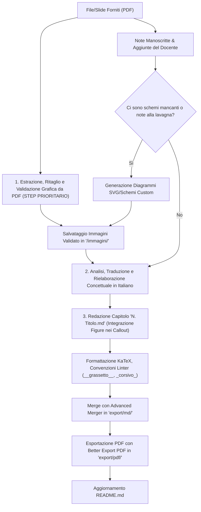

# Struttura del Vault e Guida alla Redazione degli Appunti
> Corso di Laurea Magistrale in Ingegneria Informatica e Robotica

---

## 1. Panoramica del Progetto

Questo repository è organizzato come un **Obsidian Vault** dedicato alla raccolta, redazione e pubblicazione degli appunti del corso di Laurea Magistrale in *Ingegneria Informatica e Robotica*.

L'obiettivo fondamentale del vault è mantenere:
1. **Modularità**: ogni lezione o macro-argomento vive in un singolo file `.md` atomico e facilmente manutenibile.
2. **Standard qualitativo elevato**: notazione matematica rigorosa (LaTeX/KaTeX), schemi vettoriali (SVG) e illustrazioni ad alta risoluzione (PNG), formattazione coerente tramite linter.
3. **Pipeline di esportazione unificata**: generazione di dispense complete per ciascuna materia tramite fusione automatica dei capitoli (`<Materia>-merged.md`) e compilazione in PDF tipografici per lo studio o la stampa (`<Materia>-merged.pdf`).

---

## 2. Architettura delle Directory e Stato dei Corsi

La struttura ad albero del repository si articola per anni di corso, materie e cartelle di supporto/esportazione:

```text
Magistrale/
├── .obsidian/                           # Configurazioni di Obsidian, plugin e temi
│   ├── plugins/                         # Plugin della community installati
│   └── snippets/
│       └── titoli.css                   # Regole CSS custom (ridimensionamento/centraggio immagini)
├── Anno 1/
│   ├── Digital Signal Processing/       # [COMPLETATO] 11 capitoli (0..9, A) + cartella immagini
│   │   ├── 0. Introduzione.md
│   │   ├── ...
│   │   ├── A. Sistemi Multi-Rate.md
│   │   └── immagini/                    # Schemi SVG e grafici PNG
│   ├── Electronic Embedded Systems/     # [INIZIATO] Note introduttive su ASIC, FPGA, VHDL
│   │   └── 0. Introduzione.md
│   ├── Lezioni integrative DSP/         # [COMPLETATO] 4 capitoli (0..3) propedeutici al DSP
│   │   ├── 0. Introduzione.md
│   │   ├── ...
│   │   ├── 3. Trasformata di Fourier.md
│   │   └── immagini/
│   ├── Machine Learning/                # [INIZIATO] Introduzione a Supervised/Unsupervised
│   │   └── 0. Introduzione.md
│   └── export/                          # Output generati per la consultazione aggregata
│       ├── md/                          # File Markdown uniti (Advanced Merger)
│       └── pdf/                         # PDF finali impaginati (Better Export PDF)
├── Anno 2/
│   ├── Autonomous Robotics/             # [DA SVILUPPARE] Codice di laboratorio disponibile
│   │   └── scripts_python/
│   │       └── motion_models_todo.py    # Modelli cinematici unicycle (Euler, RK, odeint)
│   └── Deep Learning And Robot Perception/ # [IN CORSO] Note approfondite di Computer Vision
│       ├── 0. Immagini, filtri e gradienti.md
│       └── immagini/                    # 53 immagini di supporto per filtri, gradienti, Canny
├── README.md                            # Presentazione del vault e link ai PDF pronti
└── STRUTTURA_E_GUIDA_APPUNTI.md         # Questo documento di riferimento
```

### Stato di Avanzamento delle Materie

| Anno | Materia | Stato | File Presenti | Note Operative |
| :--- | :--- | :---: | :--- | :--- |
| **Anno 1** | **Digital Signal Processing** | Concluso | 11 file (`0.` - `A.`), `immagini/` | Esportati `Digital Signal Processing-merged.md` e `.pdf`. Include quantizzazione, DTFT, DFT, finestratura, filtri FIR/IIR, multirate. |
| **Anno 1** | **Lezioni integrative DSP** | Concluso | 4 file (`0.` - `3.`), `immagini/` | Esportati `Lezioni integrative DSP-merged.md` e `.pdf`. Tratta segnali analogici/continui, LTI e trasformata di Fourier continua. |
| **Anno 1** | **Electronic Embedded Systems** | Bozza | `0. Introduzione.md` | Da espandere: programmazione FPGA, sintesi VHDL, toolchain Xilinx Vivado/Vitis, sistemi Real-Time. |
| **Anno 1** | **Machine Learning** | Bozza | `0. Introduzione.md` | Da espandere: regressione lineare/logistica, SVM, alberi decisionali, clustering, PCA, metriche di valutazione. |
| **Anno 2** | **Deep Learning And Robot Perception** | In corso | `0. Immagini, filtri e gradienti.md`, `immagini/` | Primo capitolo corposo già redatto (450+ righe) corredato da 53 figure. Da proseguire con CNN, feature detection, object detection, segmentation, 3D perception. |
| **Anno 2** | **Autonomous Robotics** | Da iniziare | `scripts_python/motion_models_todo.py` | Nessuna nota `.md` ancora creata. Partire dai modelli cinematici discreti (Euler, Runge-Kutta) implementati nello script Python e coprire SLAM, navigazione e pianificazione traiettorie. |

---

## 3. Convenzioni Tipografiche e Stile di Scrittura

Per garantire la massima leggibilità, coerenza stilistica e compatibilità con il plugin `obsidian-linter` e gli esportatori PDF, attenersi rigorosamente alle seguenti regole:

### 3.1 Naming dei File e Titoli
- **Formato del nome file**: `<Indice>. <Nome Argomento>.md`
  - Esempi: `0. Introduzione.md`, `1. Quantizzazione uniforme.md`, `A. Sistemi Multi-Rate.md`.
  - Usare la progressione numerica decimale `0, 1, 2, ... 9` seguita da lettere maiuscole (`A`, `B`, ...) se i capitoli superano 9, mantenendo l'ordinamento naturale nelle liste di file.
- **Heading H1 del documento**: deve corrispondere esattamente al nome del file (senza estensione `.md`):
  ```markdown
  # 1. Quantizzazione Uniforme
  ```
- **Numerazione dei Titoli (Regola H3 in Giù)**:
  - **Heading H1 (Capitolo)**: è l'unico livello che reca obbligatoriamente il numero progressivo del file (es. `# 1. Local Features e Harris Corner Detector`).
  - **Heading da H3 in giù (`###`, `####`, ecc.)**:
    - **No a sotto-numerazioni gerarchiche di sezione**: evitare prefissi decimali di paragrafo come `2.1`, `3.2`, `5.1.2`; i titoli di approfondimento devono essere puramente descrittivi (es. `### Detector: "Dove si trova il punto?"`, `### Regione Piatta (Flat Region)`).
    - **Algoritmi e Pipeline Multi-Step (Buona Norma)**: quando una procedura, algoritmo o derivazione matematica è formalizzata in più passaggi sequenziali (come Harris, Canny, SIFT, ecc.), **è opportuno e raccomandato specificare a quale step ci si sta riferendo** (es. `### Step 1: Funzione di Errore della Finestra $E(u, v)$`, `### Step 2: Approssimazione di Taylor al Primo Ordine`, `### Step 3: Matrice dei Secondi Momenti $C$`) per orientare chiaramente il lettore all'interno della sequenza operativa.
- **Capitalization dei titoli**: applicare il **Title Case** alle intestazioni (titoli principali con maiuscole sulle parole piene, come impostato nel linter).
- **Spaziature degli Heading**: lasciare sempre una riga vuota prima e dopo ciascuna intestazione.

### 3.2 Enfasi del Testo
Come configurato in `obsidian-linter`:
- **Grassetto**: utilizzare il doppio underscore `__termine importante__` anziché gli asterischi.
- **Corsivo**: utilizzare il singolo underscore `_termine_` anziché il singolo asterisco.
- **Puntini di sospensione**: utilizzare il carattere tipografico ellissi `…` (Unicode U+2026) anziché tre punti consecutivi `...`.

### 3.3 Gestione Immagini e Snippet CSS `titoli.css`
Il vault include una personalizzazione CSS attiva in `.obsidian/snippets/titoli.css` che controlla la resa visiva delle immagini tramite l'attributo `alt` (o alias dei wikilink).

#### Classi Alt supportate
- `center`: centra l'immagine orizzontalmente (`margin: auto;`).
- `small`: imposta la larghezza al **50%** (`width: 50%;`).
- `mid`: imposta la larghezza al **70%** (`width: 70%;`).
- `big`: imposta la larghezza al **90%** (`width: 90%;`).
- `full`: imposta la larghezza al **100%** (`width: 100%;`).

#### Esempi di Inclusione
Nei file Markdown si possono combinare le direttive separandole da spazi:
```markdown
![[filtro passa basso.svg|small center]]
![[ADC.svg|center big]]
![[2.10_istogramma.png|center mid]]
```
> [!NOTE] Risoluzione percorsi immagini
> I file grafici vanno posizionati nella sottocartella `immagini/` appartenente alla materia corrente (es. `Anno 2/Deep Learning And Robot Perception/immagini/`). Obsidian risolve i link corti `![[nome_file.png]]` automaticamente.

#### 3.3.1 Gerarchia e Priorità delle Immagini: PDF vs Immagini Generate
> [!IMPORTANT] Regola di Priorità Assoluta: Figure Originali da PDF/Slide
> Quando sono disponibili file sorgente esterni (slide in PDF, dispense docenti):
> 1. **Preferenza primaria per le immagini del PDF**: Le figure originali estratte dal PDF hanno **sempre la precedenza assoluta** rispetto a qualsiasi immagine generata sinteticamente (tramite IA o codice programmatico). Esse contengono i grafici cartesiani esatti, i dataset reali di riferimento (es. Middlebury, standard scikit-image, curve empiriche) e la notazione visiva identica a quella utilizzata dal docente a lezione.
> 2. **Ruolo delle immagini generate appositamente (SVG / Schemi Custom)**: La generazione ad-hoc di illustrazioni vettoriali (SVG) o diagrammi dedicati **non deve sostituire le figure del PDF**, ma va effettuata unicamente nei seguenti due casi:
>    - **Integrazione di appunti scritti a mano / aggiunte orali del docente**: Quando gli appunti dello studente riportano disegni alla lavagna, metafore concettuali (es. _"la casetta traslata"_, diagrammi di partizione dello spazio degli autovalori, patch comparative) non presenti o solo accennate nelle slide.
>    - **Mancanze o lacune didattiche oggettive**: Se nelle slide manca uno schema a blocchi fondamentale o una spiegazione visiva intermedia indispensabile per rendere l'appunto comprensibile e autosufficiente.

#### 3.3.2 Pipeline e Controlli per Ricavare Correttamente le Immagini da PDF
> [!IMPORTANT] Primo Step Obbligatorio del Workflow
> L'estrazione, il ritaglio e la validazione delle immagini dal PDF **è tassativamente il PRIMO step da compiere**, ancor prima di iniziare la stesura del testo o la traduzione della lezione. Avere l'intero set di asset grafici estratto e validato consente di costruire l'esposizione attorno a figure concrete e verificabili.

Per garantire un'estrazione impeccabile ed evitare difetti visivi (in particolare il testo troncato a metà), seguire rigidamente questa procedura in 6 fasi:

1. **Rendering Lossless ad Alta Risoluzione**:
   - Convertire le pagine del documento PDF in immagini raster ad alta risoluzione (almeno 150-300 DPI) tramite utility di sistema (es. `pdftoppm -png -r 150 sorgente.pdf scratch/slides/page`).
   - Conservare i lucidi renderizzati a piena risoluzione in una cartella di lavoro temporanea (`scratch/slides/`).

2. **Isolamento dell'Unità Grafica Concettuale**:
   - Individuare con precisione la porzione visiva rilevante: il grafico cartesiano, il set di pannelli a confronto, la tabella numerica dei valori, la mappa di risposta o lo schema architetturale.
   - Escludere elementi estranei appartenenti alla cornice della slide (titoli generici di transizione, barre di navigazione del PDF, loghi universitari, numeri di pagina, note a piè di pagina con copyright).

3. **Controllo Analitico Anti-Crop del Testo (Regola "Tutto o Niente")**:
   - È **severamente vietato** lasciare porzioni di testo tagliate a metà altezza o con parole mozzate (lettere decapitate, elenchi puntati con frasi a metà, didascalie parziali).
   - **Regola di inclusione/esclusione**:
     - _Testo intrinseco alla figura_: Etichette degli assi cartesiani ($x, y$), titoli dei singoli pannelli, valori numerici nelle celle, formule matematiche del grafico, legenda a colori $\to$ **devono essere inclusi integralmente**.
     - _Testo esterno alla figura_: Elenchi puntati a lato, didascalie descrittive generali della slide, footer, riferimenti bibliografici $\to$ **devono essere esclusi completamente**.
   - **Controllo geometrico dei bounding box**: Utilizzare strumenti di estrazione vettoriale delle coordinate del testo (es. `pdftotext -bbox-layout` o analisi dei blocchi del PDF) per mappare esattamente gli intervalli verticali $[y_{\min}, y_{\max}]$ e orizzontali $[x_{\min}, x_{\max}]$ delle linee di testo, assicurandosi che il rettangolo di ritaglio non intersechi alcun carattere o glifo.

4. **Margini di Respiro (Padding Pulito)**:
   - Non ritagliare mai a filo estremo delle linee grafiche o dei testi inclusi.
   - Applicare sempre un margine di respiro neutro (almeno 8–15 pixel di sfondo bianco o colore di fondo) tra il limite del ritaglio e gli elementi visivi o i bordi arrotondati dei riquadri.

5. **Verifica Qualità Pixel-Level ai Bordi**:
   - Eseguire una scansione di controllo lungo le prime e ultime righe/colonne del crop (`top`, `bottom`, `left`, `right`) per accertarsi che il valore dei pixel sia uniforme al colore di sfondo e non presenti residui o sbavature scure derivanti da glifi della riga soprastante o sottostante.

6. **Archiviazione e Naming Semantico**:
   - Salvare l'immagine direttamente nella sottocartella `immagini/` della materia di appartenenza.
   - Adottare una convenzione di denominazione parlante e tracciabile, preferibilmente con riferimento alla slide d'origine: `slide_<num>_<descrizione_concisa>.png` (es. `slide_44_nms_real_corner_3d.png`, `slide_37_harris_stephens_values.png`).

### 3.4 Callout di Obsidian
I callout arricchiscono il testo dividendo le nozioni teoriche da esempi ed evidenze:
- `>[!example]`: per esempi pratici, casi applicativi o esercizi svolti.
- `>[!note]`: per note di implementazione, formati (es. ordinamento dei tensori in PyTorch $C \times H \times W$), o convenzioni.
- `>[!info]`: per chiarimenti concettuali e definizioni.
- `>[!important]` o `>[!warning]`: per proprietà critiche, condizioni di stabilità/campionamento, o formule da memorizzare.

### 3.5 Formule Matematiche (LaTeX / KaTeX)
- **Inline**: `$formula$` racchiusa da singoli dollari (senza spazi iniziali/finali interni).
  - Esempio: `$f_c = 44.1\text{ kHz}$`, `$g(i, j) = h(f(i, j))$`.
- **Display Block**: blocco delimitato da `$$` su riga isolata, con una riga vuota prima e dopo:
  ```markdown
  $$
  N = \sum_{i = -k}^D b_i \cdot 2^i
  $$
  ```
- **Rigore simbolico**:
  - Differenziali e costanti con `\mathrm`: `\mathrm{d}t`, `\mathrm{d}r`, `\mathrm{e}^{j\omega t}`.
  - Vettori e matrici: grassetto `\mathbf{x}` oppure corsivo chiaro con specificazione esplicita delle dimensioni.
  - Frecce di trasformazione: `\xrightarrow{\mathcal{F}}` o `\to`.

### 3.6 Blocchi di Codice
Indicare sempre il linguaggio per abilitare la sintassi evidenziata:
````markdown
```python
def euler(p, v, w, T):
    x, y, th = p
    xn = x + v * T * np.cos(th)
    yn = y + v * T * np.sin(th)
    thn = th + w * T
    return np.array([xn, yn, thn])
```
````

### 3.7 Lingua e Traduzione dei Materiali Forniti
> [!IMPORTANT] Regola Tassativa sulla Lingua Italiana
> - **Redazione sempre in Italiano**: Tutti gli appunti, le spiegazioni, i commenti e i riassunti devono essere scritti rigorosamente in **lingua italiana**.
> - **Traduzione dei file forniti**: Se vengono forniti materiali in inglese o in altre lingue (slide dei professori, paper scientifici, manuali o documentazione), questi devono essere **interamente tradotti e rielaborati in italiano**.
> - **Terminologia Tecnica**: È consentito mantenere in lingua inglese unicamente i termini tecnici universali e acronimi ampiamente consolidati nel settore dell'ingegneria informatica e della robotica (es. *loss function*, *overfitting*, *stride*, *pooling*, *bounding box*, *zero-padding*, *look-up table*, *pipeline*), affiancandoli se opportuno a una breve spiegazione in italiano.

### 3.8 Elenchi Puntati e Numerati (Integrità Strutturale)
> [!IMPORTANT] Regola Tassativa: Mai Spezzare gli Elenchi con Immagini o Callout
> Gli elenchi (puntati `*`, `-` o numerati `1.`, `2.`) devono possedere una struttura continua, chiara e compatta:
> 1. **Conclusione prima di elementi blocco esterni**: Quando si apre un elenco, questo **deve essere completato in tutti i suoi punti prima di inserire callout (`>[!example]`, `>[!note]`), immagini (`![[...]`), tabelle o blocchi grafici**.
> 2. **Divieto assoluto di interruzione**: È **severamente vietato spezzare un elenco a metà** (es. inserire Punto 1, poi un'immagine o un callout di mezzo, e poi riprendere con Punto 2). Questo interrompe il flusso logico del discorso e compromette il rendering dei parser Markdown.
> 3. **Posizionamento degli approfondimenti visivi**: Se uno o più punti dell'elenco fanno riferimento a figure o esempi estesi, l'immagine o il callout va collocato:
>    - **subito dopo la conclusione dell'intero elenco** come elemento di approfondimento visivo globale;
>    - oppure, se strettamente correlato a un singolo punto, l'elenco va formulato in modo che ciascun elemento sia conciso, rimandando alla figura posta immediatamente al termine della lista.

---

## 4. Workflow Operativo per Nuovi Appunti o Rifiniture

Quando si deve redigere una nuova materia, completare un capitolo esistente o rifinire gli appunti partendo da materiale fornito:



### 4.1 Stesura di un Nuovo Capitolo da File Forniti
1. **Fase 1 - Estrazione Grafica da PDF (Step Prioritario)**: Prima di scrivere qualsiasi riga di testo, scansionare l'intero PDF, estrarre ad alta risoluzione tutti i grafici, le tabelle comparative, le mappe e gli esempi visivi salienti, applicare la pipeline anti-crop a 6 fasi (zero testo mozzato, padding di respiro adeguato) e archiviarli in `<Materia>/immagini/`.
2. **Fase 2 - Analisi Note Manoscritte e Schemi Custom**: Esaminare le annotazioni manoscritte dello studente e le spiegazioni orali del docente. Generare schemi vettoriali custom (SVG) solo ed esclusivamente per chiarire concetti mancanti nelle slide o per rappresentare metafore/disegni esplicitamente richiesti dalle note alla lavagna (mantenendo invece le figure del PDF per tutto ciò che è già presente nei lucidi).
3. **Fase 3 - Analisi, Traduzione e Rielaborazione**: Leggere e rielaborare i contenuti delle slide traducendoli integralmente in lingua italiana con rigore accademico e chiarezza didattica.
4. **Fase 4 - Numerazione e Titolo**: Assegnare il nome file progressivo corretto (es. `Anno 2/Deep Learning And Robot Perception/1. Local Features e Harris Corner Detector.md`), allineando perfettamente l'heading H1.
5. **Fase 5 - Composizione e Integrazione Figure**: Redigere il documento alternando spiegazioni teoriche, formule KaTeX rigorose ed esempi visivi basati sulle immagini estratte, formattate con `![[immagine.png|center mid/big]]`.

### 4.2 Aggiornamento ed Esportazione
1. **Aggregazione**: Tramite il plugin `advanced-merger` di Obsidian (oppure script dedicato), unire in ordine logico i capitoli in `Anno X/export/md/<Materia>-merged.md`.
2. **Indice dei contenuti**: Aggiungere o rigenerare la TOC in cima al file unificato usando la sintassi dei wikilink ancorati `[[#Capitolo#Sezione|Sezione]]`.
3. **Esportazione in PDF**: Utilizzare il plugin `better-export-pdf` con impostazioni A4, margini 10mm e downscale conforme per generare `Anno X/export/pdf/<Materia>-merged.pdf`.
4. **README**: Inserire il collegamento al nuovo PDF nell'elenco degli "Appunti completati" del `README.md`.

---

## 5. Linee Guida Specifiche per Materia

### 5.1 Deep Learning And Robot Perception (Anno 2)
- **Contesto**: Il corso affronta sia le basi di Computer Vision classica (spazio colore, filtering, edge detection, feature descriptors come SIFT/ORB) sia Deep Learning moderno (CNN, ResNet, Transformer visivi, Object Detection YOLO/Faster-RCNN, Semantic Segmentation, NeRF/3D Perception).
- **Materiale Grafico**: La cartella `immagini/` contiene già 53 immagini numerate (es. `2.10_istogramma.png`, `2.44_sobel_esempio.png`, `2.54_canny.png`). Nel redigere i capitoli, riutilizzare queste immagini mantenendo la corrispondenza con i lucidi delle lezioni.
- **Convenzione Tensori**: Indicare sempre esplicitamente la convenzione dei canali ($[C, H, W]$ per PyTorch vs $[H, W, C]$ per OpenCV/NumPy).

### 5.2 Autonomous Robotics (Anno 2)
- **Contesto**: Modelli cinematici di robot mobili (unicycle, car-like, omnidirectional), odometria, filtri di stima bayesiana (EKF, Particle Filter), mapping e SLAM, trajectory planning e motion control.
- **Punto di Partenza**: Integrare le formule teoriche con il codice già strutturato in `scripts_python/motion_models_todo.py`:
  - Modello differenziale continuo: $\dot{x} = v \cos\theta$, $\dot{y} = v \sin\theta$, $\dot{\theta} = \omega$.
  - Discretizzazione ad arco (Exact velocity model) vs approssimazioni tangenziali (Euler, Runge-Kutta di secondo ordine).
  - Validazione tramite `scipy.integrate.odeint`.

### 5.3 Electronic Embedded Systems (Anno 1)
- **Contesto**: Architetture hardware programmabili (FPGA, SoC, ASIC), logica riconfigurabile, linguaggi HDL (VHDL), flusso di sintesi logica e timing analysis su Xilinx Vivado/Vitis, interfaccia con sensori/attuatori e sistemi Real-Time.

### 5.4 Machine Learning (Anno 1)
- **Contesto**: Apprendimento supervisionato (Loss function, Gradient Descent, Regolarizzazione $L_1/L_2$, Bias-Variance trade-off), apprendimento non supervisionato (K-Means, GMM, PCA, autoencoder), metriche di valutazione (Precision, Recall, ROC-AUC).

---

## 6. Checklist di Controllo Qualità per l'Assistente AI

Prima di concludere qualsiasi sessione di scrittura o refactoring di un appunto:
- [ ] **Priorità Grafica da PDF**: Le immagini, schemi e grafici presenti nei lucidi sorgente sono stati estratti dal PDF come **primo step operativo** prima della stesura del testo.
- [ ] **Preferenza Immagini Originali**: È stata data preferenza assoluta alle figure originali del PDF rispetto a immagini generate sinteticamente (usando schemi custom/SVG solo per note manoscritte del docente o lacune didattiche).
- [ ] **Controllo Anti-Crop del Testo**: Tutte le immagini estratte dal PDF sono esenti da testo tagliato a metà altezza (regola "tutto o niente": etichette/legenda incluse per intero, testo esterno/footer escluso completamente).
- [ ] **Margini di Respiro**: Le immagini estratte presentano margini di padding puliti (8-15 px) senza tratti o bordi tagliati a filo.
- [ ] **Lingua Italiana**: Tutti i contenuti provenienti da file sorgente esterni (slide, dispense, paper) sono stati **tradotti e rielaborati in italiano** (mantenendo solo acronimi o termini tecnici consolidati).
- [ ] **Coerenza Titolo e File**: Il titolo `# N. Titolo` combacia esattamente con il nome del file `.md`.
- [ ] **Title Case**: Le parole del titolo rispettano il Title Case.
- [ ] **Titoli H3 in Giù (No Sotto-Numerazioni / Sì Step Algoritmici)**: Nessun titolo H3+ presenta sotto-numerazioni decimali di sezione (es. `2.1`); è invece mantenuta l'indicazione dello step (`Step N:`) per procedure e algoritmi a più passaggi.
- [ ] **Risoluzione Immagini**: Tutte le immagini referenziate esistono nella sottocartella `immagini/` della materia.
- [ ] **Snippet CSS Immagini**: Le immagini includono i modificatori di visualizzazione appropriati (es. `|center mid` o `|center big`).
- [ ] **Formule Matematiche**: Tutte le formule matematiche sono bilanciate e conformi a KaTeX.
- [ ] **Sintassi Tipografica Linter**: I termini chiave usano il doppio underscore `__termine__` e il corsivo usa il singolo `_termine_`.
- [ ] **Integrità degli Elenchi**: Gli elenchi puntati o numerati non sono spezzati da immagini, callout o altri blocchi intermedi; ogni elenco viene concluso prima di inserire figure o callout di approfondimento.
- [ ] **Callout Obsidian**: Gli esempi e le note utilizzano i callout standard Obsidian (`>[!example]`, `>[!note]`).
- [ ] **Newline Finale**: Il file termina con un newline singolo.
